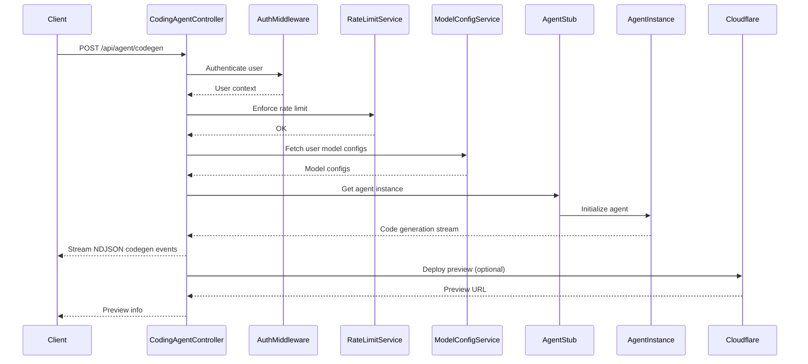

# API Controllers Module Documentation

## Introduction and Purpose

The **API Controllers** module serves as the main entry point for all HTTP and WebSocket API endpoints in the system. It provides a set of controller classes, each responsible for handling a specific domain of API requests, such as code generation, authentication, app management, secrets, model configuration, statistics, and integrations (e.g., GitHub, Sentry). These controllers orchestrate request validation, authentication, business logic invocation, and response formatting, acting as the bridge between frontend clients and backend services.

## Architecture Overview

The API Controllers module is organized as a collection of controller classes, each extending a common `BaseController` that provides shared utilities for error handling, response formatting, and authentication. Controllers interact with service layers (e.g., database, analytics, secrets, model config) and may delegate to other modules such as Agent Core, Database Services, or GitHub Integration for domain-specific logic.

### High-Level Architecture

```mermaid
graph TD
    subgraph API Controllers
        CodingAgentController
        AppViewController
        AuthController
        BaseController
        GitHubExporterController
        ModelConfigController
        ModelProvidersController
        ScreenshotsController
        SecretsController
        SentryTunnelController
        StatsController
        StatusController
        UserController
    end
    subgraph Service Layer
        DatabaseServices
        AnalyticsService
        SecretsService
        ModelConfigService
        ModelProvidersService
        AppService
        UserService
        GitHubService
    end
    subgraph Agent Core
        AgentStub
        AgentInstance
    end
    subgraph External Integrations
        GitHubAPI
        SentryAPI
        Cloudflare
    end
    subgraph Middleware
        AuthMiddleware
        RateLimitService
        CsrfService
    end
    
    CodingAgentController -- codegen, agent mgmt --> AgentStub
    CodingAgentController -- model config --> ModelConfigService
    CodingAgentController -- rate limit --> RateLimitService
    CodingAgentController -- logging --> BaseController
    AppViewController -- app data --> AppService
    AppViewController -- agent summary --> AgentStub
    AuthController -- user/session/api key --> UserService & SessionService & ApiKeyService
    AuthController -- CSRF --> CsrfService
    GitHubExporterController -- repo mgmt --> GitHubService
    GitHubExporterController -- agent files --> AgentStub
    ModelConfigController -- model config --> ModelConfigService
    ModelConfigController -- secrets --> SecretsService
    ModelConfigController -- model test --> ModelTestService
    ModelProvidersController -- provider mgmt --> ModelProvidersService
    ModelProvidersController -- secrets --> SecretsService
    ScreenshotsController -- storage --> Cloudflare
    SecretsController -- secrets --> SecretsService
    SentryTunnelController -- proxy --> SentryAPI
    StatsController -- analytics --> AnalyticsService
    StatusController -- config --> Service Layer
    UserController -- user/app mgmt --> UserService & AppService
    
    AuthController -- auth --> AuthMiddleware
    CodingAgentController -- auth --> AuthMiddleware
    AppViewController -- auth (optional) --> AuthMiddleware
```

## Component Relationships

- **BaseController**: Provides shared methods for all controllers (error handling, response formatting, optional auth, etc.).
- **Domain Controllers**: Each controller (e.g., `CodingAgentController`, `AuthController`, `AppViewController`) handles a specific set of API endpoints and delegates to service modules for business logic.
- **Service Layer**: Controllers interact with services for data persistence, analytics, secrets, and external integrations.
- **Agent Core**: Controllers dealing with code generation or agent state interact with the Agent Core module ([Agent Core](Agent Core.md)).
- **Middleware**: Authentication, rate limiting, and CSRF protection are enforced via middleware and service utilities.

## Sub-Modules and Their Functionality

The API Controllers module is composed of the following sub-modules, each with its own responsibilities:

- **CodingAgentController**: Handles code generation, agent lifecycle, and preview deployment endpoints. [See details](CodingAgentController.md)
- **AppViewController**: Manages app details, starring, and git clone token generation. [See details](AppViewController.md)
- **AuthController**: Manages authentication, registration, OAuth, sessions, API keys, and CSRF. [See details](AuthController.md)
- **BaseController**: Abstract base class for all controllers, providing shared utilities. [See details](BaseController.md)
- **GitHubExporterController**: Handles GitHub repository export, OAuth, and sync status. [See details](GitHubExporterController.md)
- **ModelConfigController**: Manages user model configurations, BYOK, and model testing. [See details](ModelConfigController.md)
- **ModelProvidersController**: Manages custom model providers and their secrets. [See details](ModelProvidersController.md)
- **ScreenshotsController**: Serves user-generated screenshots from storage. [See details](ScreenshotsController.md)
- **SecretsController**: Manages user secrets and API keys. [See details](SecretsController.md)
- **SentryTunnelController**: Proxies Sentry events to bypass ad blockers. [See details](SentryTunnelController.md)
- **StatsController**: Provides user statistics and activity timeline. [See details](StatsController.md)
- **StatusController**: Returns platform-wide status and global messages. [See details](StatusController.md)
- **UserController**: Handles user dashboard, profile, and app history. [See details](UserController.md)

---

*All sub-module documentation files are up to date and cross-referenced here. For details on each controller, see the linked files above.*

## Data Flow Example: Code Generation



## How This Module Fits Into the Overall System

The API Controllers module is the main interface for frontend and external clients to interact with the backend. It:
- Exposes REST and WebSocket endpoints for all major features
- Orchestrates authentication, authorization, and rate limiting
- Delegates business logic to service and core modules
- Integrates with external services (GitHub, Sentry, Cloudflare)
- Ensures consistent error handling and response formatting

For details on underlying business logic, see the documentation for:
- [Agent Core](Agent Core.md)
- [Database Services and Types](Database Services and Types.md)
- [GitHub Integration](GitHub Integration.md)
- [Sandbox and Execution Environment](Sandbox and Execution Environment.md)

---

*For detailed documentation of each controller, see the linked sub-module files above.*
