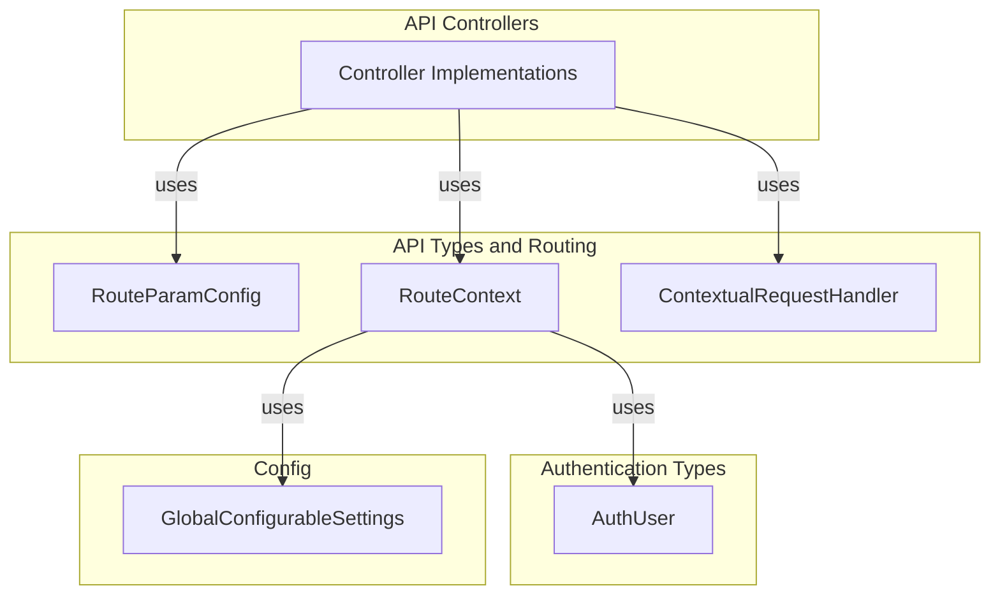
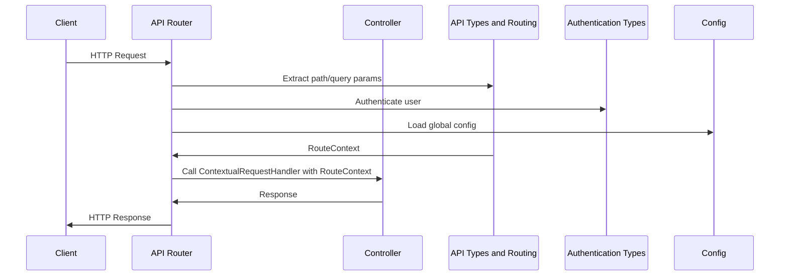

# API Types and Routing

## Introduction

The **API Types and Routing** module provides foundational type definitions and abstractions for handling API route context, parameter extraction, and type-safe request handling within the backend system. It ensures that all API controllers and middleware can access a consistent, structured context for each request, including authentication, configuration, and route parameters. This module is essential for building robust, maintainable, and secure API endpoints.

---

## Core Functionality

This module defines the following key types and interfaces:

- **RouteContext**: Encapsulates all contextual information for an API request, including the authenticated user, session ID, global configuration, path parameters, and query parameters.
- **ContextualRequestHandler**: A type for request handlers that receive the structured `RouteContext`, enabling type-safe and context-aware API logic.
- **RouteParamConfig**: Specifies required and optional path parameters for routes, supporting type safety and validation in route definitions.

These abstractions are used throughout the API Controllers module to ensure consistent access to user/session data and route parameters.

---

## Architecture and Component Relationships

The API Types and Routing module acts as a bridge between the HTTP layer and the business logic in API controllers. It is referenced by all API controllers to provide structured context and parameter validation.

### Component Diagram



---

## Data Flow and Process

### Request Handling Flow



---

## API Types

### RouteContext
```typescript
interface RouteContext {
    user: AuthUser | null;
    sessionId: string | null;
    config: GlobalConfigurableSettings;
    pathParams: Record<string, string>;
    queryParams: URLSearchParams;
}
```
- **user**: The authenticated user, or `null` for public routes. See [Authentication Types](Authentication Types.md).
- **sessionId**: The session identifier, or `null` if not authenticated.
- **config**: Global application configuration. See [Agent Core](Agent Core.md) for configuration details.
- **pathParams**: Key-value pairs of path parameters extracted from the route.
- **queryParams**: URL query parameters.

### ContextualRequestHandler
```typescript
type ContextualRequestHandler = (
    request: Request,
    env: Env,
    ctx: ExecutionContext,
    context: RouteContext,
) => Promise<Response>;
```
- A function signature for request handlers that receive the structured `RouteContext`.

### RouteParamConfig
```typescript
interface RouteParamConfig {
    requiredParams?: string[];
    optionalParams?: string[];
}
```
- **requiredParams**: List of required path parameters for the route.
- **optionalParams**: List of optional path parameters for the route.

---

## Integration with the Overall System

- **API Controllers**: All controllers (see [API Controllers](API Controllers.md)) depend on these types for consistent request context and parameter validation.
- **Authentication Types**: The `user` field in `RouteContext` references the `AuthUser` type (see [Authentication Types](Authentication Types.md)).
- **Agent Core**: The `config` field references global configuration types defined in the Agent Core module (see [Agent Core](Agent Core.md)).

---

## References
- [API Controllers](API Controllers.md)
- [Authentication Types](Authentication Types.md)
- [Agent Core](Agent Core.md)
