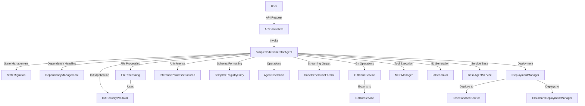

# Agent Core Module Documentation

## Introduction and Purpose

The **Agent Core** module is the central orchestration layer for the system's autonomous code generation, deployment, and management agents. It provides the foundational abstractions, state management, code generation logic, deployment orchestration, and utility services that power the system's AI-driven software engineering workflows. The module is designed for extensibility, robustness, and seamless integration with both backend services and frontend clients.

## Architecture Overview

The Agent Core module is composed of several sub-modules, each responsible for a specific aspect of agent operation. The architecture is highly modular, enabling clear separation of concerns and facilitating maintainability and scalability.

### High-Level Architecture Diagram

```mermaid
graph TD
    subgraph Agent Core
        Assistant
        SimpleCodeGeneratorAgent
        StateMigration
        DependencyManagement
        FileProcessing
        GitCloneService
        AgentConfig
        InferenceParamsStructured
        TemplateRegistryEntry
        AgentOperation
        DiffSecurityValidator
        CodeGenerationFormat
        BaseAgentService
        IDeploymentManager
        DeploymentResult
        MCPManager
        MCPServerConfig
        MCPResult
        IdGenerator
    end
    
    subgraph API Controllers
        CodingAgentController
        AppViewController
        AuthController
        BaseController
        GitHubExporterController
        ModelConfigController
        ModelProvidersController
        ScreenshotsController
        SecretsController
        SentryTunnelController
        StatsController
        StatusController
        UserController
    end
    
    subgraph Database Services
        BaseService
    end
    
    subgraph Sandbox & Execution
        BaseSandboxService
        FileTreeBuilder
        SandboxEnv
        SandboxSdkClient
        ZipExtractor
    end
    
    subgraph GitHub Integration
        GitHubService
    end
    
    subgraph Rate Limiting & Caching
        KVRateLimitStore
        RateLimitConfigBase
        RateLimitService
        KVCacheOptions
        CsrfService
    end
    
    subgraph Logger
        LoggerFactory
    end
    
    subgraph Validation
        ValidationField
    end
    
    subgraph Frontend
        ApiClient
        PaginationParams
        AppEventEmitter
        ImageAttachmentPreviewProps
        AgentDisplayConfig
        AppFiltersFormProps
        ThemeContextType
        Logger
        NDJSONStreamParser
        AutoScreenshotSystem
    end
    
    subgraph Deployment Scripts
        CloudflareDeploymentManager
        CloudflareUndeploymentManager
    end
    
    SimpleCodeGeneratorAgent -- uses --> Assistant
    SimpleCodeGeneratorAgent -- uses --> StateMigration
    SimpleCodeGeneratorAgent -- uses --> DependencyManagement
    SimpleCodeGeneratorAgent -- uses --> FileProcessing
    SimpleCodeGeneratorAgent -- uses --> GitCloneService
    SimpleCodeGeneratorAgent -- uses --> AgentConfig
    SimpleCodeGeneratorAgent -- uses --> InferenceParamsStructured
    SimpleCodeGeneratorAgent -- uses --> TemplateRegistryEntry
    SimpleCodeGeneratorAgent -- uses --> AgentOperation
    SimpleCodeGeneratorAgent -- uses --> DiffSecurityValidator
    SimpleCodeGeneratorAgent -- uses --> CodeGenerationFormat
    SimpleCodeGeneratorAgent -- uses --> BaseAgentService
    SimpleCodeGeneratorAgent -- uses --> IDeploymentManager
    SimpleCodeGeneratorAgent -- uses --> MCPManager
    SimpleCodeGeneratorAgent -- uses --> IdGenerator
    
    SimpleCodeGeneratorAgent -- interacts with --> BaseSandboxService
    SimpleCodeGeneratorAgent -- interacts with --> GitHubService
    SimpleCodeGeneratorAgent -- interacts with --> BaseService
    SimpleCodeGeneratorAgent -- interacts with --> LoggerFactory
    
    API Controllers -- calls --> SimpleCodeGeneratorAgent
    Frontend -- interacts with --> API Controllers
    
    SimpleCodeGeneratorAgent -- uses --> RateLimitService
    SimpleCodeGeneratorAgent -- uses --> ValidationField
    
    SimpleCodeGeneratorAgent -- uses --> CloudflareDeploymentManager
    SimpleCodeGeneratorAgent -- uses --> CloudflareUndeploymentManager
```

## Sub-Modules and Core Components

The Agent Core module is organized into the following sub-modules, each with its own responsibilities and internal components. For detailed documentation, see the linked files:

### 1. Agent Orchestration and State Management
- [Assistant](assistant.md)
- [SimpleCodeGeneratorAgent](simpleGeneratorAgent.md)
- [StateMigration](stateMigration.md)

### 2. Domain Logic and Utilities
- [DependencyManagement](DependencyManagement.md)
- [FileProcessing](FileProcessing.md)

### 3. Git and Repository Management
- [GitCloneService](git-clone-service.md)

### 4. Inference and Schema Formatting
- [AgentConfig](config.types.md)
- [InferenceParamsStructured](infer.md)
- [TemplateRegistryEntry](schemaFormatters.md)

### 5. Operations and Output Formats
- [AgentOperation](common.md)
- [DiffSecurityValidator](udiff.md)
- [CodeGenerationFormat](base.md)

### 6. Services and Interfaces
- [BaseAgentService](BaseAgentService.md)
- [IDeploymentManager, DeploymentResult](IDeploymentManager.md)

### 7. Tools and Utilities
- [MCPManager](mcpManager.md)
- [MCPServerConfig, MCPResult](types.md)
- [IdGenerator](idGenerator.md)

## Data Flow and Component Interactions



## How Agent Core Fits Into the Overall System

- **API Controllers** invoke the Agent Core's main agent (SimpleCodeGeneratorAgent) to process user requests, generate code, and manage deployments.
- **Database Services** are used for persistent storage of agent state, app metadata, and deployment records.
- **Sandbox and Execution Environment** are orchestrated by the agent for code validation, testing, and preview.
- **GitHub Integration** is handled via the GitCloneService and related utilities for code export and versioning.
- **Frontend Clients** interact with the system via API Controllers, receiving real-time updates and streaming code generation results.

## References to Sub-Module Documentation

For detailed information on each sub-module, see:
- [Assistant](assistant.md)
- [SimpleCodeGeneratorAgent](simpleGeneratorAgent.md)
- [StateMigration](stateMigration.md)
- [DependencyManagement](DependencyManagement.md)
- [FileProcessing](FileProcessing.md)
- [GitCloneService](git-clone-service.md)
- [AgentConfig](config.types.md)
- [InferenceParamsStructured](infer.md)
- [TemplateRegistryEntry](schemaFormatters.md)
- [AgentOperation](common.md)
- [DiffSecurityValidator](udiff.md)
- [CodeGenerationFormat](base.md)
- [BaseAgentService](BaseAgentService.md)
- [IDeploymentManager, DeploymentResult](IDeploymentManager.md)
- [MCPManager](mcpManager.md)
- [MCPServerConfig, MCPResult](types.md)
- [IdGenerator](idGenerator.md)

---

*For details on API Controllers, Database Services, Sandbox, GitHub Integration, and Frontend, see their respective documentation files: [API Controllers.md], [Database Services and Types.md], [Sandbox and Execution Environment.md], [GitHub Integration.md], [Frontend.md].*
