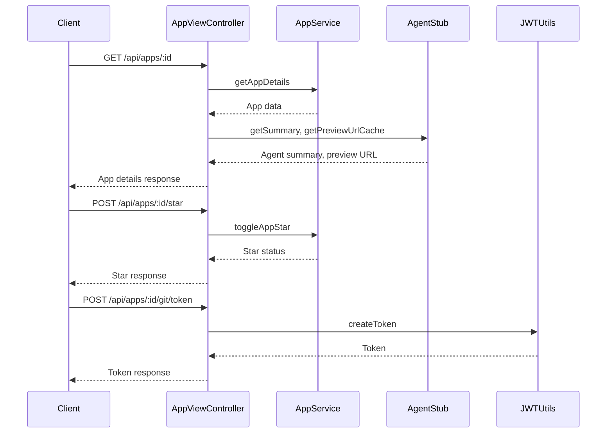

# AppViewController

## Purpose
Handles endpoints related to viewing app details, starring/un-starring apps, and generating git clone tokens for private repositories.

## Core Components
- AppViewController (class)
- GeneratedCodeFile (type)

## Responsibilities
- Fetch app details, including stats, user info, and preview URLs
- Track app views for analytics
- Allow users to star/unstar apps
- Generate short-lived tokens for git clone operations

## Key Interactions
- **AppService**: Fetches app details, manages starring, and analytics ([Database Services and Types](Database Services and Types.md))
- **Agent Core**: Fetches agent summaries and preview URLs ([Agent Core](Agent Core.md))
- **JWTUtils**: Generates secure tokens for git clone

## Data Flow

## Endpoints
- `GET /api/apps/:id` — Get app details
- `POST /api/apps/:id/star` — Star/unstar app
- `POST /api/apps/:id/git/token` — Generate git clone token

## Related Modules
- [Database Services and Types](Database Services and Types.md)
- [Agent Core](Agent Core.md)
