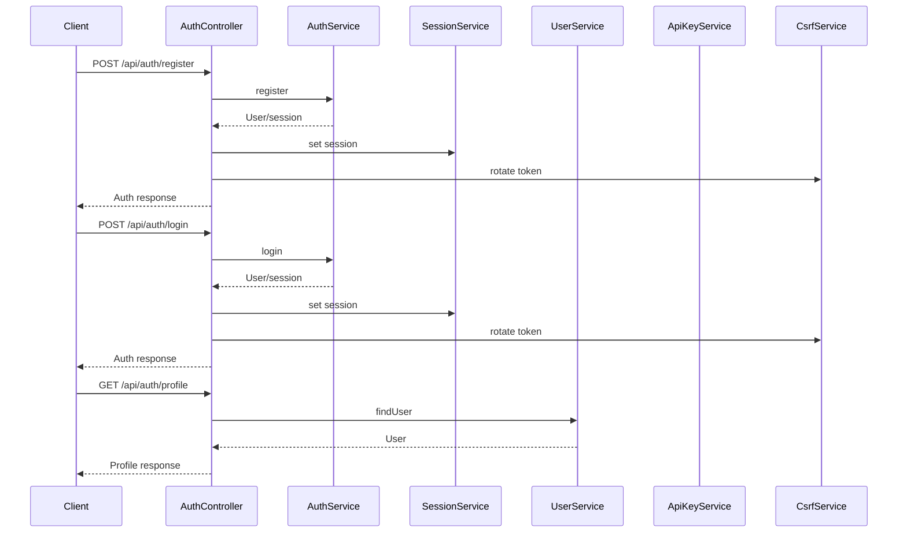

# AuthController

## Purpose
Handles all authentication and authorization endpoints, including registration, login, OAuth, session management, API key management, and CSRF protection.

## Core Components
- AuthController (class)

## Responsibilities
- Register and authenticate users (email/password and OAuth)
- Manage user sessions and logout
- Provide user profile and update endpoints
- Manage API keys (create, revoke, list)
- Handle CSRF token issuance and rotation
- Expose available authentication providers

## Key Interactions
- **AuthService, SessionService, UserService, ApiKeyService**: User/session/api key management ([Database Services and Types](Database Services and Types.md))
- **CsrfService**: CSRF token management ([Cache and CSRF](Cache and CSRF.md))
- **authMiddleware**: Authentication enforcement ([API Types and Routing](API Types and Routing.md))

## Data Flow

## Endpoints
- `POST /api/auth/register` — Register user
- `POST /api/auth/login` — Login user
- `POST /api/auth/logout` — Logout user
- `GET /api/auth/profile` — Get user profile
- `PUT /api/auth/profile` — Update user profile
- `GET /api/auth/oauth/:provider` — Initiate OAuth
- `GET /api/auth/callback/:provider` — Handle OAuth callback
- `GET /api/auth/check` — Check authentication status
- `GET /api/auth/sessions` — List active sessions
- `DELETE /api/auth/sessions/:sessionId` — Revoke session
- `GET /api/auth/api-keys` — List API keys
- `POST /api/auth/api-keys` — Create API key
- `DELETE /api/auth/api-keys/:keyId` — Revoke API key
- `POST /api/auth/verify-email` — Verify email with OTP
- `POST /api/auth/resend-verification` — Resend verification OTP
- `GET /api/auth/csrf-token` — Get CSRF token
- `GET /api/auth/providers` — Get available auth providers

## Related Modules
- [Database Services and Types](Database Services and Types.md)
- [Cache and CSRF](Cache and CSRF.md)
- [API Types and Routing](API Types and Routing.md)
