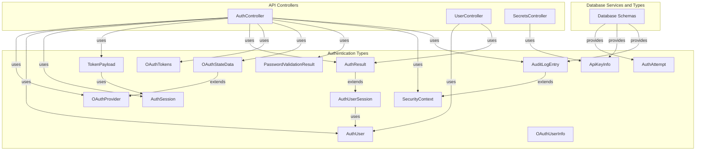
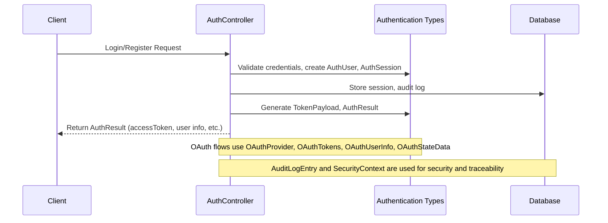

# Authentication Types Module Documentation

## Introduction

The **Authentication Types** module defines the core type system for authentication and authorization processes within the platform. It provides a set of TypeScript interfaces and type aliases that standardize the structure of authentication-related data, including user sessions, OAuth flows, JWT payloads, API keys, password validation, and security context. These types are foundational for ensuring type safety and consistency across authentication logic in both backend and frontend components.

This module is primarily consumed by authentication controllers, middleware, and services throughout the system, and is referenced by other modules that require authentication or user identity information.

---

## Core Functionality

The module provides type definitions for:
- **OAuth Providers and Tokens**: Standardizes supported OAuth providers and the structure of tokens received from them.
- **User and Session Types**: Defines the shape of authenticated users, sessions, and JWT payloads.
- **Authentication Results**: Structures the result of login and registration operations.
- **API Key Information**: Provides a safe subset of API key data for client display.
- **Password Validation**: Details the result and requirements for password strength checks.
- **Security Context**: Captures request and device metadata for risk assessment and auditing.
- **Audit Logging**: Extends audit log entries with security context for traceability.

---

## Architecture and Component Relationships

The Authentication Types module is a **pure type definition module**. It does not implement logic, but its types are imported and used by controllers, services, and middleware throughout the system. The relationships can be visualized as follows:

---

## Data Flow and Process Overview

The following diagram illustrates a typical authentication flow and how the types are used:

---

## Component Reference

### OAuthProvider
- Supported OAuth providers: `'google' | 'github'`

### AuthUser
- Represents an authenticated user, including optional profile and provider info.

### AuthSession
- Session metadata for active authentication.

### TokenPayload
- JWT payload structure, including standard and custom claims.

### AuthUserSession
- Combines user and session ID for context.

### AuthResult
- Result of authentication operations, including tokens and user info.

### OAuthUserInfo
- User info as received from OAuth providers.

### OAuthTokens
- Structure for OAuth access, refresh, and ID tokens.

### OAuthStateData
- Secure state for OAuth flows, typed by provider.

### ApiKeyInfo
- Safe subset of API key data for client display.
- See [Database Services and Types.md](Database Services and Types.md) for full schema.

### AuthAttempt
- Re-exported from database schema.
- See [Database Services and Types.md](Database Services and Types.md).

### PasswordValidationResult
- Password strength and validation details.

### SecurityContext
- Metadata for risk assessment and auditing.

### AuditLogEntry
- Audit log entry extended with security context.
- See [Database Services and Types.md](Database Services and Types.md) for base AuditLog.

---

## Integration with the Overall System

- **API Controllers**: The types are used by controllers such as [AuthController](API Controllers.md) and [UserController](API Controllers.md) to enforce type safety in authentication flows.
- **Database Services and Types**: Some types (e.g., `ApiKeyInfo`, `AuthAttempt`, `AuditLogEntry`) are derived from or extend database schemas. See [Database Services and Types.md](Database Services and Types.md) for details.
- **Frontend**: Types like `AuthUser`, `AuthResult`, and `OAuthTokens` are used in frontend API clients and session management.

---

## References
- [API Controllers.md](API Controllers.md)
- [Database Services and Types.md](Database Services and Types.md)
