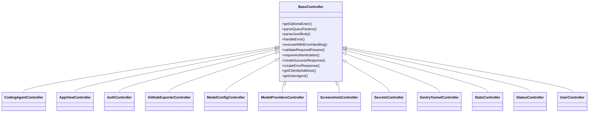

# BaseController

## Purpose
Provides a common abstract base class for all API controllers, encapsulating shared logic for error handling, response formatting, authentication, and utility methods.

## Core Components
- BaseController (abstract class)

## Responsibilities
- Standardize error handling and logging for all controllers
- Provide methods for parsing requests (query params, JSON bodies)
- Enforce authentication and required parameters
- Format success and error responses in a consistent structure
- Utility methods for extracting client IP, user agent, etc.

## Key Interactions
- **authMiddleware**: Used for optional and required authentication ([API Types and Routing](API Types and Routing.md))
- **ControllerErrorHandler, ErrorHandler**: Centralized error handling ([Validation Utilities](Validation Utilities.md))

## Component Diagram

## Related Modules
- [API Types and Routing](API Types and Routing.md)
- [Validation Utilities](Validation Utilities.md)
