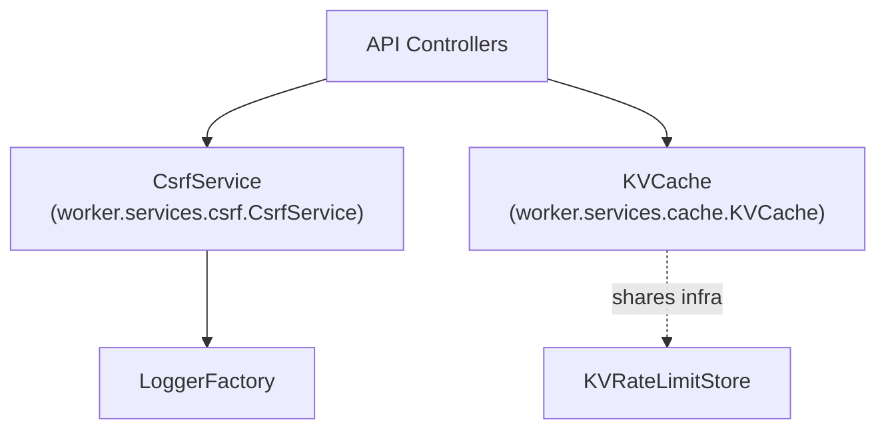

# Cache and CSRF Module Documentation

## Introduction and Purpose

The **Cache and CSRF** module provides two critical infrastructural services for the system:

- **KVCache**: A key-value caching layer for efficient, temporary data storage, supporting TTL (time-to-live) and namespacing.
- **CsrfService**: A robust Cross-Site Request Forgery (CSRF) protection service, implementing the double-submit cookie pattern to secure state-changing HTTP requests.

These services are foundational for both performance (via caching) and security (via CSRF protection) across the backend API and service layers.

## Architecture Overview

- **KVCache** is used by API controllers and other backend services for fast, ephemeral data storage.
- **CsrfService** is invoked by API controllers to enforce CSRF protection on incoming requests, logging security events via the Logger module.
- Both modules may share underlying infrastructure with other caching/rate-limiting services.

## High-Level Functionality of Sub-Modules

### 1. KVCache
- Provides a namespaced, TTL-enabled key-value cache abstraction over a Cloudflare KV store.
- Supports get, set, delete, and pattern-based invalidation operations.
- Used for caching API responses, session data, or other ephemeral state.
- [See detailed documentation in KVCache sub-module](KVCache.md)

### 2. CsrfService
- Implements CSRF protection using the double-submit cookie pattern.
- Handles token generation, validation, rotation, and secure cookie management.
- Integrates with logging and security event capture for observability.
- [See detailed documentation in CsrfService sub-module](CsrfService.md)

## Module Relationships

- **API Controllers** depend on both KVCache and CsrfService for caching and request security. See [API Controllers](API Controllers.md).
- **Logger** is used by CsrfService for security event logging. See [Logger](Logger.md).
- **Rate Limiting and Caching** module shares similar infrastructure (Cloudflare KV) with KVCache. See [Rate Limiting and Caching](Rate Limiting and Caching.md).
