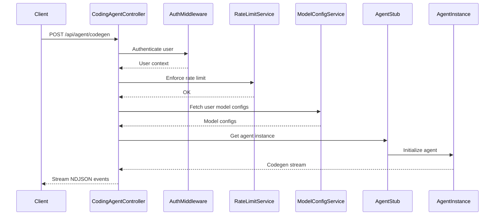

# CodingAgentController

## Purpose
Handles all code generation related endpoints, including starting code generation, managing agent WebSocket connections, connecting to existing agents, and deploying previews.

## Core Components
- CodingAgentController (class)

## Responsibilities
- Start incremental code generation and stream results to the client
- Handle WebSocket connections for real-time code generation
- Connect to existing agent instances and provide connection info
- Deploy code previews to sandbox environments
- Enforce authentication and rate limiting for codegen endpoints
- Integrate with model configuration, agent core, and image upload subsystems

## Key Interactions
- **Agent Core**: Uses agent stubs and agent instances for code generation ([Agent Core](Agent Core.md))
- **ModelConfigService**: Fetches user model configurations ([Database Services and Types](Database Services and Types.md))
- **RateLimitService**: Enforces app creation rate limits ([Rate Limiting and Caching](Rate Limiting and Caching.md))
- **Image Upload**: Handles image attachments for codegen queries
- **WebSocket**: Streams codegen events to clients

## Data Flow

## Endpoints
- `POST /api/agent/codegen` — Start code generation
- `GET /api/agent/:agentId/ws` — WebSocket for codegen
- `GET /api/agent/:agentId/connect` — Connect to existing agent
- `POST /api/agent/:agentId/deploy-preview` — Deploy preview

## Related Modules
- [Agent Core](Agent Core.md)
- [Database Services and Types](Database Services and Types.md)
- [Rate Limiting and Caching](Rate Limiting and Caching.md)
