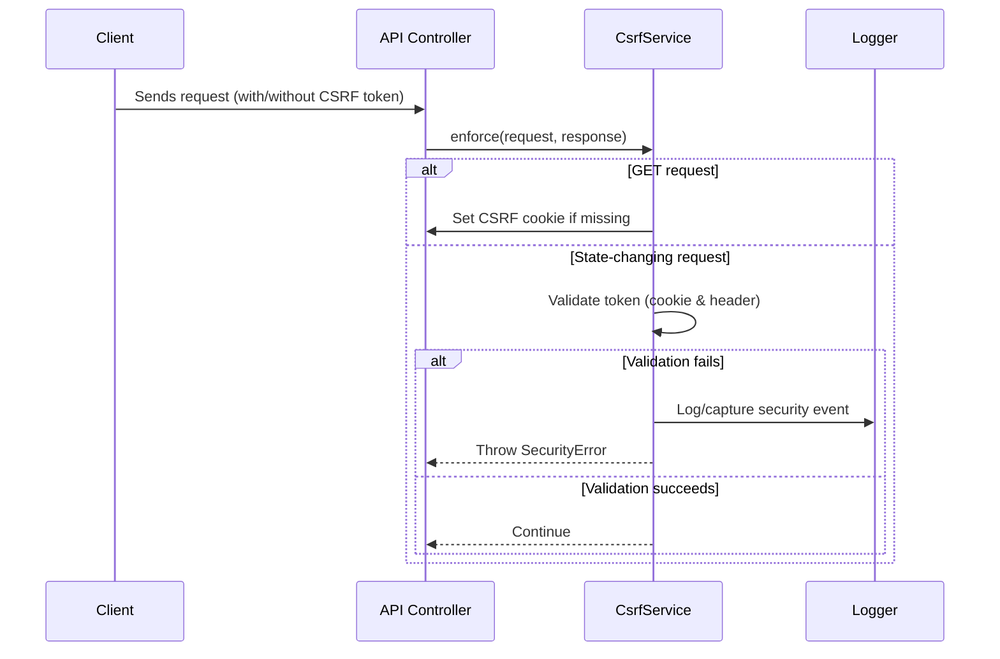

# CsrfService Sub-Module Documentation

## Overview

**CsrfService** implements robust CSRF (Cross-Site Request Forgery) protection for the backend, using the double-submit cookie pattern. It is responsible for generating, validating, rotating, and clearing CSRF tokens, and integrates with logging and security event capture for observability.

## Core Components and Responsibilities

### CsrfService
- **Purpose:** Provides static methods for CSRF token management and enforcement.
- **Responsibilities:**
  - **Token Generation:** Creates cryptographically secure tokens.
  - **Token Storage:** Sets tokens in secure, HTTP-only cookies with timestamps.
  - **Token Extraction:** Retrieves tokens from cookies and headers, supporting legacy formats.
  - **Token Validation:** Validates tokens using the double-submit cookie pattern, with detailed logging and security event capture on failure.
  - **Token Rotation:** Rotates tokens and invalidates old ones.
  - **Token Clearing:** Removes CSRF cookies.
  - **Middleware Enforcement:** Provides a method to enforce CSRF protection as middleware for API endpoints.
- **Integration:**
  - Used by API controllers to secure state-changing requests.
  - Logs security events via the Logger module.
  - Captures security violations for observability.

## Process Flow Diagram

## Related Modules
- [Cache and CSRF](Cache and CSRF.md)
- [Logger](Logger.md)
