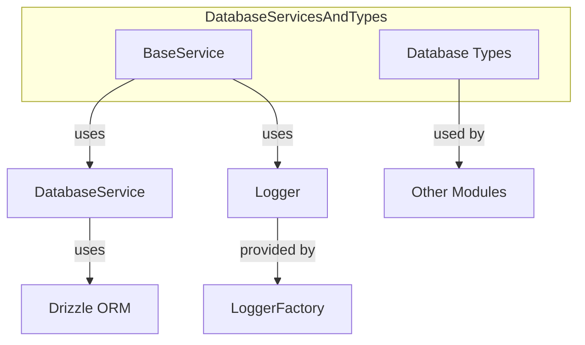
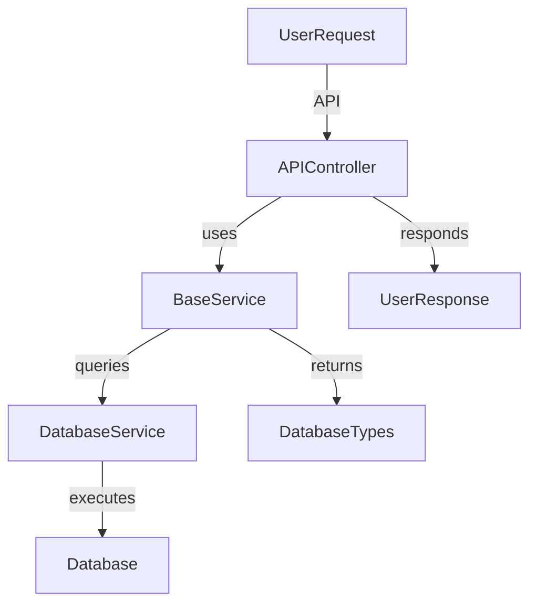

# Database Services and Types

## Introduction and Purpose

The **Database Services and Types** module provides the foundational abstractions and type definitions for all database-related operations in the system. It offers a base service class for implementing domain-specific database services and a comprehensive set of shared types for queries, results, analytics, and error handling. This module ensures consistency, type safety, and robust error management across all database interactions.

## Architecture Overview

The module is composed of two main parts:
- **BaseService**: An abstract class that encapsulates common database access patterns, error handling, and connection management for all domain services.
- **Database Types**: A centralized collection of TypeScript interfaces and types that standardize data structures for database queries, results, analytics, and error reporting.

### High-Level Architecture Diagram

## Component Relationships

- **BaseService** depends on:
    - The lower-level `DatabaseService` (from the database layer, not detailed here)
    - The `Logger` utility (see [Logger.md])
    - Drizzle ORM for query composition
- **Database Types** are imported and used by various modules, including API Controllers, Agent Core, and analytics services, to ensure consistent data contracts.

## Sub-Modules and Core Functionality

### 1. BaseService
- Provides a base class for all domain-specific database services
- Handles database connection management, error logging, and type-safe query construction
- See detailed documentation: [BaseService.md]

### 2. Database Types
- Defines all shared interfaces and types for database operations, including:
    - Query options and pagination
    - App, user, team, and board statistics
    - Operation results and error handling
    - Analytics and health check types
- See detailed documentation: [database-types.md]

## Integration with the Overall System

- **API Controllers**: Use the types and services from this module to implement endpoint logic and data validation ([API Controllers.md])
- **Agent Core**: Leverages database types for state management and analytics ([Agent Core.md])
- **Logger**: Used for error reporting and diagnostics ([Logger.md])

## Data Flow Diagram

## See Also
- [API Controllers.md]
- [Agent Core.md]
- [Logger.md]
