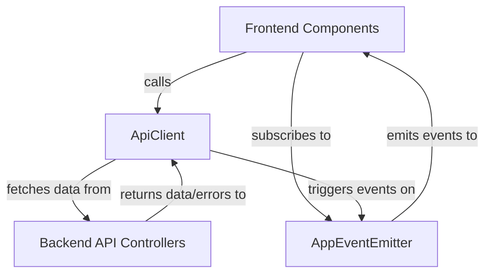
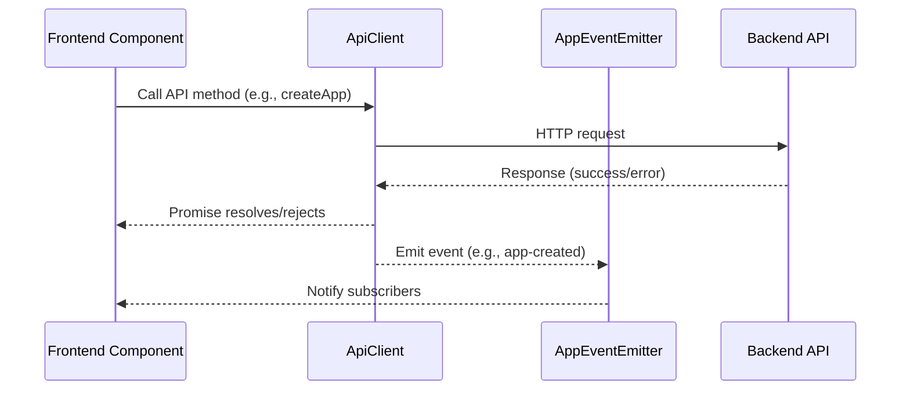

# Frontend API Client and Events

## Introduction and Purpose

The **Frontend API Client and Events** module provides a unified, type-safe interface for all frontend-to-backend API interactions and a simple event system for app-related state changes. It abstracts the complexity of HTTP requests, authentication, error handling, and event-driven communication, enabling frontend components to interact with backend services and coordinate app state changes efficiently.

## Architecture Overview

This module consists of two main sub-modules:
- **API Client**: Handles all API requests, authentication, CSRF protection, error handling, and provides methods for all major backend endpoints.
- **App Events**: Implements a lightweight event emitter for app lifecycle events (create, update, delete), allowing decoupled communication between UI components.

### High-Level Architecture

- **ApiClient** acts as the gateway for all frontend API calls, handling authentication, CSRF, and error management.
- **AppEventEmitter** enables event-driven updates across the UI, e.g., when an app is created, updated, or deleted.

## Component Relationships

- **ApiClient** depends on API types from [Frontend API Types](Frontend%20API%20Types.md) and interacts with backend endpoints defined in [API Controllers](API%20Controllers.md).
- **AppEventEmitter** is used by frontend components to listen for and emit app-related events, supporting a reactive UI.

## Sub-Modules and Their Functionality

### 1. API Client ([api-client.md](api-client.md))
- Provides a singleton `apiClient` instance for all API operations.
- Handles authentication, CSRF token management, error interception, and exposes methods for all major backend endpoints (apps, users, models, secrets, etc.).
- Supports streaming responses and custom error classes.
- See [api-client.md](api-client.md) for detailed documentation.

### 2. App Events ([app-events.md](app-events.md))
- Implements a simple event emitter for app lifecycle events (created, updated, deleted).
- Allows components to subscribe/unsubscribe to specific app events and emit events as needed.
- See [app-events.md](app-events.md) for detailed documentation.

## Data Flow Diagram

## Integration in the Overall System

- The module is the primary bridge between frontend UI and backend services, ensuring secure, reliable, and maintainable data flow.
- It is used by all frontend components that require backend data or need to react to app state changes.
- Closely interacts with [Frontend API Types](Frontend%20API%20Types.md), [API Controllers](API%20Controllers.md), and [Frontend Components](Frontend%20Components.md).

---

For detailed sub-module documentation, see:
- [API Client](api-client.md)
- [App Events](app-events.md)

---

**Related Modules:**
- [Frontend API Types](Frontend%20API%20Types.md)
- [API Controllers](API%20Controllers.md)
- [Frontend Components](Frontend%20Components.md)
