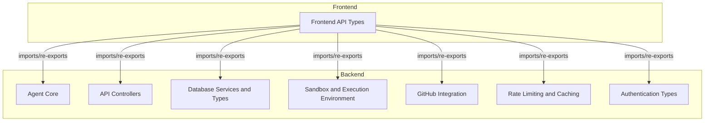
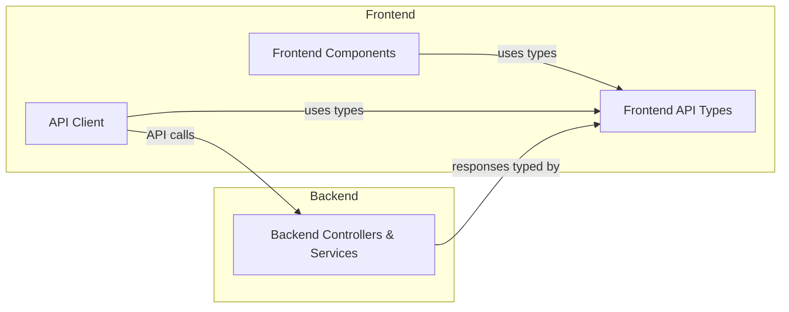

# Frontend API Types

## Introduction

The **Frontend API Types** module serves as the single source of truth for all type definitions used in communication between the frontend and backend (worker) services. By centralizing type imports and exports, this module ensures type safety, consistency, and maintainability across the application. It acts as a bridge, re-exporting types from backend modules and defining frontend-specific types where necessary.

## Core Functionality

- **Centralized Type Management:** Imports and re-exports a wide range of types from backend (worker) modules, including API responses, database entities, agent/code generation types, authentication, and more.
- **Frontend-Specific Types:** Defines types and interfaces used exclusively on the frontend, such as `FileType` and `StreamingResponse`.
- **Type Synchronization:** Ensures that the frontend and backend remain in sync regarding data contracts, reducing the risk of runtime errors due to type mismatches.

## Key Components

### 1. `FileType`
Represents a file entity exchanged between the frontend and backend, especially in code generation and chat contexts.

```typescript
interface FileType {
  filePath: string;
  fileContents: string;
  explanation?: string;
  isGenerating?: boolean;
  needsFixing?: boolean;
  hasErrors?: boolean;
  language?: string;
}
```

- **filePath:** Path of the file in the project.
- **fileContents:** The actual content of the file.
- **explanation:** (Optional) Explanation or description of the file.
- **isGenerating:** (Optional) Indicates if the file is currently being generated.
- **needsFixing:** (Optional) Indicates if the file requires fixes.
- **hasErrors:** (Optional) Indicates if the file has errors.
- **language:** (Optional) Programming language of the file.

### 2. `StreamingResponse`
Wraps a streaming HTTP response, typically used for agent session creation and real-time data delivery.

```typescript
interface StreamingResponse {
  success: boolean;
  stream: Response;
}
```

- **success:** Indicates if the streaming request was successful.
- **stream:** The actual streaming `Response` object.

### 3. Type Re-exports
The module re-exports a comprehensive set of types from backend modules, including but not limited to:
- API response types (e.g., `ControllerResponse`, `ApiResponse`)
- Database types (e.g., `App`, `User`, `UserModelConfig`)
- Agent and code generation types (e.g., `BlueprintType`, `GeneratedFile`, `CodeGenState`)
- Authentication types (e.g., `AuthSession`, `AuthUser`, `OAuthProvider`)
- WebSocket and streaming types
- Model configuration and provider types
- Error and status types

For detailed definitions, refer to the respective backend module documentation:
- [Agent Core](Agent Core.md)
- [API Controllers](API Controllers.md)
- [Database Services and Types](Database Services and Types.md)
- [Sandbox and Execution Environment](Sandbox and Execution Environment.md)
- [GitHub Integration](GitHub Integration.md)
- [Rate Limiting and Caching](Rate Limiting and Caching.md)
- [Authentication Types](Authentication Types.md)

## Architecture and Component Relationships

The **Frontend API Types** module is architected as a thin, centralized layer that:
- **Imports** types from backend (worker) modules
- **Defines** frontend-specific types
- **Re-exports** all types for use throughout the frontend codebase

This design ensures that all API-related types used in the frontend are consistent with backend definitions, and any changes in backend types are immediately reflected in the frontend after updating imports.

### Mermaid Diagram: Module Relationships



### Mermaid Diagram: Data Flow



## How This Module Fits Into the Overall System

- **Usage:** All frontend components, API clients, and event systems import types from this module to ensure type safety and consistency.
- **Integration:** By re-exporting backend types, the module guarantees that the frontend always uses up-to-date type definitions, minimizing integration errors.
- **Maintainability:** Centralizing type definitions reduces duplication and simplifies updates when backend contracts change.

## References
- For detailed type definitions and backend logic, see:
  - [Agent Core](Agent Core.md)
  - [API Controllers](API Controllers.md)
  - [Database Services and Types](Database Services and Types.md)
  - [Sandbox and Execution Environment](Sandbox and Execution Environment.md)
  - [GitHub Integration](GitHub Integration.md)
  - [Rate Limiting and Caching](Rate Limiting and Caching.md)
  - [Authentication Types](Authentication Types.md)
