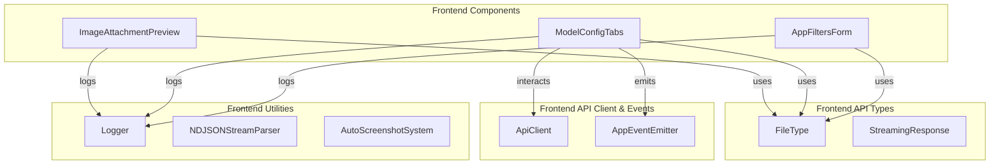
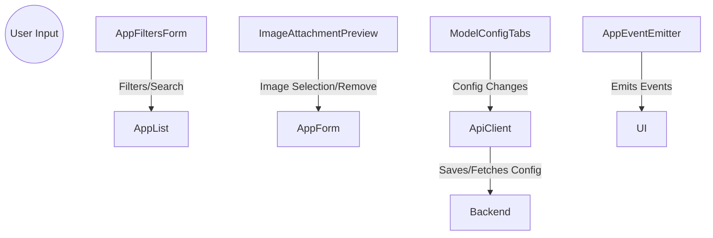

# Frontend Components Module Documentation

## Introduction and Purpose

The **Frontend Components** module provides reusable, composable UI components and configuration interfaces for the frontend of the application. These components are designed to support core user interactions such as image preview, model configuration, and application filtering, enabling a consistent and efficient user experience across the platform.

## Architecture Overview

The module is structured as a collection of independent React components, each responsible for a specific UI or configuration task. These components interact with frontend API types, event emitters, and utility modules, and are often used within higher-level pages or feature modules.

### High-Level Architecture

## Sub-Modules and Core Components

### 1. Image Attachment Preview
- **Component:** `ImageAttachmentPreviewProps`
- **Purpose:** Displays previews of image attachments with support for removal and compact display.
- **Details:** See [Image Attachment Preview](image-attachment-preview.md)

### 2. Model Config Tabs
- **Component:** `AgentDisplayConfig`
- **Purpose:** Provides a tabbed interface for configuring AI model settings per agent, organized by workflow stage.
- **Details:** See [Model Config Tabs](model-config-tabs.md)

### 3. App Filters Form
- **Component:** `AppFiltersFormProps`
- **Purpose:** Renders a form for searching and filtering applications by various criteria.
- **Details:** See [App Filters Form](AppFiltersForm.md)

## Component Relationships and Integration

- These components are typically used within frontend pages or feature modules, and may depend on types and utilities from the [Frontend API Types](Frontend%20API%20Types.md) and [Frontend Utilities](Frontend%20Utilities.md) modules.
- The `ModelConfigTabs` component may interact with backend configuration APIs via the [Frontend API Client and Events](Frontend%20API%20Client%20and%20Events.md) module.

## Data Flow Diagram

## See Also
- [Frontend API Types](Frontend%20API%20Types.md)
- [Frontend API Client and Events](Frontend%20API%20Client%20and%20Events.md)
- [Frontend Utilities](Frontend%20Utilities.md)
- [Frontend Contexts and Hooks](Frontend%20Contexts%20and%20Hooks.md)

---

*For detailed component documentation, refer to the respective sub-module files linked above.*
