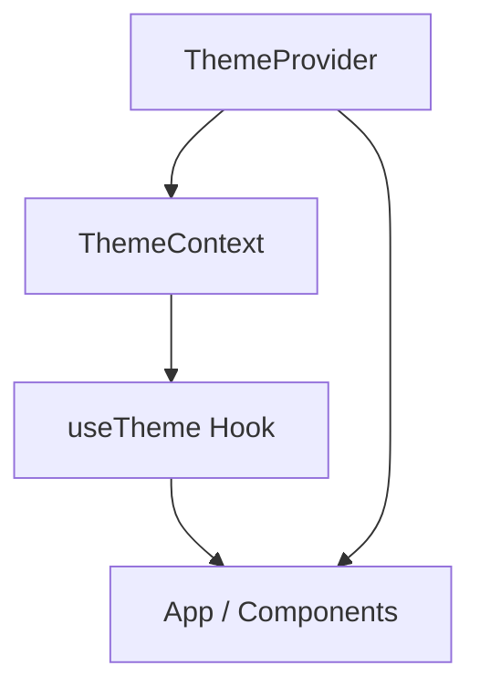
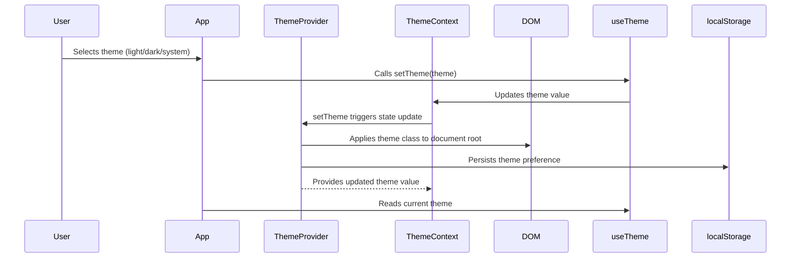

# Frontend Contexts and Hooks

## Introduction

The **Frontend Contexts and Hooks** module provides React context and custom hooks to manage global state and cross-cutting concerns in the frontend application. Its primary focus is to enable consistent theming (light, dark, or system) across the user interface, but it can be extended to support other shared frontend concerns. This module is essential for maintaining a unified user experience and for enabling components to access and modify global state in a type-safe and React-idiomatic way.

## Core Functionality

- **Theme Management**: Provides a context and hook for managing the application's theme (light, dark, or system). It ensures the selected theme is applied to the document root and persists user preference in local storage.
- **Custom Hooks**: Exposes hooks (e.g., `useTheme`) for easy access to context values within React components.
- **Provider Pattern**: Supplies a `ThemeProvider` component to wrap the application or component tree, making the context available throughout the UI.

## Architecture and Component Relationships

### Core Component: `ThemeContextType`
- **Location**: `src.contexts.theme-context.ThemeContextType`
- **Type Definition**:
  - `theme`: Current theme value (`'light' | 'dark' | 'system'`).
  - `setTheme`: Function to update the theme.

### Supporting Components
- **ThemeContext**: React context holding the theme state and setter.
- **ThemeProvider**: React provider component that manages theme state, applies the theme to the DOM, and listens for system theme changes.
- **useTheme**: Custom hook for consuming the theme context.

### Component Interaction Diagram

### Data Flow Diagram

## Integration with the Overall System

- **Frontend Components**: UI components consume the theme context via the `useTheme` hook to adjust their appearance based on the current theme. See [Frontend Components.md] for more details.
- **Frontend Utilities**: May interact with context for logging or analytics. See [Frontend Utilities.md].
- **Frontend API Client and Events**: Not directly dependent, but may use context for user experience consistency. See [Frontend API Client and Events.md].

## Extensibility

The context and provider pattern used here can be extended to manage other global frontend states, such as authentication, localization, or feature flags, by defining additional contexts and hooks following the same architectural principles.

## References
- [Frontend Components.md]
- [Frontend Utilities.md]
- [Frontend API Client and Events.md]

