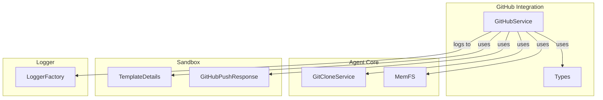
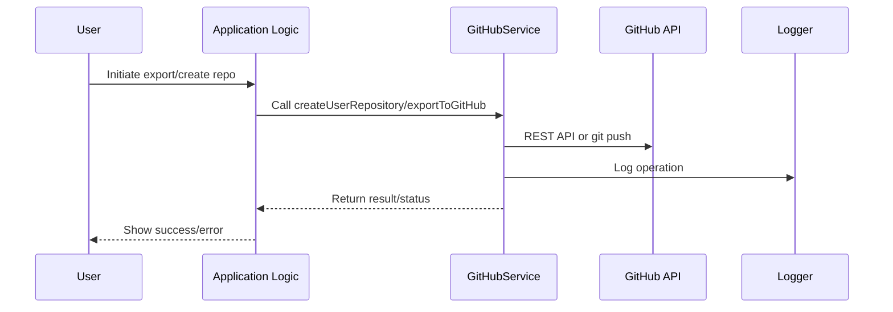

# GitHub Integration Module

## Introduction and Purpose

The **GitHub Integration** module provides a robust interface for interacting with GitHub repositories, enabling repository creation, export, synchronization, and status checking. It acts as the bridge between the application's internal code and the GitHub platform, supporting both REST API and native git push protocols. This module is essential for features such as exporting generated code, managing repository metadata, and ensuring seamless developer workflows.

## Architecture Overview

The GitHub Integration module is composed of service and type definition sub-modules:
- **GitHubService**: Implements the core logic for repository management, export, and synchronization.
- **Types**: Defines the data structures and error types used throughout the service.

It interacts with other modules such as the [Agent Core](Agent Core.md) (for repository building and memory file systems), [Logger](Logger.md) (for logging), and [Sandbox and Execution Environment](Sandbox and Execution Environment.md) (for template and git object management).

### High-Level Architecture

## Sub-Modules and Core Functionality

### 1. GitHubService
- **Purpose**: Implements all core GitHub operations, including repository creation, export, synchronization, and status checks.
- **Key Responsibilities**:
    - Creating repositories for users
    - Exporting code to GitHub via git push or REST API
    - Checking repository existence and status
    - Modifying repository files (e.g., README)
    - Logging all operations and errors
- **See**: [GitHubService (worker.services.github.GitHubService.GitHubService)](worker.services.github.GitHubService.GitHubService.md)

### 2. Types
- **Purpose**: Defines all type interfaces, result objects, and error classes used by the service.
- **Key Responsibilities**:
    - Standardizing data structures for repository and token management
    - Providing error handling constructs
- **See**: [Types (worker.services.github.types)](worker.services.github.types.md)

## Component Interactions

## Integration with the Overall System

- **Agent Core**: Supplies repository build logic and memory file system (MemFS) for in-memory git operations.
- **Sandbox and Execution Environment**: Provides template details and git object management for repository export.
- **Logger**: Used for all operational and error logging.

For details on these modules, see:
- [Agent Core](Agent Core.md)
- [Sandbox and Execution Environment](Sandbox and Execution Environment.md)
- [Logger](Logger.md)

## Further Reading
- [worker.services.github.GitHubService.GitHubService.md](worker.services.github.GitHubService.GitHubService.md)
- [worker.services.github.types.md](worker.services.github.types.md)
