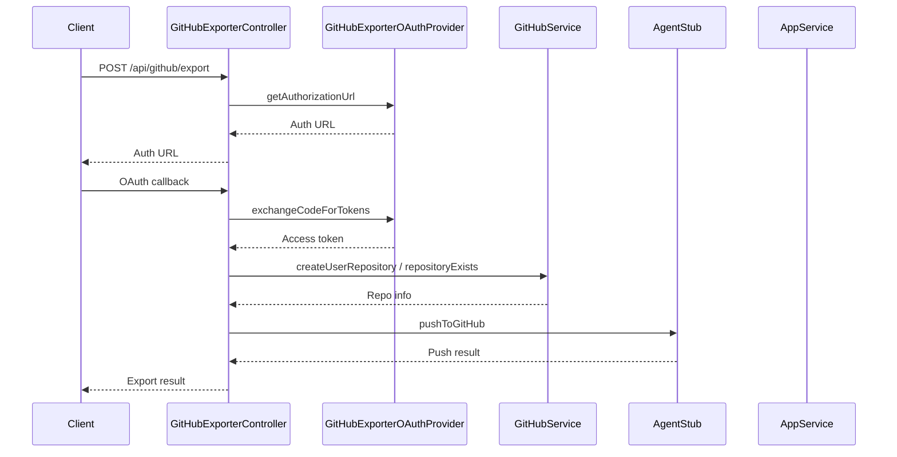

# GitHubExporterController

## Purpose
Handles endpoints for exporting code to GitHub repositories, managing OAuth flows, and checking repository sync status.

## Core Components
- GitHubExporterController (class)
- GitHubExportData (type)

## Responsibilities
- Initiate GitHub OAuth for repository export
- Create or sync repositories and push agent-generated files
- Check remote repository status and sync state
- Handle OAuth callback and token exchange

## Key Interactions
- **GitHubService**: Manages repository creation, existence checks, and file pushes ([GitHub Integration](GitHub Integration.md))
- **Agent Core**: Provides agent files for export ([Agent Core](Agent Core.md))
- **AppService**: Fetches app details and updates repository info ([Database Services and Types](Database Services and Types.md))
- **GitHubExporterOAuthProvider**: Handles OAuth token exchange

## Data Flow

## Endpoints
- `POST /api/github/export` — Initiate export
- `GET /api/github/callback` — OAuth callback
- `POST /api/github/check-remote` — Check remote status

## Related Modules
- [GitHub Integration](GitHub Integration.md)
- [Agent Core](Agent Core.md)
- [Database Services and Types](Database Services and Types.md)
