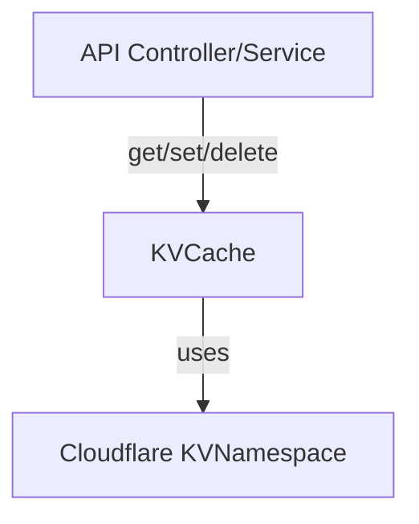

# KVCache Sub-Module Documentation

## Overview

**KVCache** provides a simple, namespaced, and TTL-enabled key-value cache abstraction over a Cloudflare KV store. It is designed for fast, ephemeral data storage and is used by API controllers and backend services for caching API responses, session data, and other temporary state.

## Core Components and Responsibilities

### KVCacheOptions
- **Purpose:** Configuration options for the cache, including TTL (time-to-live, in seconds) and key prefixing for namespacing.
- **Fields:**
  - `ttl?`: Optional number of seconds before a cache entry expires.
  - `prefix?`: Optional string to namespace cache keys.

### KVCache
- **Purpose:** Main cache class that interacts with the Cloudflare KVNamespace.
- **Responsibilities:**
  - **Key Generation:** Uses a prefix and key to generate a unique cache key.
  - **Get:** Retrieves a value by key and prefix, parsing JSON.
  - **Set:** Stores a value with optional TTL, serializing to JSON.
  - **Delete:** Removes a specific key.
  - **DeleteByPrefix:** Removes all keys with a given prefix (supports pattern-based invalidation).
  - **Invalidate:** Invalidates multiple patterns (prefixes) in parallel.
- **Usage:**
  - Used by API controllers and backend services for caching.
  - Shares infrastructure with rate limiting (see [Rate Limiting and Caching](Rate Limiting and Caching.md)).

### createKVCache
- **Purpose:** Factory function to instantiate a KVCache using the environment's KV namespace.

## Data Flow Diagram

## Related Modules
- [Cache and CSRF](Cache and CSRF.md)
- [Rate Limiting and Caching](Rate Limiting and Caching.md)
