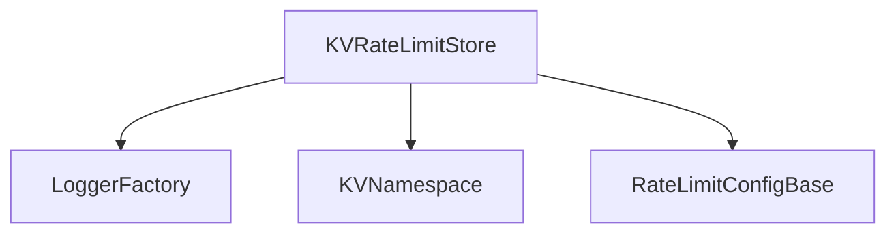

# KVRateLimitStore (KVRateLimitStore.ts)

## Overview
`KVRateLimitStore` implements a sliding window rate limiting algorithm using a key-value store (KV). It supports both main and burst window limits, and is designed for distributed environments where consistency and performance are important.

## Core Responsibilities
- Increment and track request counts in time buckets
- Support burst and main window limits
- Provide remaining quota information
- Handle retries and fail-open logic for robustness

## Key Methods
- `increment(kv, key, config, incrementBy)`: Increments the count for the current bucket, checks limits, and returns the result.
- `getRemainingLimit(kv, key, config)`: Returns the remaining quota for a given key and config.
- `generateBucketKeys(key, now, windowMs, bucketSizeMs)`: Generates the set of bucket keys for a sliding window.
- `incrementBucketWithRetry(kv, bucketKey, ttlSeconds, maxRetries, incrementBy)`: Handles atomic increment with retry logic.

## Algorithm
- Uses time-bucketed keys to implement a sliding window counter.
- Supports both main and burst windows for flexible rate limiting.
- Fails open (allows requests) if the KV store is unavailable, to avoid blocking all users.

## Component Interaction Diagram

## Related Files
- [rateLimits.md]
- [config.md]
- [Logger.md]
