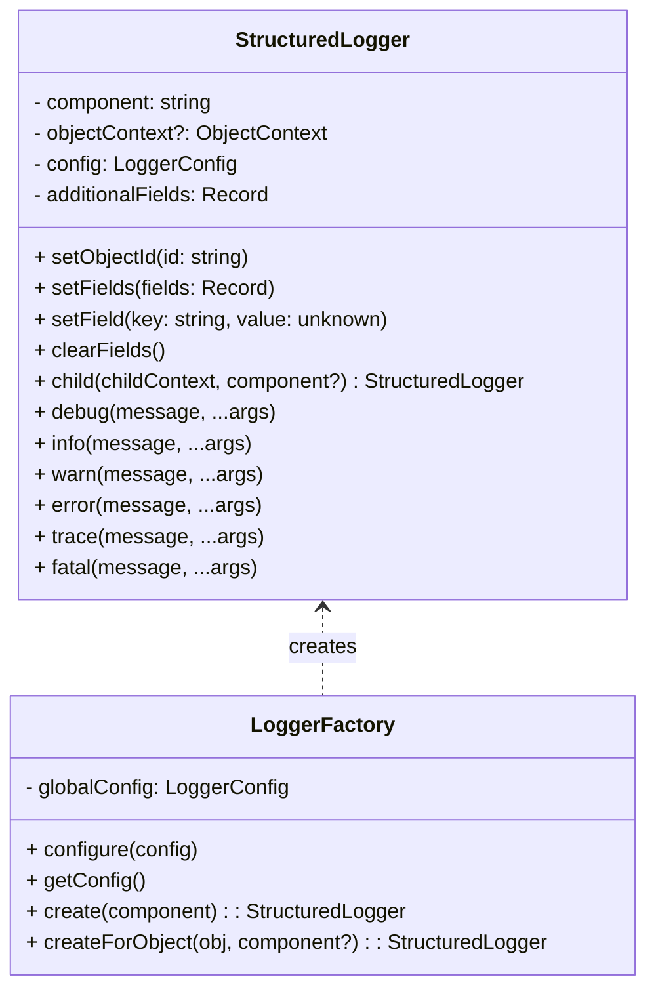
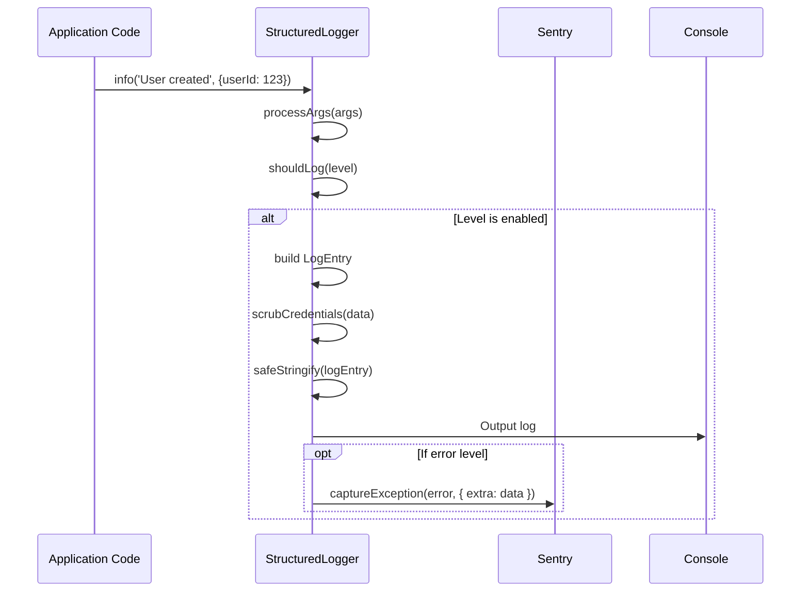

# Logger Module Documentation

## Introduction

The Logger module provides a robust, structured logging system for the application, supporting both development and production environments. It enables consistent, context-rich log entries, credential scrubbing, and integration with error tracking systems such as Sentry. The module is designed for extensibility and ease of use, allowing developers to create loggers with component and object context, manage log levels, and output logs in both human-readable and machine-friendly formats.

## Core Functionality

- **Structured Logging:** All logs are output as structured JSON objects, making them easy to parse and analyze.
- **Log Levels:** Supports `debug`, `info`, `warn`, and `error` levels, with configurable thresholds.
- **Contextual Logging:** Loggers can be associated with specific components and objects, and can be extended with additional fields.
- **Child Loggers:** Supports creation of child loggers with extended or overridden context.
- **Pretty Print:** Optionally formats logs for human readability in development.
- **Error Reporting:** Integrates with Sentry for error-level logs.
- **Safe Serialization:** Handles circular references and special object types (e.g., `Error`).

## Architecture Overview

The Logger module is centered around the `StructuredLogger` class and the `LoggerFactory` for global configuration and instantiation. The module is self-contained but integrates with external systems (e.g., Sentry) and is used throughout the backend and API layers.

### Main Components
- **StructuredLogger:** The core logger class, providing all logging methods and context management.
- **LoggerFactory:** Singleton-style factory for global logger configuration and creation.
- **createLogger / createObjectLogger:** Helper functions for instantiating loggers with or without object context.

### Component Relationships



## Data Flow and Process

### Logging a Message



### Logger Creation and Configuration

```mermaid
flowchart TD
    A[Application Startup] --> B[LoggerFactory.configure(config)]
    B --> C[LoggerFactory.create(component)]
    C --> D[StructuredLogger instance]
    D --> E[Used throughout application]
```

## Integration with the System

The Logger module is a foundational utility used by all backend modules, including:
- **Agent Core** ([Agent Core.md])
- **API Controllers** ([API Controllers.md])
- **Database Services and Types** ([Database Services and Types.md])
- **Sandbox and Execution Environment** ([Sandbox and Execution Environment.md])
- **GitHub Integration** ([GitHub Integration.md])
- **Rate Limiting and Caching** ([Rate Limiting and Caching.md])
- **Cache and CSRF** ([Cache and CSRF.md])
- **Validation Utilities** ([Validation Utilities.md])
- **Authentication Types** ([Authentication Types.md])

It is also referenced by frontend utilities for client-side logging ([Frontend Utilities.md]).

## Usage Example

```typescript
import { LoggerFactory } from 'worker.logger.core';

// Configure global logger (e.g., at app startup)
LoggerFactory.configure({ level: 'debug', prettyPrint: true });

// Create a logger for a component
const logger = LoggerFactory.create('MyComponent');

logger.info('Component initialized', { config: 'value' });

// Create a logger with object context
const obj = { id: 'abc123', type: 'User' };
const objLogger = LoggerFactory.createForObject(obj);
objLogger.warn('Potential issue detected', { details: '...' });
```

## References
- [Agent Core.md]
- [API Controllers.md]
- [Database Services and Types.md]
- [Sandbox and Execution Environment.md]
- [GitHub Integration.md]
- [Rate Limiting and Caching.md]
- [Cache and CSRF.md]
- [Validation Utilities.md]
- [Authentication Types.md]
- [Frontend Utilities.md]
