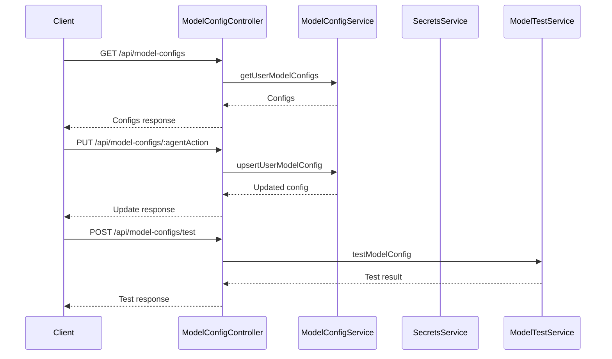

# ModelConfigController

## Purpose
Handles CRUD operations for user model configurations, BYOK (Bring Your Own Key) providers, and model configuration testing.

## Core Components
- ModelConfigController (class)

## Responsibilities
- Retrieve, update, and reset user model configurations
- Validate model access and BYOK status
- Test model configurations with user or platform keys
- List available BYOK providers and models

## Key Interactions
- **ModelConfigService**: Manages user model configs ([Database Services and Types](Database Services and Types.md))
- **SecretsService**: Retrieves user BYOK keys ([Database Services and Types](Database Services and Types.md))
- **ModelTestService**: Tests model configurations ([Database Services and Types](Database Services and Types.md))
- **BYOK Helper**: Validates model access and lists available models

## Data Flow

## Endpoints
- `GET /api/model-configs` — List all configs
- `GET /api/model-configs/:agentAction` — Get config
- `PUT /api/model-configs/:agentAction` — Update config
- `DELETE /api/model-configs/:agentAction` — Delete/reset config
- `POST /api/model-configs/test` — Test config
- `POST /api/model-configs/reset-all` — Reset all configs
- `GET /api/model-configs/defaults` — Get default configs
- `GET /api/model-configs/byok-providers` — List BYOK providers/models

## Related Modules
- [Database Services and Types](Database Services and Types.md)
