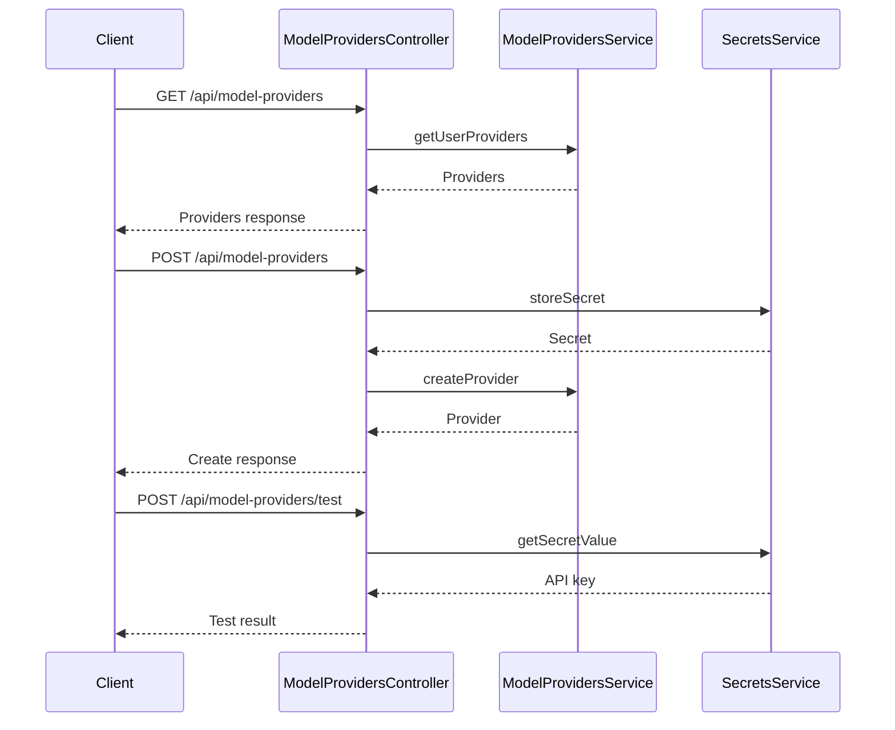

# ModelProvidersController

## Purpose
Handles CRUD operations for user custom model providers and their associated secrets.

## Core Components
- ModelProvidersController (class)

## Responsibilities
- List, create, update, and delete custom model providers
- Store and manage provider API keys as secrets
- Test provider connectivity and API access

## Key Interactions
- **ModelProvidersService**: Manages provider records ([Database Services and Types](Database Services and Types.md))
- **SecretsService**: Stores and retrieves provider API keys ([Database Services and Types](Database Services and Types.md))

## Data Flow

## Endpoints
- `GET /api/model-providers` — List providers
- `GET /api/model-providers/:id` — Get provider
- `POST /api/model-providers` — Create provider
- `PUT /api/model-providers/:id` — Update provider
- `DELETE /api/model-providers/:id` — Delete provider
- `POST /api/model-providers/test` — Test provider

## Related Modules
- [Database Services and Types](Database Services and Types.md)
