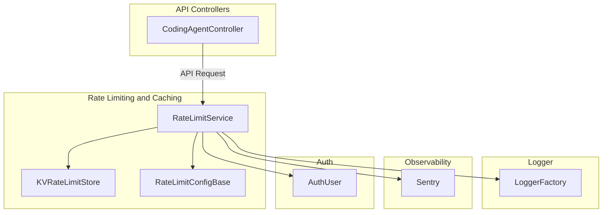
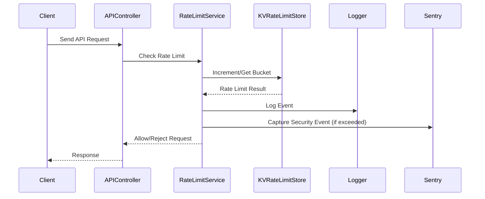

# Rate Limiting and Caching

## Introduction and Purpose

The **Rate Limiting and Caching** module is responsible for enforcing usage limits and managing request quotas across the platform, as well as providing caching mechanisms for improved performance and resource efficiency. It ensures fair usage, prevents abuse, and helps maintain system stability by controlling the rate at which users and services can access APIs and resources.

## Architecture Overview

The module is composed of several key components:
- **RateLimitService**: The main service orchestrating rate limit enforcement for different types of actions (API, authentication, app creation, LLM calls).
- **KVRateLimitStore**: Implements a sliding window rate limiting algorithm using a key-value store (KV), supporting burst and main window limits.
- **RateLimitConfigBase**: Defines configuration schemas for different rate limiting backends (KV, Durable Object, external rate limiter bindings).

The module interacts with other system modules, such as authentication, logging, and observability, to provide a comprehensive rate limiting solution.

### High-Level Architecture Diagram

## Sub-Modules and Core Functionality

### 1. [RateLimitService](rateLimits.md)
See [rateLimits.md](rateLimits.md) for detailed documentation on the RateLimitService sub-module.

### 2. [KVRateLimitStore](KVRateLimitStore.md)
See [KVRateLimitStore.md](KVRateLimitStore.md) for detailed documentation on the KVRateLimitStore sub-module.

### 3. [RateLimitConfigBase](config.md)
See [config.md](config.md) for detailed documentation on the RateLimitConfigBase sub-module.

## Integration with Other Modules

- **API Controllers**: Enforce rate limits on incoming requests before processing.
- **Logger**: Used for structured logging of rate limit events and errors ([Logger.md]).
- **Observability/Sentry**: Captures security events when limits are exceeded ([Logger.md]).
- **Authentication**: Identifies users and requests for per-user or per-request rate limiting ([auth-types.md]).
- **Cache and CSRF**: Related but separate; see [Cache and CSRF.md] for details on caching and CSRF protection.

## Data Flow Diagram

## See Also
- [Cache and CSRF.md] for caching and CSRF protection
- [Logger.md] for logging and observability
- [auth-types.md] for authentication types
- [API Controllers.md] for API entry points
