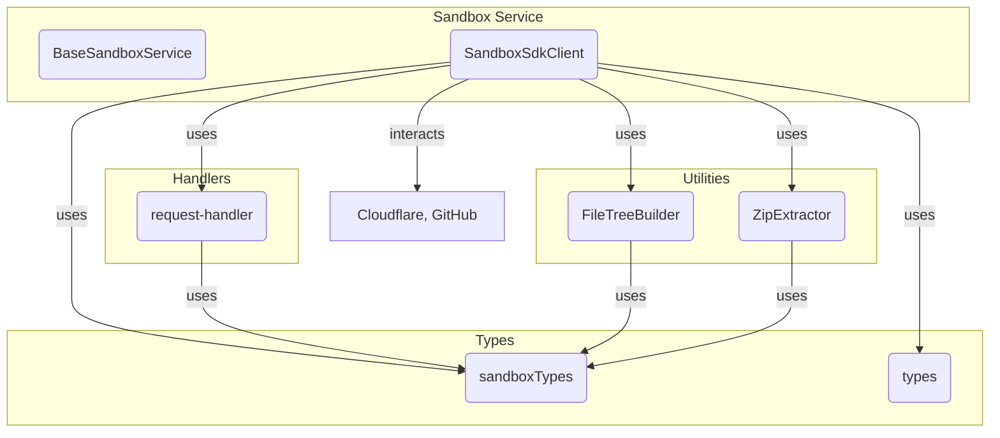

# Sandbox and Execution Environment

## Introduction and Purpose

The Sandbox and Execution Environment module is responsible for providing isolated, secure, and reproducible environments for code execution, file management, and deployment. It enables the creation, management, and teardown of sandboxed instances, supports file operations, command execution, static analysis, error management, and deployment to Cloudflare Workers. This module is essential for running user code safely and efficiently, supporting features such as template management, resource provisioning, and integration with external services like GitHub and Cloudflare.

## Architecture Overview

The module is composed of several sub-modules, each handling a specific aspect of the sandbox lifecycle. The architecture is designed for extensibility and security, leveraging Cloudflare Workers and Durable Objects for isolation and scalability.

```mermaid
graph TD
    A[BaseSandboxService] -->|Defines API| B[SandboxSdkClient]
    B --> C[FileTreeBuilder]
    B --> D[ZipExtractor]
    B --> E[ResourceProvisioner]
    B --> F[TemplateParser]
    B --> G[request-handler (SandboxEnv)]
    B --> H[sandboxTypes]
    B --> I[types]
    B --> J[Cloudflare/External Services]
    B --> K[Logger]
    B --> L[GitHub Integration]
    C --> H
    D --> H
    E --> I
    F --> I
    G --> H
    B -->|Uses| M[API Controllers]
    B -->|Deploys to| N[Cloudflare Workers]
    B -->|Exports to| O[GitHub]
```

## High-Level Functionality of Sub-modules

### 1. BaseSandboxService
- **Purpose:** Abstract base class defining the API for all sandbox operations, including template management, instance lifecycle, file operations, command execution, error management, static analysis, deployment, and GitHub integration.
- **Core Components:** `TemplateInfo`, `StreamEvent`
- **See:** [BaseSandboxService.md]

### 2. SandboxSdkClient
- **Purpose:** Concrete implementation of `BaseSandboxService` that interacts with the Cloudflare sandbox SDK, manages sessions, metadata, file operations, command execution, resource provisioning, and deployment.
- **Core Components:** `StreamEvent`
- **See:** [SandboxSdkClient.md]

### 3. FileTreeBuilder
- **Purpose:** Utility for constructing hierarchical file trees from flat file lists, parsing file system outputs, and generating exclusion patterns for sandboxed environments.
- **Core Components:** `FileTreeBuilder`
- **See:** [FileTreeBuilder.md]

### 4. ZipExtractor
- **Purpose:** In-memory zip extraction service for handling template archives, supporting both text and binary files.
- **Core Components:** `ZipExtractor`
- **See:** [ZipExtractor.md]

### 5. request-handler (SandboxEnv)
- **Purpose:** Handles proxying requests to sandboxed environments, including WebSocket upgrades and port routing, using Cloudflare Durable Objects.
- **Core Components:** `SandboxEnv`
- **See:** [request-handler.md]

### 6. sandboxTypes
- **Purpose:** Defines core types and schemas for file trees, templates, instance details, command execution, API requests/responses, and GitHub integration.
- **Core Components:** `GitHubUserInfo` and many type definitions
- **See:** [sandboxTypes.md]

### 7. types
- **Purpose:** Contains types for resource provisioning and wrangler configuration validation.
- **Core Components:** `WranglerConfigValidationResult`, `ResourceProvisioningOptions`
- **See:** [types.md]

## Component Relationships and Data Flow



## Integration with the Overall System

- **API Controllers:** The Sandbox and Execution Environment module is invoked by API controllers (see [API Controllers.md]) to handle user requests for code execution, file management, and deployment.
- **Database Services:** Stores and retrieves instance metadata and configuration as needed (see [Database Services and Types.md]).
- **GitHub Integration:** Supports exporting and pushing code to GitHub repositories (see [GitHub Integration.md]).
- **Deployment Scripts:** Deploys applications to Cloudflare Workers (see [Deployment Scripts.md]).
- **Logger:** Uses the centralized logging system for observability (see [Logger.md]).

For details on each sub-module, refer to their respective documentation files.
