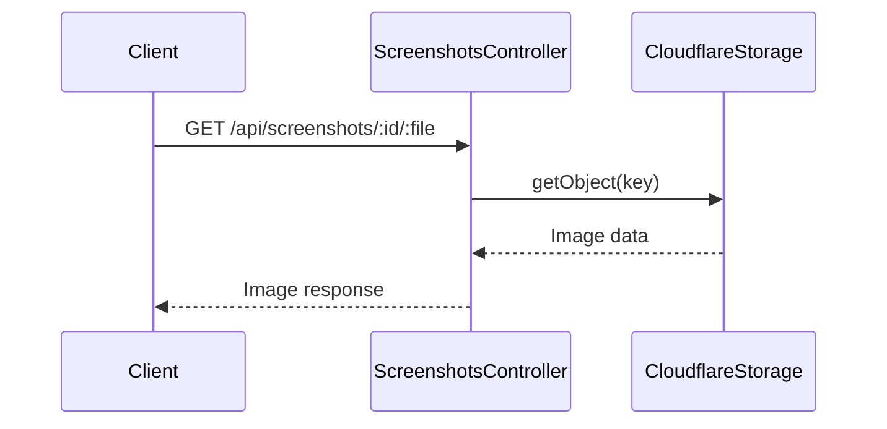

# ScreenshotsController

## Purpose
Serves user-generated screenshots from object storage, with strict validation and security checks.

## Core Components
- ScreenshotsController (class)

## Responsibilities
- Validate and sanitize screenshot request parameters
- Fetch screenshot files from storage (e.g., Cloudflare R2)
- Set appropriate content-type and cache headers
- Return binary image responses for valid requests

## Key Interactions
- **Cloudflare Storage**: Fetches screenshot files from object storage ([Sandbox and Execution Environment](Sandbox and Execution Environment.md))

## Data Flow

## Endpoints
- `GET /api/screenshots/:id/:file` — Serve screenshot image

## Related Modules
- [Sandbox and Execution Environment](Sandbox and Execution Environment.md)
