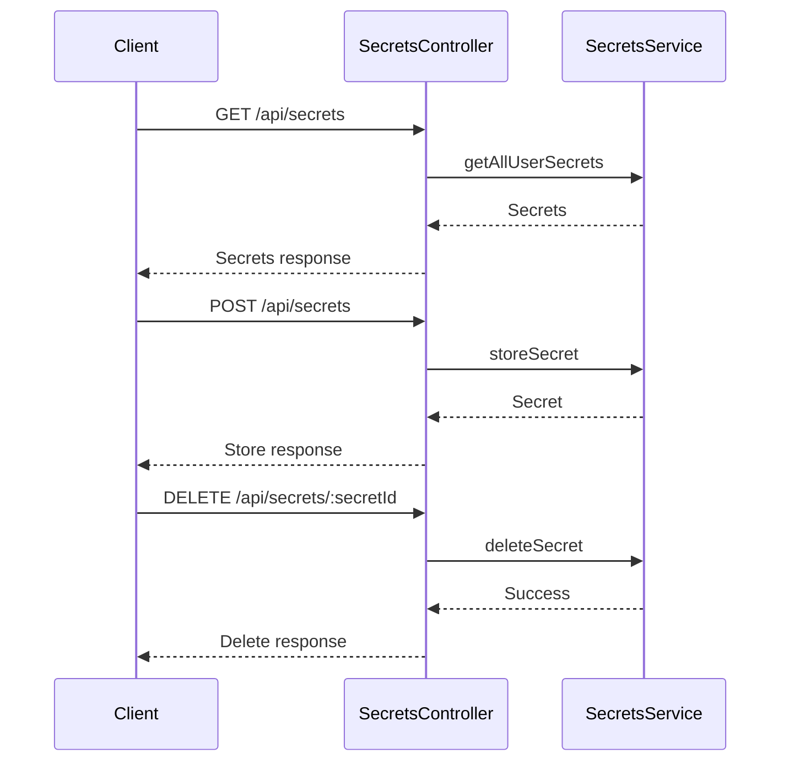

# SecretsController

## Purpose
Handles API endpoints for user secrets and API key management, including storage, retrieval, toggling, and deletion.

## Core Components
- SecretsController (class)

## Responsibilities
- Store and retrieve user secrets (API keys, environment variables)
- Validate and sanitize secret data
- Toggle secret active status
- Delete secrets
- Provide predefined secret templates for common providers

## Key Interactions
- **SecretsService**: Manages secret storage and retrieval ([Database Services and Types](Database Services and Types.md))
- **Secret Templates**: Provides templates for common provider secrets

## Data Flow

## Endpoints
- `GET /api/secrets` — List all secrets
- `POST /api/secrets` — Store secret
- `DELETE /api/secrets/:secretId` — Delete secret
- `PATCH /api/secrets/:secretId/toggle` — Toggle secret active status
- `GET /api/secrets/templates` — List secret templates

## Related Modules
- [Database Services and Types](Database Services and Types.md)
