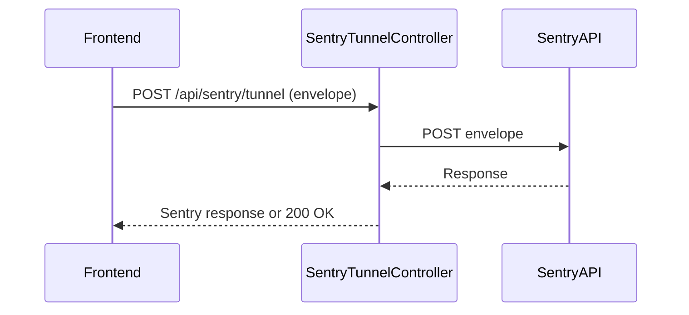

# SentryTunnelController

## Purpose
Proxies Sentry events from the frontend to the Sentry backend, bypassing ad blockers and enforcing DSN validation.

## Core Components
- SentryTunnelController (class)

## Responsibilities
- Receive Sentry envelopes from the frontend
- Validate DSN and forward events to Sentry backend
- Add Cloudflare Access headers if configured
- Return Sentry's response or 200 OK on error (to not block frontend)

## Key Interactions
- **Sentry API**: Forwards events to Sentry backend ([Logger](Logger.md))
- **Cloudflare**: Adds access headers if required ([Deployment Scripts](Deployment Scripts.md))

## Data Flow

## Endpoints
- `POST /api/sentry/tunnel` — Proxy Sentry events

## Related Modules
- [Logger](Logger.md)
- [Deployment Scripts](Deployment Scripts.md)
