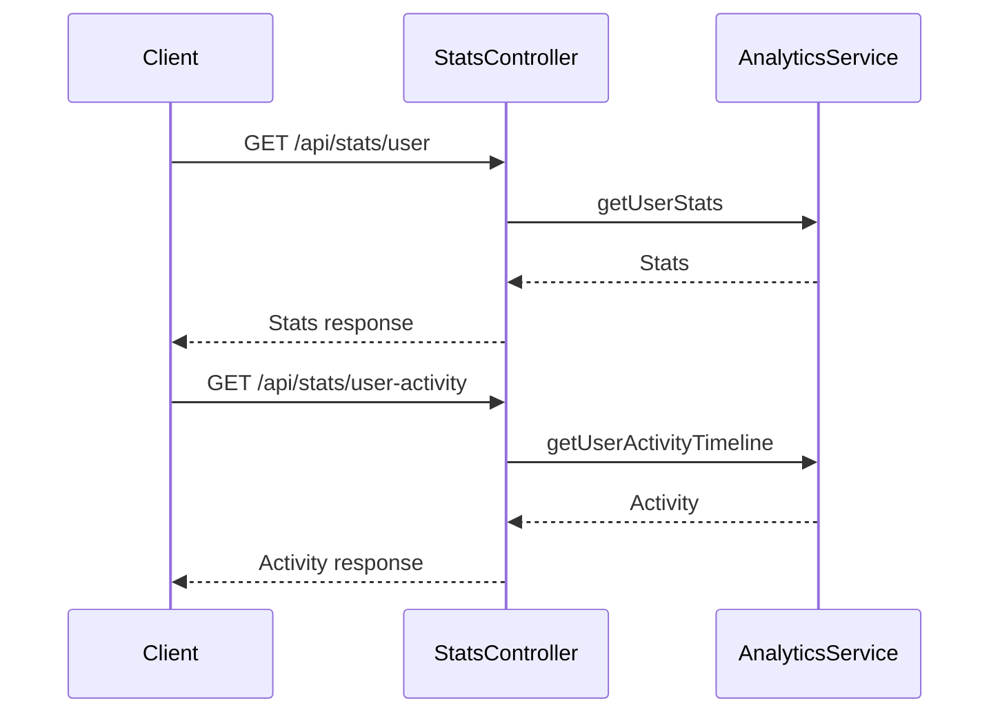

# StatsController

## Purpose
Provides endpoints for retrieving user statistics and activity timelines.

## Core Components
- StatsController (class)

## Responsibilities
- Fetch user statistics (e.g., usage, activity)
- Fetch user activity timeline (recent actions)

## Key Interactions
- **AnalyticsService**: Retrieves user stats and activity ([Database Services and Types](Database Services and Types.md))

## Data Flow

## Endpoints
- `GET /api/stats/user` — Get user stats
- `GET /api/stats/user-activity` — Get user activity timeline

## Related Modules
- [Database Services and Types](Database Services and Types.md)
