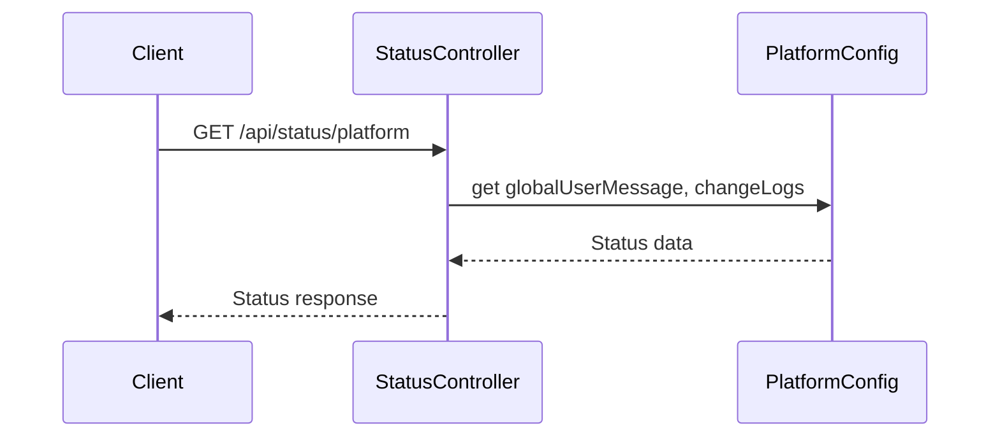

# StatusController

## Purpose
Returns platform-wide status, global user messages, and change logs for the frontend.

## Core Components
- StatusController (class)

## Responsibilities
- Provide global user messages and change logs
- Indicate if there are active platform-wide messages

## Key Interactions
- **Platform Config**: Reads global messaging and change logs from configuration ([Database Services and Types](Database Services and Types.md))

## Data Flow

## Endpoints
- `GET /api/status/platform` — Get platform status

## Related Modules
- [Database Services and Types](Database Services and Types.md)
