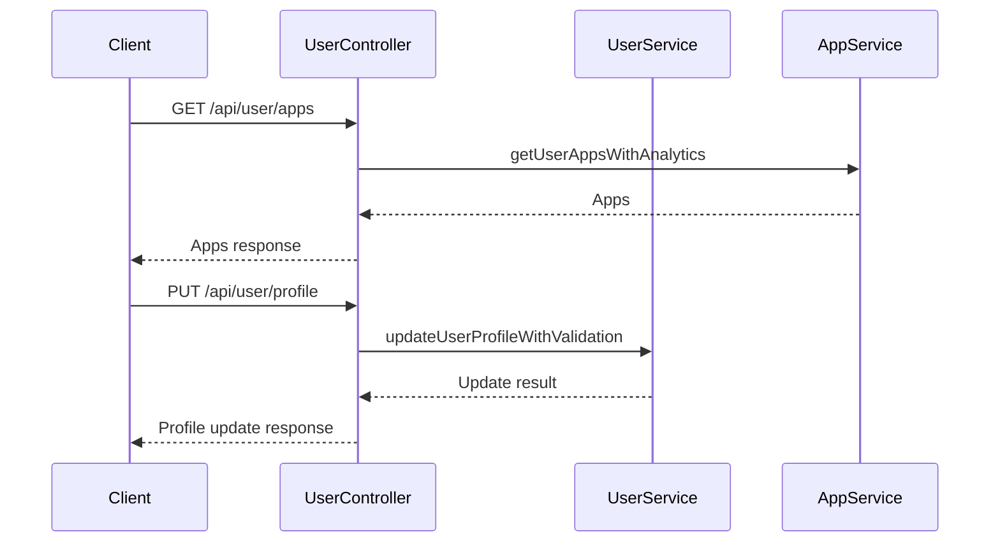

# UserController

## Purpose
Handles user dashboard, profile management, and app history endpoints.

## Core Components
- UserController (class)

## Responsibilities
- Fetch user's apps with pagination, filtering, and analytics
- Update user profile (username, display name, bio, theme)

## Key Interactions
- **UserService**: Manages user profile and validation ([Database Services and Types](Database Services and Types.md))
- **AppService**: Fetches user apps and analytics ([Database Services and Types](Database Services and Types.md))

## Data Flow

## Endpoints
- `GET /api/user/apps` — Get user's apps
- `PUT /api/user/profile` — Update user profile

## Related Modules
- [Database Services and Types](Database Services and Types.md)
