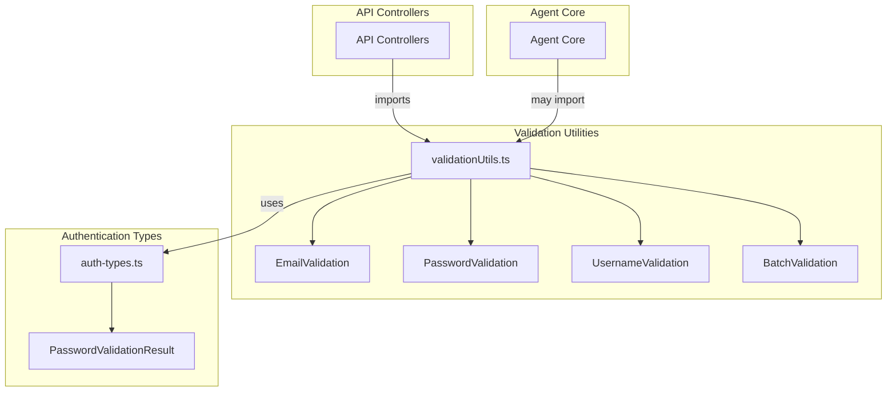
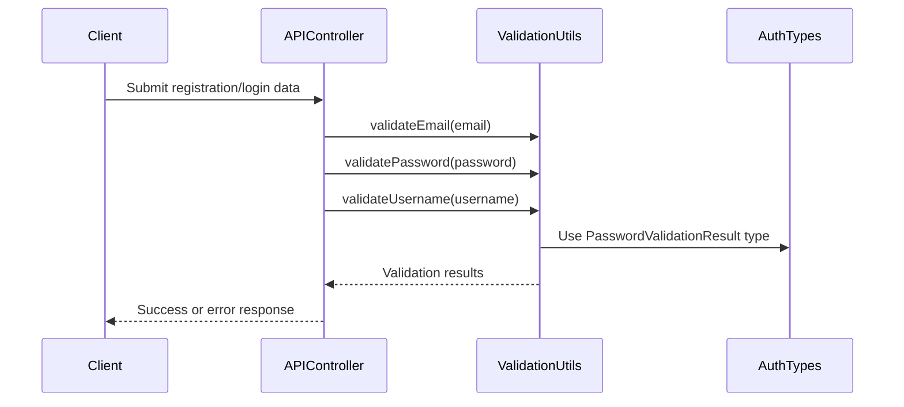

# Validation Utilities Module Documentation

## Introduction

The **Validation Utilities** module provides centralized, reusable validation logic for user input fields such as email addresses, passwords, and usernames. It is designed to ensure consistent validation rules across the system, improve security, and simplify the process of adding or updating validation requirements. This module is commonly used by authentication, user management, and API controller components throughout the backend.

## Core Functionality

The module exposes the following key validation utilities:

- **Email Validation**: Configurable checks for email format, length, domain restrictions, and plus addressing.
- **Password Validation**: Enforces password strength using [Zod](https://zod.dev/) schemas, with scoring and suggestions for improvement.
- **Username Validation**: Ensures usernames meet length, character, and reserved name requirements.
- **Batch Validation Utility**: Provides a generic interface for validating multiple fields in a structured way.

## Component Overview

### 1. Email Validation
- **Function**: `validateEmail(email: string, config?: EmailValidationConfig)`
- **Features**:
  - Checks for required field, length, and format (international or ASCII-only)
  - Blocks known temporary email domains
  - Optionally disables plus addressing
- **Configurable via**: `EmailValidationConfig`

### 2. Password Validation
- **Function**: `validatePassword(password: string, _config?, _userInfo?)`
- **Features**:
  - Enforces minimum/maximum length, character diversity (upper/lowercase, numbers, special chars)
  - Returns a score and suggestions for improvement
  - Uses Zod schema for robust validation
- **Returns**: `PasswordValidationResult` ([see Authentication Types](Authentication Types.md))

### 3. Username Validation
- **Function**: `validateUsername(username: string, config?)`
- **Features**:
  - Enforces length and character set (with optional special characters)
  - Checks for reserved names and valid starting character

### 4. Batch Validation Utility
- **Type**: `ValidationField`
- **Purpose**: Structure for validating multiple fields with their respective validators and arguments.

## Architecture and Relationships

The Validation Utilities module is a low-level utility that is imported by higher-level modules such as authentication services, API controllers, and user management logic. It does not maintain state and has no direct dependencies on business logic, making it highly reusable.

### Mermaid Diagram: Module Placement and Dependencies

### Data Flow and Component Interaction

## How the Module Fits into the Overall System

- **API Controllers** ([see API Controllers](API Controllers.md)) use Validation Utilities to validate user input before processing authentication, registration, or profile updates.
- **Authentication Types** ([see Authentication Types](Authentication Types.md)) provides the `PasswordValidationResult` type used by password validation.
- **Agent Core** ([see Agent Core](Agent Core.md)) and other backend modules may use these utilities for internal validation needs.

## References
- [Authentication Types](Authentication Types.md)
- [API Controllers](API Controllers.md)
- [Agent Core](Agent Core.md)

## Extending Validation Utilities

To add new validation logic:
1. Implement a new validator function in `validationUtils.ts`.
2. Optionally, extend the `ValidationField` interface for batch validation.
3. Update API controllers or services to use the new validator as needed.

---

*For details on how validation results are consumed by authentication and user management, see [API Controllers](API Controllers.md) and [Authentication Types](Authentication Types.md).*
