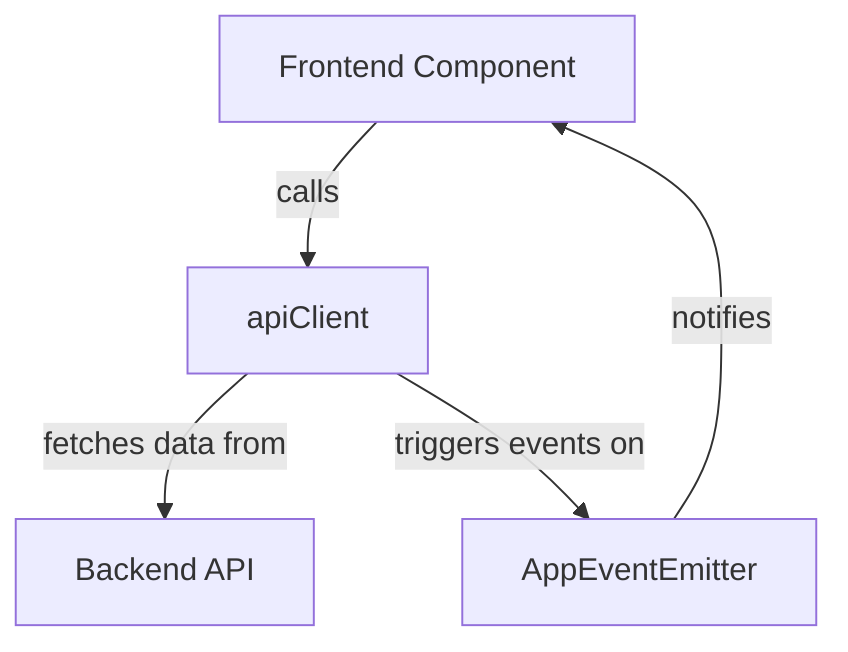

# API Client (api-client.ts)

## Overview

The **API Client** sub-module provides a unified, type-safe abstraction for all frontend API calls to the backend. It manages authentication, CSRF protection, error handling, and exposes a comprehensive set of methods for interacting with backend endpoints. This ensures that all data-fetching and mutation logic is centralized, consistent, and secure.

## Core Components
- **ApiClient**: Main class encapsulating all API logic.
- **apiClient**: Singleton instance used throughout the frontend.
- **ApiError**: Custom error class for API errors.
- **PaginationParams**: Interface for paginated API requests.

## Responsibilities
- Centralizes all HTTP requests to backend endpoints.
- Handles authentication (including 401 interception and triggering auth modals).
- Manages CSRF tokens for state-changing requests.
- Provides type-safe methods for all major backend endpoints (apps, users, models, secrets, analytics, etc.).
- Handles error reporting and user notifications (e.g., via toast messages).
- Supports streaming responses for endpoints that require it.

## Key Features
- **Type Safety**: All methods are typed using shared API types from [Frontend API Types](Frontend%20API%20Types.md).
- **Error Handling**: Custom error classes and toast notifications for user feedback.
- **CSRF Protection**: Automatic fetching and refreshing of CSRF tokens.
- **Session Management**: Handles anonymous and authenticated sessions.
- **Streaming Support**: For endpoints that return streaming data (e.g., code generation).

## Example Usage
```typescript
import { apiClient } from '@/lib/api-client';

// Fetch user apps
const apps = await apiClient.getUserApps();

// Create a new app
const newApp = await apiClient.createApp({ title: 'My App' });

// Listen for authentication errors
setGlobalAuthModalTrigger((context) => {
  // Show login modal with context
});
```

## Component Interaction Diagram



## Related Modules
- [Frontend API Types](Frontend%20API%20Types.md): Shared types for API responses and requests.
- [API Controllers](API%20Controllers.md): Backend endpoints consumed by the API client.
- [App Events](app-events.md): Event system for app state changes.
