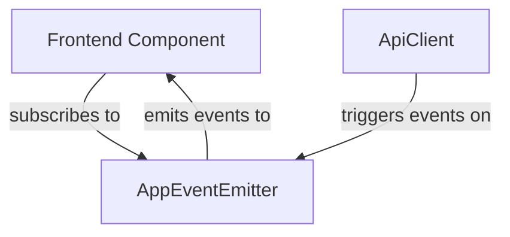

# App Events (app-events.ts)

## Overview

The **App Events** sub-module implements a lightweight event emitter for app-related events, enabling decoupled communication between different parts of the frontend. It is primarily used to notify components about app lifecycle changes (creation, update, deletion) so that the UI can react accordingly.

## Core Components
- **AppEventEmitter**: Main class managing event listeners and event emission.
- **AppDeletedEvent, AppCreatedEvent, AppUpdatedEvent**: Typed event interfaces for app lifecycle events.
- **appEvents**: Singleton instance used for event communication.

## Responsibilities
- Allows components to subscribe to specific app events (created, updated, deleted).
- Enables emission of events when app state changes occur (e.g., after API calls).
- Provides cleanup mechanisms for event listeners.

## Key Features
- **Type Safety**: All events are strongly typed.
- **Decoupled Communication**: Components can react to events without direct dependencies.
- **Convenience Methods**: For emitting common app events.

## Example Usage
```typescript
import { appEvents } from '@/lib/app-events';

// Subscribe to app deleted events
const unsubscribe = appEvents.on('app-deleted', (event) => {
  // Handle app deletion
});

// Emit an app created event
appEvents.emitAppCreated('appId123', { title: 'New App' });

// Cleanup listener
unsubscribe();
```

## Component Interaction Diagram



## Related Modules
- [API Client](api-client.md): Triggers events after API operations.
- [Frontend Components](Frontend%20Components.md): Consume events to update UI.
