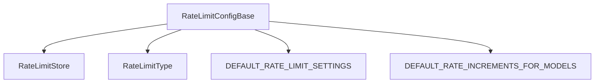

# RateLimitConfigBase (config.ts)

## Overview
`RateLimitConfigBase` and related interfaces define the configuration schema for all supported rate limiting backends. This includes settings for KV, Durable Object, and external rate limiter bindings, as well as model-specific increments for LLM calls.

## Core Responsibilities
- Define configuration interfaces for each backend
- Provide enums for backend selection and rate limit types
- Supply default settings for all rate limit types
- Map AI models to rate increments for LLM call limiting

## Key Types and Interfaces
- `RateLimitStore`: Enum for backend selection (`KV`, `RATE_LIMITER`, `DURABLE_OBJECT`)
- `RateLimitConfigBase`: Base interface for all configs
- `KVRateLimitConfig`, `RLRateLimitConfig`, `DORateLimitConfig`, `LLMCallsRateLimitConfig`: Backend-specific configs
- `RateLimitType`: Enum for different rate limit types (API, Auth, App Creation, LLM Calls)
- `RateLimitSettings`: Aggregates all rate limit configs
- `DEFAULT_RATE_LIMIT_SETTINGS`: Default settings for all types
- `DEFAULT_RATE_INCREMENTS_FOR_MODELS`: Model-to-increment mapping for LLM calls

## Example
```typescript
const config: RateLimitSettings = DEFAULT_RATE_LIMIT_SETTINGS;
```

## Component Interaction Diagram


## Related Files
- [rateLimits.md]
- [KVRateLimitStore.md]
