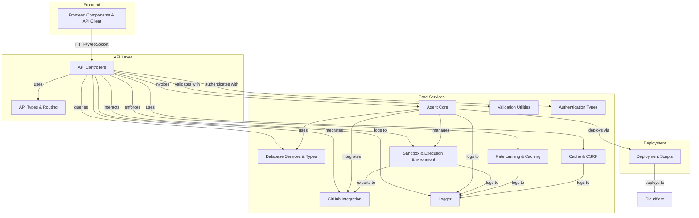
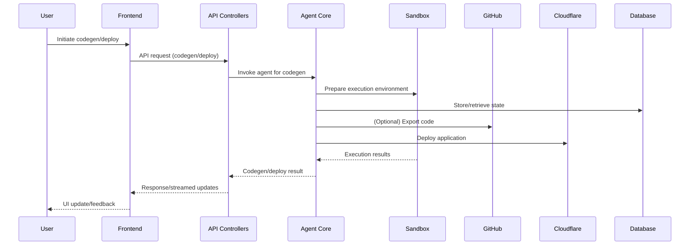

# vibesdk Repository Overview

## Purpose

The `vibesdk` repository is a full-stack, modular platform for AI-driven software engineering workflows. It orchestrates autonomous code generation, deployment, and management through a system of agents, robust API endpoints, secure sandboxed execution, and seamless integration with external services like GitHub and Cloudflare. The repository is designed for extensibility, security, and developer productivity, supporting both backend and frontend components for building, deploying, and managing AI-generated applications.

---

## End-to-End Architecture

The system is composed of several core modules, each responsible for a distinct layer of the platform. Below is a high-level architecture diagram and data flow visualization.

### High-Level System Architecture

### Data Flow: User Request to Deployment

---

## Repository Structure & Core Modules

Below is a summary of the main modules, their responsibilities, and links to their detailed documentation.

### 1. [Agent Core](#agent-core)
- **Purpose:** Central orchestration for autonomous code generation, deployment, and agent management.
- **Key Components:** Assistant, SimpleCodeGeneratorAgent, StateMigration, DependencyManagement, FileProcessing, GitCloneService, AgentConfig, InferenceParamsStructured, TemplateRegistryEntry, AgentOperation, DiffSecurityValidator, CodeGenerationFormat, BaseAgentService, IDeploymentManager, MCPManager, IdGenerator, and more.
- **[Full documentation](#agent-core-module-documentation)**

### 2. [API Controllers](#api-controllers)
- **Purpose:** Main entry point for all HTTP/WebSocket API endpoints; handles request validation, authentication, business logic, and response formatting.
- **Key Components:** CodingAgentController, AppViewController, AuthController, BaseController, GitHubExporterController, ModelConfigController, ModelProvidersController, ScreenshotsController, SecretsController, SentryTunnelController, StatsController, StatusController, UserController.
- **[Full documentation](#api-controllers-module-documentation)**

### 3. [API Types and Routing](#api-types-and-routing)
- **Purpose:** Provides type-safe abstractions for API route context, parameter extraction, and request handling.
- **Key Components:** RouteContext, ContextualRequestHandler, RouteParamConfig.
- **[Full documentation](#api-types-and-routing)**

### 4. [Database Services and Types](#database-services-and-types)
- **Purpose:** Abstractions and type definitions for all database operations, including queries, analytics, and error handling.
- **Key Components:** BaseService, AppForForkResult, BaseAppQueryOptions, BoardStats, TeamStats, SimpleAppCreation, OperationResult.
- **[Full documentation](#database-services-and-types)**

### 5. [Sandbox and Execution Environment](#sandbox-and-execution-environment)
- **Purpose:** Provides secure, isolated environments for code execution, file management, and deployment.
- **Key Components:** BaseSandboxService, SandboxSdkClient, FileTreeBuilder, ZipExtractor, SandboxEnv, GitHubUserInfo, WranglerConfigValidationResult, ResourceProvisioningOptions.
- **[Full documentation](#sandbox-and-execution-environment)**

### 6. [GitHub Integration](#github-integration)
- **Purpose:** Interfaces with GitHub for repository creation, export, synchronization, and status checking.
- **Key Components:** GitHubService, GitHubServiceConfig, GitHubUserAccessToken, GitHubTokenResult.
- **[Full documentation](#github-integration-module)**

### 7. [Rate Limiting and Caching](#rate-limiting-and-caching)
- **Purpose:** Enforces usage limits, manages request quotas, and provides caching for performance and resource efficiency.
- **Key Components:** RateLimitService, KVRateLimitStore, RateLimitConfigBase.
- **[Full documentation](#rate-limiting-and-caching)**

### 8. [Cache and CSRF](#cache-and-csrf)
- **Purpose:** Provides key-value caching and robust CSRF protection for secure, performant APIs.
- **Key Components:** KVCache, CsrfService.
- **[Full documentation](#cache-and-csrf-module-documentation)**

### 9. [Logger](#logger)
- **Purpose:** Structured, context-rich logging system with Sentry integration for error tracking.
- **Key Components:** LoggerFactory, StructuredLogger.
- **[Full documentation](#logger-module-documentation)**

### 10. [Validation Utilities](#validation-utilities)
- **Purpose:** Centralized, reusable validation logic for user input fields (email, password, username).
- **Key Components:** ValidationField.
- **[Full documentation](#validation-utilities-module-documentation)**

### 11. [Authentication Types](#authentication-types)
- **Purpose:** Type system for authentication and authorization, including OAuth, sessions, JWTs, and password validation.
- **Key Components:** OAuthTokens, AuthUser, AuthSession, TokenPayload, etc.
- **[Full documentation](#authentication-types-module-documentation)**

### 12. [Frontend API Types](#frontend-api-types)
- **Purpose:** Central source of truth for all types used in frontend-backend communication.
- **Key Components:** FileType, StreamingResponse, and re-exports from backend modules.
- **[Full documentation](#frontend-api-types)**

### 13. [Frontend API Client and Events](#frontend-api-client-and-events)
- **Purpose:** Type-safe API client and event system for frontend-to-backend communication and app state changes.
- **Key Components:** ApiClient, PaginationParams, AppEventEmitter.
- **[Full documentation](#frontend-api-client-and-events)**

### 14. [Frontend Components](#frontend-components)
- **Purpose:** Reusable UI components and configuration interfaces for the frontend.
- **Key Components:** ImageAttachmentPreviewProps, AgentDisplayConfig, AppFiltersFormProps.
- **[Full documentation](#frontend-components-module-documentation)**

### 15. [Frontend Contexts and Hooks](#frontend-contexts-and-hooks)
- **Purpose:** React context and hooks for global state management (e.g., theming).
- **Key Components:** ThemeContextType.
- **[Full documentation](#frontend-contexts-and-hooks)**

### 16. [Frontend Utilities](#frontend-utilities)
- **Purpose:** Utility functions for logging, NDJSON parsing, and screenshot automation.
- **Key Components:** Logger, NDJSONStreamParser, AutoScreenshotSystem.

### 17. [Deployment Scripts](#deployment-scripts)
- **Purpose:** Scripts for deploying and undeploying applications to Cloudflare.
- **Key Components:** CloudflareDeploymentManager, CloudflareUndeploymentManager.

---

## References to Core Module Documentation

- [Agent Core Module Documentation](#agent-core-module-documentation)
- [API Controllers Module Documentation](#api-controllers-module-documentation)
- [API Types and Routing](#api-types-and-routing)
- [Database Services and Types](#database-services-and-types)
- [Sandbox and Execution Environment](#sandbox-and-execution-environment)
- [GitHub Integration Module](#github-integration-module)
- [Rate Limiting and Caching](#rate-limiting-and-caching)
- [Cache and CSRF Module Documentation](#cache-and-csrf-module-documentation)
- [Logger Module Documentation](#logger-module-documentation)
- [Validation Utilities Module Documentation](#validation-utilities-module-documentation)
- [Authentication Types Module Documentation](#authentication-types-module-documentation)
- [Frontend API Types](#frontend-api-types)
- [Frontend API Client and Events](#frontend-api-client-and-events)
- [Frontend Components Module Documentation](#frontend-components-module-documentation)
- [Frontend Contexts and Hooks](#frontend-contexts-and-hooks)

---

*For detailed documentation of each module and sub-module, see the respective linked documentation files in the repository.*