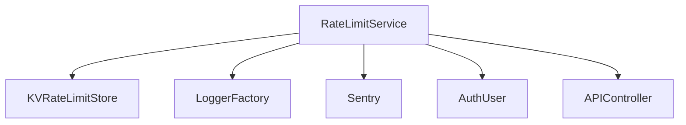

# RateLimitService (rateLimits.ts)

## Overview
The `RateLimitService` is the central orchestrator for enforcing rate limits across the platform. It supports multiple types of rate limits (API, authentication, app creation, and LLM calls) and can use different backends (KV, Durable Object, or external rate limiter bindings) depending on configuration.

## Core Responsibilities
- Build unique rate limit keys for users or requests
- Identify users or requests for rate limiting
- Enforce rate limits using the configured backend
- Integrate with logging and observability (Sentry)
- Throw appropriate errors when limits are exceeded

## Key Methods
- `buildRateLimitKey(rateLimitType, identifier)`: Constructs a unique key for rate limiting.
- `getUserIdentifier(user)`: Returns a user-based identifier.
- `getRequestIdentifier(request)`: Returns a request-based identifier (token hash or IP).
- `getUniversalIdentifier(user, request)`: Chooses the best identifier for the context.
- `enforce(env, key, config, limitType, incrementBy)`: Main enforcement logic, delegates to the correct backend.
- `enforceGlobalApiRateLimit`, `enforceAuthRateLimit`, `enforceAppCreationRateLimit`, `enforceLLMCallsRateLimit`: Specialized enforcement for each rate limit type.

## Backend Support
- **KV Store**: Uses [KVRateLimitStore](KVRateLimitStore.md) for sliding window rate limiting.
- **Durable Object**: Calls a Durable Object stub for distributed rate limiting.
- **External Rate Limiter**: Uses bindings for rate limiting via external services.

## Error Handling
- Logs and captures security events when limits are exceeded.
- Throws `RateLimitExceededError` or `SecurityError` as appropriate.

## Component Interaction Diagram

## Related Files
- [KVRateLimitStore.md]
- [config.md]
- [Logger.md]
- [auth-types.md]
