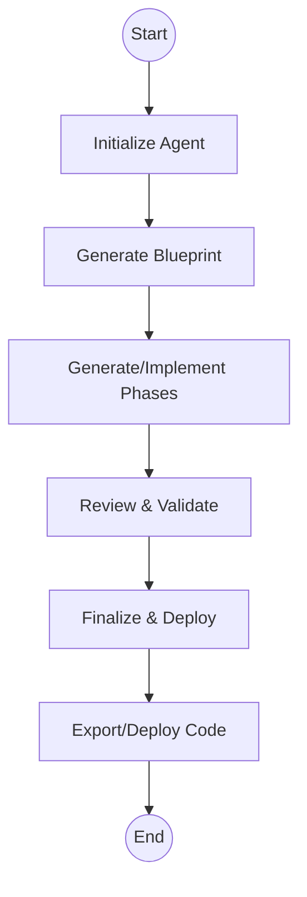

# SimpleCodeGeneratorAgent

## Purpose
The `SimpleCodeGeneratorAgent` is the main orchestrator for code generation, deployment, and user interaction in the Agent Core module. It manages the full lifecycle of an agent session, including blueprint generation, phase management, file streaming, code validation, deployment, and integration with external services.

## Core Component
- **SimpleCodeGeneratorAgent**: Extends the base `Agent` class and implements a deterministic state machine for code generation workflows.

## Responsibilities
- Orchestrate the code generation process in phases (blueprint, implementation, review, finalization).
- Manage agent state, including conversation history, generated files, and user suggestions.
- Integrate with file management, deployment, and git services.
- Handle user input, runtime errors, static analysis, and code validation.
- Support real-time streaming of file generation and WebSocket updates.
- Export code to GitHub and deploy to sandbox or Cloudflare environments.
- Maintain robust error handling, state migration, and logging.

## Key Interactions
- Uses `Assistant` for conversational context.
- Relies on `StateMigration` for state schema upgrades.
- Utilizes `DependencyManagement`, `FileProcessing`, and `GitCloneService` for domain logic and repository management.
- Integrates with deployment and sandbox services via `IDeploymentManager`.
- Employs `AgentOperation` for modular operation execution (phase generation, file regeneration, etc.).
- Uses `DiffSecurityValidator` and `CodeGenerationFormat` for output validation and streaming.
- Leverages `IdGenerator` for unique conversation and entity IDs.

## Process Flow Diagram

## Component Relationships
- **Assistant**: Manages message history.
- **StateMigration**: Ensures state compatibility.
- **DependencyManagement**: Handles dependency merging.
- **FileProcessing**: Cleans and processes file contents.
- **GitCloneService**: Builds and exports git repositories.
- **IDeploymentManager**: Orchestrates deployments.
- **AgentOperation**: Modularizes agent operations.
- **DiffSecurityValidator**: Validates diffs for security and correctness.
- **CodeGenerationFormat**: Handles streaming code output.
- **IdGenerator**: Generates unique IDs.

## References
- [Assistant](assistant.md)
- [StateMigration](stateMigration.md)
- [DependencyManagement](DependencyManagement.md)
- [FileProcessing](FileProcessing.md)
- [GitCloneService](git-clone-service.md)
- [IDeploymentManager, DeploymentResult](IDeploymentManager.md)
- [AgentOperation](common.md)
- [DiffSecurityValidator](udiff.md)
- [CodeGenerationFormat](base.md)
- [IdGenerator](idGenerator.md)
