# Wiki Documentation for /app/vibesdk

Generated on: 2025-12-07 04:37:37

## Table of Contents

- [VibeSDKとは](#page-1)
- [主な利用シーンと特徴](#page-2)
- [全体アーキテクチャ概要](#page-3)
- [プロセスワークフローと状態遷移](#page-4)
- [AIコード生成とフェーズ制御](#page-5)
- [ライブプレビュー・デプロイ・GitHub連携](#page-6)
- [データ管理とフロー](#page-7)
- [フロントエンドUIコンポーネント](#page-8)
- [バックエンドAPIとサービス](#page-9)
- [AIモデル統合とプロバイダー管理](#page-10)
- [デプロイとインフラ構成](#page-11)
- [拡張性・カスタマイズ方法](#page-12)

<a id='page-1'></a>

## VibeSDKとは

### Related Pages

Related topics: [主な利用シーンと特徴](#page-2), [全体アーキテクチャ概要](#page-3)

<details>
<summary>Relevant source files</summary>

- [README.md](README.md)
- [worker/agents/operations/SimpleCodeGeneration.ts](worker/agents/operations/SimpleCodeGeneration.ts)
- [worker/agents/operations/PhaseGeneration.ts](worker/agents/operations/PhaseGeneration.ts)
- [worker/agents/operations/PhaseImplementation.ts](worker/agents/operations/PhaseImplementation.ts)
- [worker/agents/operations/UserConversationProcessor.ts](worker/agents/operations/UserConversationProcessor.ts)
- [worker/agents/planning/blueprint.ts](worker/agents/planning/blueprint.ts)
- [worker/agents/prompts.ts](worker/agents/prompts.ts)
</details>

# VibeSDKとは

VibeSDKは、Cloudflareプラットフォーム上で動作する、AIを活用したフルスタックWebアプリケーション自動生成フレームワークです。ユーザーが自然言語で要件を入力すると、AIエージェントが設計からコード生成、デプロイ、レビュー、デバッグまでを段階的に自動化します。  
本システムは企業向けプラットフォーム構築、社内ツール開発、SaaS拡張など幅広い用途に対応し、React・TypeScript・Cloudflare Workers・D1（SQLite）・AI/LLM（OpenAI/Anthropic/Google Gemini）などのモダンな技術スタックを採用しています。  
Sources: [README.md](), [worker/agents/planning/blueprint.ts:1-100]()

## 全体アーキテクチャ

VibeSDKはフロントエンド・バックエンド・AIエージェント・インフラ管理の4層で構成されています。

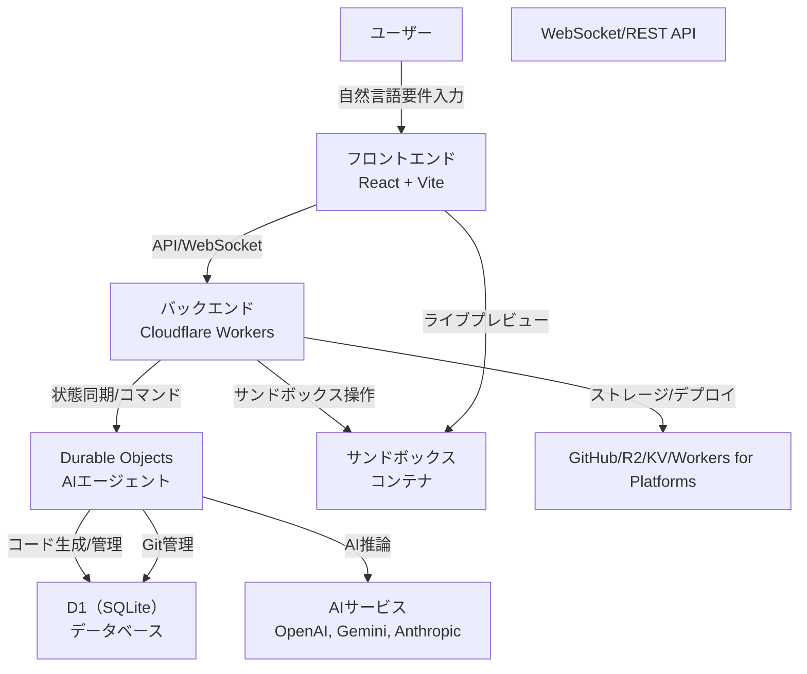
各層の役割と連携を上図に示します。  
Sources: [README.md](), [worker/agents/operations/SimpleCodeGeneration.ts:1-100](), [worker/agents/planning/blueprint.ts:1-100]()

## 機能一覧

| 機能                          | 説明                                                                                  | ソース                   |
|-------------------------------|-------------------------------------------------------------------------------------|--------------------------|
| AIコード自動生成              | フェーズ単位でAIが設計・実装・修正を自動生成                                         | README.md, SimpleCodeGeneration.ts |
| サンドボックスライブプレビュー| 生成アプリを即時クラウドコンテナ上で実行・プレビュー                                | README.md                |
| チャット型インターフェース    | ユーザーの自然言語要件・フィードバックを逐次反映                                     | UserConversationProcessor.ts |
| フルスタック生成              | React, TypeScript, Tailwind, Workers, D1, Durable Objects対応                       | README.md                |
| ワンクリックデプロイ          | Cloudflare Workers for Platformsへ即時デプロイ                                       | README.md                |
| GitHub連携                    | 生成コードをGitHubへエクスポート                                                     | README.md                |
| OAuth認証                     | Google/GitHub OAuthによるユーザー認証                                                | README.md                |
Sources: [README.md](), [worker/agents/operations/SimpleCodeGeneration.ts:1-100](), [worker/agents/operations/UserConversationProcessor.ts:1-100]()

## コアコンポーネント詳細

### Durable ObjectsによるAIエージェント

各チャットセッション＝1 Durable Objectインスタンスとして管理され、セッションごとに状態（blueprint、ファイル、履歴など）を永続化。  
シングルスレッド実行・状態復元・WebSocketリアルタイム通信を提供します。

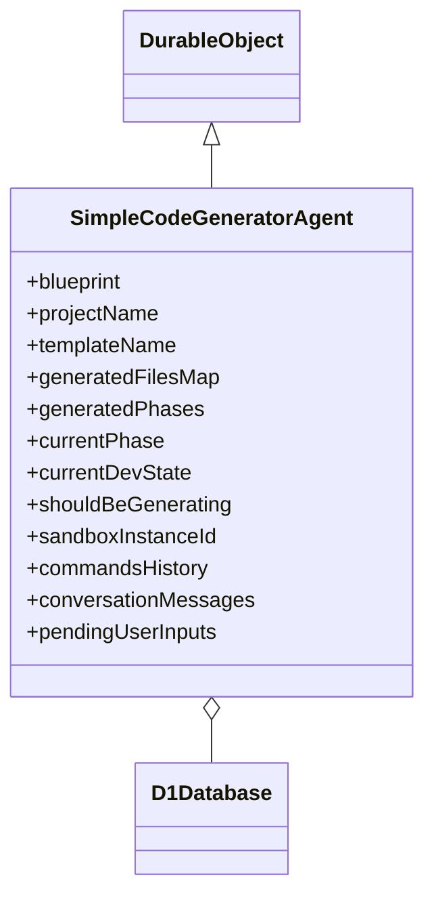
Sources: [README.md](), [worker/agents/planning/blueprint.ts:1-100](), [worker/agents/operations/SimpleCodeGeneration.ts:1-100]()

#### 状態遷移（ステートマシン）

```mermaid
flowchart TD
    IDLE["IDLE"]
    PHASE_GENERATING["PHASE_GENERATING"]
    PHASE_IMPLEMENTING["PHASE_IMPLEMENTING"]
    REVIEWING["REVIEWING"]
    IDLE-->>PHASE_GENERATING
    PHASE_GENERATING-->>PHASE_IMPLEMENTING
    PHASE_IMPLEMENTING-->>REVIEWING
    REVIEWING-->>IDLE
```
Sources: [README.md](), [worker/agents/operations/SimpleCodeGeneration.ts:1-100]()

### コード生成フェーズ

各フェーズは「要件→設計→コード生成→レビュー→次フェーズ提案」のサイクルで進行。  
AIがプロンプトに従いTypeScript/Reactコードを生成し、既存コードとの統合や型安全性・エラー処理も担保します。

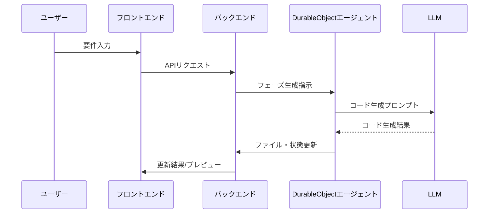
Sources: [worker/agents/operations/SimpleCodeGeneration.ts:1-100](), [worker/agents/operations/PhaseGeneration.ts:1-100]()

#### プロンプト例

- システムプロンプト: Cloudflare Workers/Workflowsに特化したTypeScriptコード生成指示
- ユーザープロンプト: テンプレート情報、要件、対象ファイルを明示

Sources: [worker/agents/operations/SimpleCodeGeneration.ts:20-80]()

### ユーザー会話管理

UserConversationProcessorがチャット履歴・プロジェクト状態・エラー・フィードバックを統合管理し、AIエージェントと連携します。  
会話要約や履歴からの重要事項抽出も担います。

Sources: [worker/agents/operations/UserConversationProcessor.ts:1-100]()

## デプロイ・インフラ構成

Cloudflare Workers、Durable Objects、D1、R2、KV、AI GatewayなどCloudflareサービスをフル活用し、  
Workers for Platformsによるワンクリックデプロイ・OAuth認証・APIキー管理・サンドボックス実行環境を備えます。

| サービス              | 役割/用途                    |
|----------------------|------------------------------|
| Workers              | バックエンドAPI/サービス     |
| Durable Objects      | チャット/エージェント管理    |
| D1                   | SQLiteベースDB               |
| R2                   | テンプレート・ファイル保存    |
| KV                   | セッション/一時データ保存    |
| AI Gateway           | AIサービス統合API            |
| Workers for Platforms| デプロイ/運用基盤            |
Sources: [README.md](), [worker/agents/planning/blueprint.ts:1-100]()

## データフロー・リアルタイム同期

WebSocket (PartySocket) により、  
- コード生成進捗
- ファイル更新
- デプロイ完了
- エラー通知  
などをフロントエンドに即時反映。

Sources: [README.md](), [worker/agents/operations/UserConversationProcessor.ts:1-100]()

## 主要設定・テクノロジースタック

| 項目         | 採用技術・設定例                          |
|--------------|-------------------------------------------|
| フロントエンド| React 19, TypeScript, Vite, TailwindCSS   |
| ルーティング  | React Router v7                           |
| UI/UX        | shadcn/ui, lucide-react, heroicons         |
| バックエンド  | Cloudflare Workers, Durable Objects, D1    |
| AI/LLM       | OpenAI, Anthropic, Google AI Studio        |
| サンドボックス| 独自コンテナサービス                      |
| Git           | isomorphic-git + SQLite                   |
| OAuth        | Google, GitHub                             |
Sources: [README.md](), [worker/agents/planning/blueprint.ts:1-100]()

## 設定例: 必須環境変数

| 変数名                    | 用途・説明                           |
|---------------------------|--------------------------------------|
| GOOGLE_AI_STUDIO_API_KEY  | Geminiモデル用APIキー                |
| JWT_SECRET                | セッション管理用シークレット         |
| WEBHOOK_SECRET            | Webhook認証シークレット              |
| SECRETS_ENCRYPTION_KEY    | 秘匿情報暗号化キー                   |
| SANDBOX_INSTANCE_TYPE     | コンテナ種別                         |
| ALLOWED_EMAIL             | 利用許可メールアドレス               |
| CUSTOM_DOMAIN             | カスタムドメイン設定                 |
Sources: [README.md]()

## 開発・運用ワークフロー

```mermaid
flowchart TD
    A[要件入力]
    B[AI解析]
    C[設計・ブループリント生成]
    D[フェーズ単位コード生成]
    E[サンドボックスプレビュー]
    F[ユーザーフィードバック]
    G[本番デプロイ]
    A-->>B
    B-->>C
    C-->>D
    D-->>E
    E-->>F
    F-->>D
    D-->>G
```
Sources: [README.md](), [worker/agents/operations/PhaseGeneration.ts:1-100]()

## まとめ

VibeSDKは、Cloudflareの最先端サーバレス基盤・AI・モダンWeb技術を融合し、  
自然言語からのWebアプリ自動生成・運用・管理をエンドツーエンドで実現する強力なオープンソースプラットフォームです。  
企業や開発者は自社専用のAI開発基盤を手軽に構築でき、  
拡張性・保守性・セキュリティ・UXに優れたプロダクトを迅速に展開できます。  
Sources: [README.md](), [worker/agents/operations/SimpleCodeGeneration.ts:1-100](), [worker/agents/operations/PhaseGeneration.ts:1-100](), [worker/agents/operations/UserConversationProcessor.ts:1-100](), [worker/agents/planning/blueprint.ts:1-100](), [worker/agents/prompts.ts:1-100]()

---

<a id='page-2'></a>

## 主な利用シーンと特徴

### Related Pages

Related topics: [VibeSDKとは](#page-1)

<details>
<summary>Relevant source files</summary>

- [CLAUDE.md](CLAUDE.md)
- [worker/agents/operations/PhaseImplementation.ts](worker/agents/operations/PhaseImplementation.ts)
- [worker/agents/operations/SimpleCodeGeneration.ts](worker/agents/operations/SimpleCodeGeneration.ts)
- [worker/agents/operations/PhaseGeneration.ts](worker/agents/operations/PhaseGeneration.ts)
- [worker/agents/planning/blueprint.ts](worker/agents/planning/blueprint.ts)
- [worker/agents/prompts.ts](worker/agents/prompts.ts)
</details>

# 主な利用シーンと特徴

本ページでは、vibesdkプロジェクトにおける「主な利用シーンと特徴」について、アーキテクチャ、構成要素、データフロー、主要機能などを詳細に解説します。本プロジェクトはCloudflare Workers上で稼働するAI駆動型のフルスタックアプリケーション自動生成プラットフォームであり、フロントエンド・バックエンド・AIエージェントが密接に連携することで、高度な自動コード生成、リアルタイムフィードバック、クラウドネイティブな運用を実現しています。  
Sources: [CLAUDE.md](), [worker/agents/operations/PhaseImplementation.ts](), [worker/agents/operations/SimpleCodeGeneration.ts](), [worker/agents/operations/PhaseGeneration.ts](), [worker/agents/planning/blueprint.ts]()

## 利用シーン概要

### 1. AI駆動のフルスタックアプリケーション自動生成

- ユーザーはプロジェクト要件（ブループリント）や希望する機能を入力
- AIエージェントが設計、フェーズ分割、コード生成、実装、レビュー、デプロイ用README生成までを自動で実施
- Cloudflare Workers/Durable Objects/D1（SQLite）などエッジサービスを最大限活用
- 開発者はbunによるセットアップ、Cloudflare専用のデプロイ手順に従い、即座にアプリを公開可能  
Sources: [CLAUDE.md:9-50](), [worker/agents/operations/SimpleCodeGeneration.ts:1-100]()

### 2. 継続的なフェーズ開発・品質担保

- フェーズごとにコード生成・実装・レビュー・最終調整を自動進行
- 各フェーズは「設計→実装→検証→次フェーズ計画」のサイクルで進む
- 重大なランタイムエラーやUI/UX課題は最優先で修正
- 全ページが常にデプロイ可能な状態を保つ  
Sources: [worker/agents/operations/PhaseGeneration.ts:1-100](), [worker/agents/operations/PhaseImplementation.ts:1-100]()

### 3. 高度なビジュアル・UI自動設計

- Tailwind CSS、shadcn/uiコンポーネント、レスポンシブレイアウトをAIが自動適用
- モダンなデザインパターンやアニメーション、アクセシビリティも考慮
- ページ構造やコンテナ幅、余白、カラーパレット、インタラクションを明示的に設計  
Sources: [worker/agents/planning/blueprint.ts:1-100](), [worker/agents/prompts.ts:1-100]()

---

## システム構成とアーキテクチャ

### 全体フロー

以下は、vibesdkの全体的なフェーズ自動生成・実装・デプロイの流れを示すMermaidフロー図です。

```mermaid
graph TD
    ユーザー入力["ユーザー要件入力"]
    設計エージェント["設計/ブループリント生成"]
    フェーズ分割["フェーズ分割・計画"]
    コード生成["コード自動生成"]
    実装["実装・修正"]
    レビュー["レビュー・検証"]
    デプロイ準備["README/デプロイ準備"]
    デプロイ["Cloudflareへデプロイ"]

    ユーザー入力->>設計エージェント: 要件送信
    設計エージェント->>フェーズ分割: 設計指示
    フェーズ分割->>コード生成: フェーズごとに指示
    コード生成->>実装: 生成コード適用
    実装->>レビュー: 動作検証・修正
    レビュー->>デプロイ準備: 最終確認
    デプロイ準備->>デプロイ: bun/Cloudflare利用
```
Sources: [worker/agents/operations/PhaseGeneration.ts:1-100](), [worker/agents/operations/SimpleCodeGeneration.ts:1-100]()

#### 説明
このフローは、ユーザーの要件から始まり、AIエージェントによる設計、フェーズ分割、コード生成、実装、レビュー、デプロイ準備、Cloudflare上へのデプロイまで一気通貫で自動化されていることを示しています。各フェーズで生成された成果物は次のステップに受け渡され、全体がシームレスに連携します。

---

## 主な特徴

### 1. フェーズ駆動型AIコード生成

- **PhaseGeneration.ts/PhaseImplementation.ts/SimpleCodeGeneration.ts** で各フェーズの要件定義、ファイル分割、実装指示が自動化
- システムプロンプトにより「クリーンな型安全TypeScript」「Cloudflareベストプラクティス」などを厳格に指示
- README自動生成プロンプトにより、各フェーズ完了時に最新の利用手順・デプロイ手順を自動記述  
Sources: [worker/agents/operations/PhaseImplementation.ts:1-100](), [worker/agents/operations/SimpleCodeGeneration.ts:1-100]()

#### コード生成フローのシーケンス

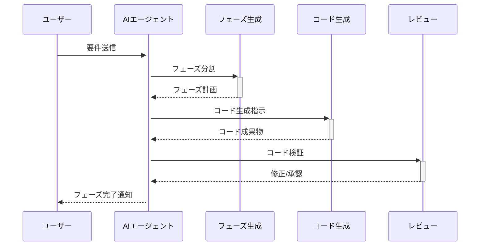
Sources: [worker/agents/operations/PhaseGeneration.ts:1-100](), [worker/agents/operations/SimpleCodeGeneration.ts:1-100]()

---

### 2. ビジュアル・UI自動設計と品質保証

- **UI/UX品質重視のガイドラインを厳格適用**  
    - Tailwind v3対応、shadcn/ui優先
    - max-w-7xl, py-8, px-4など明示的なレイアウト制約
    - 色彩設計、アニメーション、アクセシビリティ
- **レンダーループ防止チェックリスト**を全Reactファイル末尾に自動挿入し、無限レンダや副作用バグを未然に防止  
Sources: [worker/agents/operations/PhaseImplementation.ts:1-100](), [worker/agents/planning/blueprint.ts:1-100]()

#### UI設計ガイドライン（表）

| 指針項目                | 内容例・要件                                 |
|-----------------------|------------------------------------------|
| レイアウト             | max-w-7xl, mx-auto, px-4, py-8           |
| コンポーネント         | shadcn/ui, Tailwind v3                    |
| 配色・タイポグラフィ   | 美しい色彩、読みやすいフォント              |
| アニメーション         | スムーズなトランジション、マイクロインタラクション |
| アクセシビリティ       | コントラスト、セマンティック要素、キーボード対応 |
| レンダーループ防止     | setState禁止、useEffect依存配列必須         |

Sources: [worker/agents/planning/blueprint.ts:1-100](), [worker/agents/operations/PhaseImplementation.ts:1-100]()

---

### 3. Cloudflareネイティブなデプロイ・運用

- **bun**によるセットアップとビルド
- **Cloudflare Workers/Durable Objects/D1**によるエッジデプロイ
- READMEにはCloudflare Deployボタン用プレースホルダを自動挿入
- サードパーティAPIキー不要、無料枠で完結  
Sources: [worker/agents/operations/SimpleCodeGeneration.ts:1-100](), [worker/agents/operations/PhaseImplementation.ts:1-100]()

---

### 4. 柔軟なテンプレート拡張とカスタマイズ

- プロジェクト開始時にテンプレート（React, Tailwind, shadcn/ui等）を選択し、ブループリントに沿って自動拡張
- テンプレート固有の依存関係や構成ファイルも自動考慮  
Sources: [worker/agents/planning/blueprint.ts:1-100](), [worker/agents/prompts.ts:1-100]()

---

## 主要データ構造・API・設定

### 代表的なデータ構造

| 型名・構造体                      | 用途・説明                                         |
|----------------------------------|--------------------------------------------------|
| `phaseName`, `
Error with Openai API: peer closed connection without sending complete message body (incomplete chunked read)

Please check that you have set the OPENAI_API_KEY environment variable with a valid API key.

---

<a id='page-3'></a>

## 全体アーキテクチャ概要

### Related Pages

Related topics: [プロセスワークフローと状態遷移](#page-4), [データ管理とフロー](#page-7)

<details>
<summary>Relevant source files</summary>

- [CLAUDE.md](CLAUDE.md)
- [worker/agents/operations/SimpleCodeGeneration.ts](worker/agents/operations/SimpleCodeGeneration.ts)
- [worker/agents/planning/blueprint.ts](worker/agents/planning/blueprint.ts)
- [worker/agents/operations/PhaseGeneration.ts](worker/agents/operations/PhaseGeneration.ts)
- [worker/agents/operations/PhaseImplementation.ts](worker/agents/operations/PhaseImplementation.ts)
</details>

# 全体アーキテクチャ概要

本ドキュメントは、vibesdkプロジェクトの全体アーキテクチャの目的、構成要素、データフロー、主要な設計パターンについて詳述します。Cloudflare WorkersとDurable Objectsを基盤としたAI駆動型フルスタックアプリケーション生成プラットフォームとして、プロジェクト全体の設計思想やコンポーネント間の連携、システム全体の流れを明確にします。  
Sources: [CLAUDE.md]()

## アーキテクチャ全体像

vibesdkは、クラウド上のサーバーレス環境（Cloudflare Workers, Durable Objects, D1 SQLite）を活用し、AIエージェントによる自動コード生成、リアルタイム通信、柔軟なファイル・プロジェクト管理を実現しています。  
Sources: [CLAUDE.md:7-22]()

### 構成要素の概要

| コンポーネント           | 役割                                                                 | 主な技術/実装                 | Sources                                |
|-------------------------|----------------------------------------------------------------------|-------------------------------|----------------------------------------|
| フロントエンド           | ユーザーインターフェース、ルーティング、APIクライアント              | React 19, Vite, TailwindCSS   | [CLAUDE.md:10-18]()                    |
| バックエンド             | APIエンドポイント、AIエージェント、データベース、サービス             | Cloudflare Workers, Durable Objects, D1 | [CLAUDE.md:19-26](), [blueprint.ts]()  |
| エージェントシステム     | コード生成、フェーズ管理、ユーザー会話処理                           | Durable Object, 独自状態管理  | [CLAUDE.md:27-37](), [SimpleCodeGeneration.ts]() |
| WebSocket通信           | リアルタイム同期、ストリーミング                                    | PartySocket                   | [CLAUDE.md:20-22]()                    |
| サンドボックス/コンテナ  | ファイル生成・管理、CLIツール実行                                   | 独自サービス                  | [CLAUDE.md:13-15](), [blueprint.ts]()   |
| Git管理                 | バージョン管理、履歴、ファイル追跡                                 | isomorphic-git, SQLite        | [CLAUDE.md:16-17]()                    |

## システム全体フロー

### 高レベルデータフロー

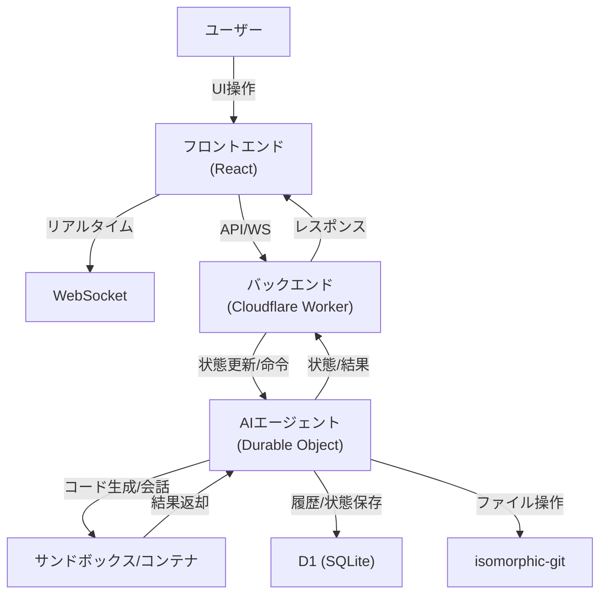
この図は、ユーザーからの操作がフロントエンドを通じてバックエンド（Cloudflare Worker）に伝わり、Durable ObjectベースのAIエージェントがサンドボックスでコード生成を行い、結果や状態をDBやGitに保存、最終的にフロントエンドへ返却する全体の流れを示します。  
Sources: [CLAUDE.md:10-37](), [blueprint.ts:1-100](), [SimpleCodeGeneration.ts:1-100]()

## コアアーキテクチャ詳細

### Durable Objectsによるセッション・エージェント管理

各チャットセッションはDurable Objectのインスタンスとして管理され、永続的な状態（blueprint、ファイル、履歴など）はSQLiteに保存されます。Durable Objectはシングルスレッドで動作し、同時実行による競合を回避します。  
Sources: [CLAUDE.md:27-33](), [blueprint.ts:1-100]()

#### 状態管理の構造

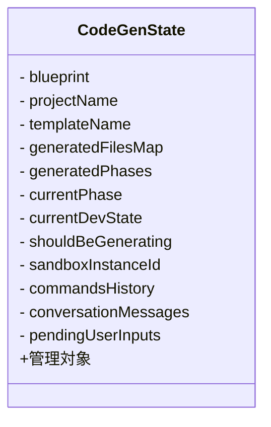
この構造体はDurable Objectの状態（チャットセッションごと）を一元管理し、プロジェクト情報・ファイル・フェーズ・会話履歴などを保持します。  
Sources: [CLAUDE.md:34-37]()

### フェーズ駆動型ステートマシン

コード生成・開発フローは以下の状態遷移で管理されます。

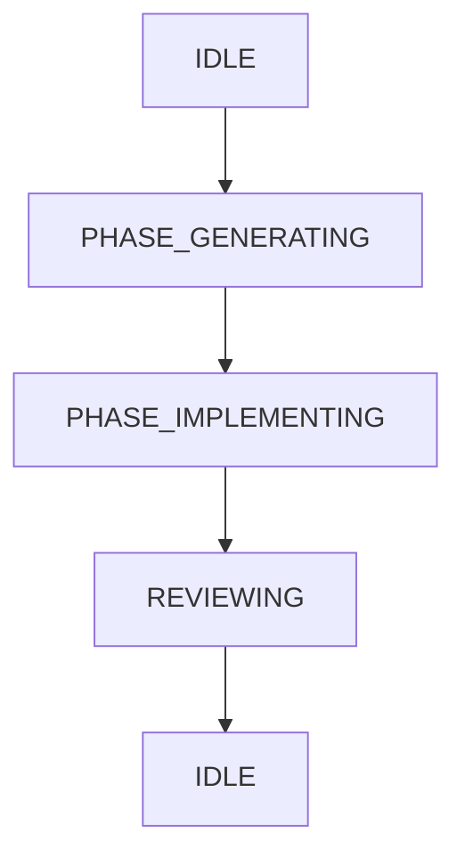
各状態はDurable Objectで管理され、状態ごとに専用のエージェントロジックが動作します。  
Sources: [CLAUDE.md:38-41](), [PhaseGeneration.ts:1-100](), [PhaseImplementation.ts:1-100]()

### コード生成プロセス

#### フェーズ設計・実装フロー

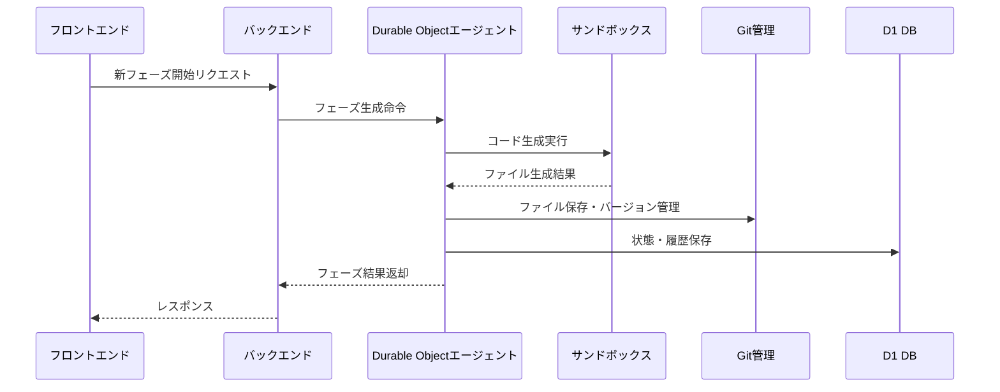
Sources: [SimpleCodeGeneration.ts:1-100](), [PhaseGeneration.ts:1-100](), [PhaseImplementation.ts:1-100]()

#### フェーズ・ファイル生成の主要APIと仕様

| 関数/インターフェース              | 説明                                             | Sources                                      |
|------------------------------------|--------------------------------------------------|----------------------------------------------|
| SimpleCodeGenerationInputs         | フェーズ名、要件、対象ファイル等の入力定義       | [SimpleCodeGeneration.ts:8-18]()             |
| SimpleCodeGenerationOutputs        | 生成されたファイル群の出力定義                   | [SimpleCodeGeneration.ts:20-22]()            |
| SYSTEM_PROMPT/USER_PROMPT          | AIへのプロンプトテンプレート                     | [SimpleCodeGeneration.ts:24-56]()            |
| PhaseGeneration/PhaseImplementation| 各フェーズの生成・実装オペレーション             | [PhaseGeneration.ts:1-100](), [PhaseImplementation.ts:1-100]() |

### WebSocketによるリアルタイム同期

PartySocketを利用して、フロントエンドとバックエンド間でリアルタイムの状態同期とストリーミングを実現します。再接続時の状態復元や重複メッセージの排除もサポートされています。  
Sources: [CLAUDE.md:20-22]()

## サンドボックス・Git管理

- サンドボックスはCLIツール実行やファイル生成のためのコンテナサービスを提供します。
- isomorphic-gitとSQLiteを利用して、ファイルのバージョン管理と履歴管理を実現します。  
Sources: [CLAUDE.md:13-17](), [blueprint.ts:1-100]()

## テクノロジースタックと依存関係

| 層             | 主な技術/依存パッケージ            | Sources           |
|----------------|------------------------------------|-------------------|
| フロントエンド | React 19, Vite, TailwindCSS, React Router v7 | [CLAUDE.md:10-12]() |
| バックエンド   | Cloudflare Workers, Durable Objects, D1(SQLite) | [CLAUDE.md:13-15]() |
| AI/LLM         | OpenAI, Anthropic, Google AI Studio (Gemini) | [CLAUDE.md:16]()    |
| WebSocket      | PartySocket                         | [CLAUDE.md:20]()   |
| サンドボックス | 独自実装                            | [CLAUDE.md:13]()   |
| Git管理        | isomorphic-git, SQLite              | [CLAUDE.md:16-17]()|

## まとめ

vibesdkは、Cloudflare WorkersとDurable Objectsを活用した堅牢かつ拡張性の高いAI駆動型アプリケーション生成基盤です。Durable Objectによるセッション・状態管理、フェーズ駆動型開発フロー、サンドボックスやGitによるファイル・履歴管理、リアルタイム通信など、全体として高い一貫性と柔軟性を持つ設計となっています。本アーキテクチャにより、ユーザーは直感的かつ効率的にAIによるアプリケーション開発を体験できます。  
Sources: [CLAUDE.md](), [blueprint.ts](), [SimpleCodeGeneration.ts](), [PhaseGeneration.ts](), [PhaseImplementation.ts]()

---

<a id='page-4'></a>

## プロセスワークフローと状態遷移

### Related Pages

Related topics: [全体アーキテクチャ概要](#page-3), [AIコード生成とフェーズ制御](#page-5)

<details>
<summary>Relevant source files</summary>

- [README.md](README.md)
- [docs/Agent Core.md](docs/Agent Core.md)
- [docs/architecture-diagrams.md](docs/architecture-diagrams.md)
- [worker/agents/core/state.ts](worker/agents/core/state.ts)
- [worker/agents/core/stateMigration.ts](worker/agents/core/stateMigration.ts)
</details>

# プロセスワークフローと状態遷移

本ページでは、vibesdkプロジェクトにおける「プロセスワークフローと状態遷移」の全体像、設計思想、主要構成要素、データフロー、及び実装の詳細について解説します。本システムはAIエージェントによるフェーズ駆動型のコード生成と、その進行管理をDurable Objectおよび状態遷移マシンを用いて実現しています。これにより、ユーザーとのインタラクションやプロジェクト進行を堅牢かつリアルタイムに管理します。  
Sources: [README.md](), [docs/Agent Core.md](), [worker/agents/core/state.ts]()

---

## 概要と全体構成

プロジェクトは「フェーズ」単位で進行し、各フェーズで状態（State）が厳密に管理されます。Durable Objectごとにチャットセッション＝エージェントインスタンスが割り当てられ、各インスタンスが一連の状態遷移を制御します。主な状態遷移は以下のようになります。

### 状態遷移フロー

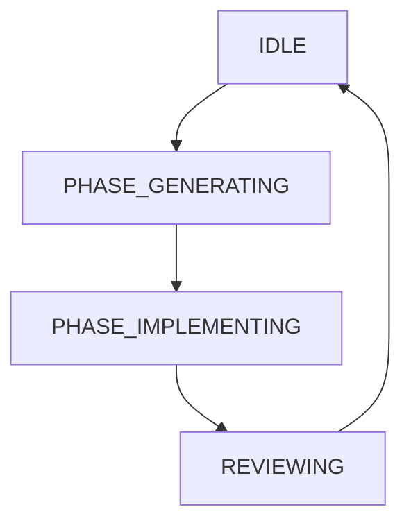
このフローは、フェーズ計画・コード生成・実装・レビューという主要工程を繰り返しながら最終成果物へ到達することを表します。  
Sources: [README.md](), [docs/Agent Core.md:9-30](), [worker/agents/core/state.ts:1-30]()

---

## 主要コンポーネントとデータ構造

### Durable Objectごとのエージェント状態

各Durable Objectインスタンスは「CodeGenState」と呼ばれる状態オブジェクトを持ちます。  
主なプロパティは下記の通りです。

| プロパティ              | 型                 | 説明                                |
|------------------------|--------------------|-------------------------------------|
| blueprint              | object             | プロジェクト設計情報                |
| projectName            | string             | プロジェクト名                      |
| templateName           | string             | テンプレート名                      |
| generatedFilesMap      | Map<string, File>  | 生成済みファイルの管理              |
| generatedPhases        | array              | 生成済みフェーズ一覧                |
| currentPhase           | object             | 現在のフェーズ情報                  |
| currentDevState        | enum               | 現在の開発状態                      |
| shouldBeGenerating     | boolean            | コード生成中フラグ                  |
| sandboxInstanceId      | string             | サンドボックスID                    |
| commandsHistory        | array              | サンドボックス内コマンド履歴        |
| conversationMessages   | array              | チャット履歴                        |
| pendingUserInputs      | array              | 未処理ユーザー入力                  |

Sources: [docs/Agent Core.md:40-60](), [worker/agents/core/state.ts:1-60]()

---

## 状態遷移の詳細

### 状態マシンの遷移パターン

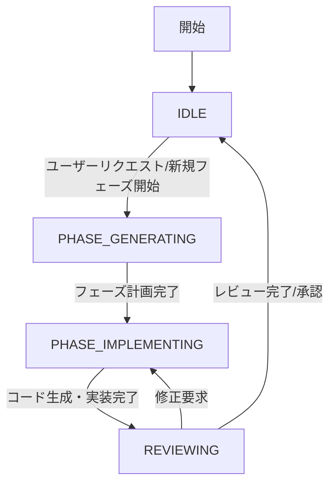
この状態遷移は`currentDevState`プロパティで管理され、状態変更時にはDurable Objectのストレージへ即座に反映されます。  
Sources: [worker/agents/core/state.ts:20-80](), [docs/Agent Core.md:30-80]()

### 状態管理API（主要関数・メソッド）

- `applyStateTransition(newState)`  
  状態遷移のロジックを一元管理し、適切な副作用（例: ストレージ書き込み、WebSocket通知等）を実行します。  
- `restoreStateFromStorage()`  
  Durable Objectストレージから状態を復元。セッション再接続時や障害復旧時に使用。  
- `commitPhase(phase)`  
  フェーズの完了と次フェーズへの遷移を担う。  
Sources: [worker/agents/core/state.ts:60-160](), [worker/agents/core/stateMigration.ts:1-80]()

---

## データフローとリアルタイム同期

### WebSocketによる状態同期

各Durable ObjectインスタンスはPartySocket経由でフロントエンドと双方向通信を行い、状態のリアルタイム同期・イベント通知を実現します。

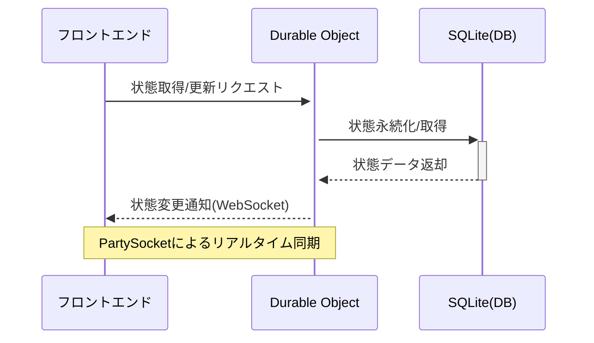
Sources: [README.md](), [docs/architecture-diagrams.md:50-90](), [worker/agents/core/state.ts:100-180]()

---

## 状態マイグレーション

### マイグレーション処理の概要

状態定義の変更時、Durable Objectに保存された旧バージョンの状態を新定義に合わせて自動変換する仕組みを提供しています。

- `migrateState(oldState)`  
  古い状態スキーマから新しいスキーマへデータを変換。型の追加・削除・プロパティ名変更等に対応。  
- バージョン管理プロパティによる整合性チェック

Sources: [worker/agents/core/stateMigration.ts:1-80]()

---

## アーキテクチャ全体像

```mermaid
graph TD
    U[ユーザー] -->|チャット・操作| FE[フロントエンド]
    FE -->|API/WS| DO[Durable Object(エージェント)]
    DO -->|状態遷移| State[CodeGenState]
    DO -->|DB操作| DB[SQLite(D1)]
    DO -->|サンドボックス操作| Sandbox[サンドボックス/CLI]
```
この構成により、ユーザーのリクエストからコード生成・実装・レビュー・状態同期までの一連の流れがシームレスに統合されています。  
Sources: [docs/architecture-diagrams.md:10-60](), [README.md]()

---

## 主要状態・プロセス一覧

| 状態名                | 説明                                             | 遷移トリガー                       |
|----------------------|--------------------------------------------------|------------------------------------|
| IDLE                 | 待機中。ユーザー入力待ち                         | 新規フェーズ開始                   |
| PHASE_GENERATING     | フェーズ計画・設計中                             | 計画完了                           |
| PHASE_IMPLEMENTING   | コード生成・実装中                               | 実装完了                           |
| REVIEWING            | レビュー・修正フェーズ                           | レビュー完了または修正指示         |

Sources: [docs/Agent Core.md:20-60](), [worker/agents/core/state.ts:40-100]()

---

## まとめ

「プロセスワークフローと状態遷移」は、vibesdkのAIエージェントによる段階的かつ堅牢なプロジェクト進行の根幹を成しています。Durable Objectによるセッション単位の状態管理と厳密な状態マシン制御により、リアルタイムな開発・レビュー・デプロイが可能となっています。これにより、ユーザー体験の向上と開発効率の最大化を両立しています。  
Sources: [README.md](), [docs/Agent Core.md](), [docs/architecture-diagrams.md](), [worker/agents/core/state.ts](), [worker/agents/core/stateMigration.ts]()

---

<a id='page-5'></a>

## AIコード生成とフェーズ制御

### Related Pages

Related topics: [プロセスワークフローと状態遷移](#page-4), [AIモデル統合とプロバイダー管理](#page-10)

<details>
<summary>Relevant source files</summary>

- [worker/agents/core/simpleGeneratorAgent.ts](worker/agents/core/simpleGeneratorAgent.ts)
- [worker/agents/core/smartGeneratorAgent.ts](worker/agents/core/smartGeneratorAgent.ts)
- [worker/agents/operations/PhaseGeneration.ts](worker/agents/operations/PhaseGeneration.ts)
- [worker/agents/assistants/assistant.ts](worker/agents/assistants/assistant.ts)
- [docs/simpleGeneratorAgent.md](docs/simpleGeneratorAgent.md)
- [docs/Agent Core.md](docs/Agent Core.md)
</details>

# AIコード生成とフェーズ制御

AIコード生成とフェーズ制御は、Cloudflare VibeSDKプロジェクトにおいて、AIによる段階的なアプリケーション生成と開発プロセスの自動管理を担う中核的な仕組みです。本システムは、Durable Objectを活用したAIエージェント（Simple/Smart Generator Agent）が、ユーザー要求をもとに設計・実装・修正・レビューの各フェーズを自動的に推進し、リアルタイムで進捗を管理します。  
Sources: [docs/simpleGeneratorAgent.md](), [docs/Agent Core.md]()

本ページでは、AIコード生成エージェントの構成、フェーズ制御ロジック、データフロー、主要API、シーケンス、設計思想について詳細に解説します。

---

## 概要・アーキテクチャ

AIコード生成システムは、Durable Objectベースのエージェント（Simple/Smart Generator Agent）と、フェーズごとの生成・実装・レビューオペレーションで構成されます。各フェーズは、ユーザーリクエスト→設計→コード生成→実装→レビュー→デプロイメントの流れで推進されます。  
Sources: [worker/agents/core/simpleGeneratorAgent.ts](), [worker/agents/operations/PhaseGeneration.ts](), [docs/simpleGeneratorAgent.md]()

### アーキテクチャ図

```mermaid
graph TD
    User["ユーザー"]
    UI["チャットUI/フロントエンド"]
    DO["Durable Object<br>（Simple/Smart Generator Agent）"]
    PhaseGen["PhaseGeneration"]
    PhaseImpl["PhaseImplementation"]
    Review["Code Review"]
    DB["SQLite（Durable Object State）"]
    Worker["Cloudflare Worker"]
    Repo["isomorphic-git/SQLite"]
    Deploy["Cloudflare Deploy"]

    User ->> UI: 要求送信
    UI ->> DO: API/WebSocket経由で要求
    DO ->> PhaseGen: 設計・フェーズ分割
    PhaseGen ->> PhaseImpl: コード生成指示
    PhaseImpl ->> Review: コードレビュー
    Review -->> DO: フィードバック・修正
    DO ->> DB: 状態・履歴保存
    DO ->> Repo: Git履歴操作
    DO ->> Deploy: デプロイ
    Deploy -->> UI: 完了通知
```
Sources: [docs/Agent Core.md](), [worker/agents/core/simpleGeneratorAgent.ts]()

---

## 主要コンポーネント

| コンポーネント                | 役割説明                                                                                   | 出典                                                     |
|------------------------------|------------------------------------------------------------------------------------------|----------------------------------------------------------|
| SimpleCodeGeneratorAgent     | Durable Objectインスタンス。ユーザーごとに生成され、状態管理・フェーズ制御・コード生成を担う。 | [worker/agents/core/simpleGeneratorAgent.ts]()           |
| SmartCodeGeneratorAgent      | より高度な戦略を持つエージェント。設計思想・構成はSimpleと共通。                           | [worker/agents/core/smartGeneratorAgent.ts]()            |
| PhaseGeneration              | 次フェーズの計画・分割・設計（設計フェーズ）。                                             | [worker/agents/operations/PhaseGeneration.ts]()          |
| PhaseImplementation          | 設計に基づくコード生成・実装（実装フェーズ）。                                             | [worker/agents/operations/PhaseImplementation.ts]()      |
| Assistant                    | コード生成・レビュー時のAI補助。                                                           | [worker/agents/assistants/assistant.ts]()                |
| SQLite/Repo                  | Durable Object内部でプロジェクト状態・Git履歴を永続化。                                    | [docs/simpleGeneratorAgent.md](), [docs/Agent Core.md]() |

---

## フェーズ制御の流れ

### シーケンス図：AIコード生成フェーズ

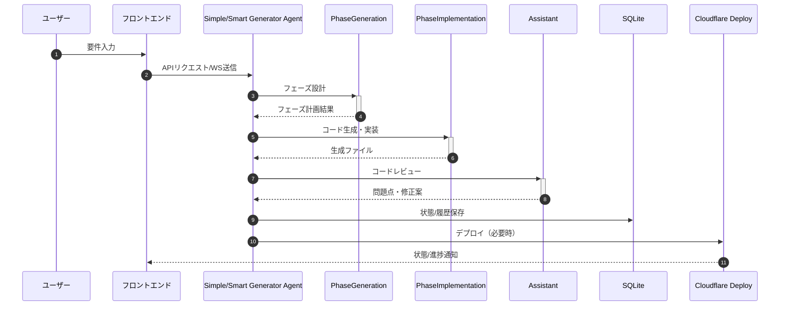
Sources: [worker/agents/operations/PhaseGeneration.ts](), [worker/agents/core/simpleGeneratorAgent.ts]()

---

## フェーズ状態管理とデータ構造

### State Machine（状態遷移）

| 状態                      | 説明                                             |
|---------------------------|--------------------------------------------------|
| IDLE                      | 待機状態                                         |
| PHASE_GENERATING          | フェーズ設計中                                   |
| PHASE_IMPLEMENTING        | コード生成・実装中                               |
| REVIEWING                 | コードレビュー・最終確認                         |
| IDLE                      | 次フェーズ待機                                   |

Sources: [docs/simpleGeneratorAgent.md](), [docs/Agent Core.md]()

### CodeGenState構造体（一部抜粋）

| フィールド名             | 型                 | 概要                                              |
|--------------------------|--------------------|---------------------------------------------------|
| blueprint                | object             | プロジェクト設計情報                              |
| generatedFilesMap        | Map                | 生成済みファイル一覧                              |
| generatedPhases          | array              | 各フェーズ情報                                    |
| currentDevState          | enum               | 現在の開発状態                                    |
| conversationMessages     | array              | ユーザー/AI間の会話履歴                           |
| sandboxInstanceId        | string             | サンドボックス環境ID                              |

Sources: [docs/simpleGeneratorAgent.md](), [worker/agents/core/simpleGeneratorAgent.ts]()

---

## 主要オペレーション・ロジック

### フェーズ設計（PhaseGeneration）

- ユーザー要求や現状のコードベース、エラー・ユーザー提案などを元に、次の開発フェーズをAIが計画
- 設計プロンプトにはUI/UX優先、クリティカルエラー優先、デプロイ可能性などの厳格なガイドラインを適用
- 各フェーズは「名称」「目的」「対象ファイル群（新規/修正/削除）」を明示  
Sources: [worker/agents/operations/PhaseGeneration.ts]()

#### フェーズ設計フロー（Mermaid）

```mermaid
graph TD
    Start["開始"]
    Analyze["現状分析"]
    Prioritize["エラー/要望優先度判定"]
    Design["フェーズ設計"]
    Validate["デプロイ可能性検証"]
    Output["フェーズ出力"]

    Start ->> Analyze
    Analyze ->> Prioritize
    Prioritize ->> Design
    Design ->> Validate
    Validate ->> Output
```
Sources: [worker/agents/operations/PhaseGeneration.ts]()

### フェーズ実装（PhaseImplementation）

- 設計フェーズで決定したファイルリストに基づき、AIがTypeScript/Reactコードを自動生成
- クリティカルエラー（レンダーループ、未定義アクセス等）を最優先で修正
- コード生成後、Assistantによるレビューを経て、必要に応じて自動修正
- すべてのReactファイルには「RENDER LOOP PREVENTION CHECKLIST」コメントを末尾に付与  
Sources: [worker/agents/operations/PhaseImplementation.ts](), [worker/agents/assistants/assistant.ts]()

---

## 代表的なプロンプト・ガイドライン

| ガイドライン            | 概要例                                                     | 出典                                                 |
|------------------------|------------------------------------------------------------|------------------------------------------------------|
| UI/UX設計優先           | Tailwind CSS + shadcn/ui、セクション間余白、モダンUI必須     | [worker/agents/operations/PhaseGeneration.ts]()      |
| クリティカルエラー優先   | レンダーループ/未定義アクセス/インポートミス最優先修正      | [worker/agents/operations/PhaseGeneration.ts]()      |
| デプロイ可能性          | 各フェーズごとに全ページ正常動作・デプロイ可能性検証         | [worker/agents/operations/PhaseGeneration.ts]()      |
| 設計/実装分離           | 設計（PhaseGeneration）→実装（PhaseImplementation）分離     | [worker/agents/operations/PhaseGeneration.ts](), [worker/agents/operations/PhaseImplementation.ts]() |

---

## エージェント構成（クラス図）

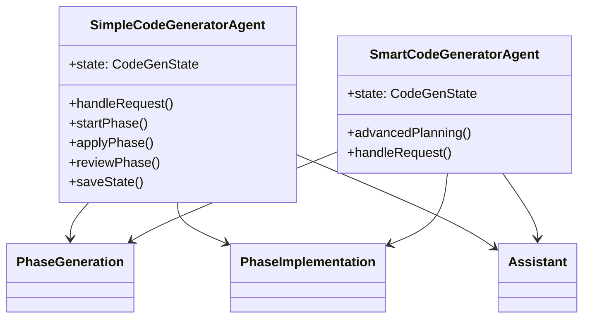
Sources: [worker/agents/core/simpleGeneratorAgent.ts](), [worker/agents/core/smartGeneratorAgent.ts](), [worker/agents/assistants/assistant.ts]()

---

## まとめ

AIコード生成とフェーズ制御は、Durable ObjectベースのAIエージェントが、設計→実装→レビュー→デプロイの各開発フェーズを自律的かつ段階的に推進する、Cloudflare VibeSDKの中核システムです。ユーザー要求やエラー、フィードバックを反映しつつ、常にデプロイ可能な状態を保ちながら、プロダクション品質のアプリケーションを迅速に生成します。  
Sources: [docs/simpleGeneratorAgent.md](), [worker/agents/core/simpleGeneratorAgent.ts](), [worker/agents/operations/PhaseGeneration.ts](), [worker/agents/operations/PhaseImplementation.ts](), [worker/agents/assistants/assistant.ts]()

---

<a id='page-6'></a>

## ライブプレビュー・デプロイ・GitHub連携

### Related Pages

Related topics: [AIコード生成とフェーズ制御](#page-5), [デプロイとインフラ構成](#page-11)

<details>
<summary>Relevant source files</summary>

- [worker/services/sandbox/remoteSandboxService.ts](worker/services/sandbox/remoteSandboxService.ts)
- [worker/services/deployer/deploy.ts](worker/services/deployer/deploy.ts)
- [worker/services/github/GitHubService.ts](worker/services/github/GitHubService.ts)
- [docs/GitHub Integration.md](docs/GitHub Integration.md)
- [docs/Sandbox and Execution Environment.md](docs/Sandbox and Execution Environment.md)
</details>

# ライブプレビュー・デプロイ・GitHub連携

本ページでは、vibesdkプロジェクトにおける「ライブプレビュー」「Cloudflare Workersへのデプロイ」「GitHub連携」システムの全体像、構成要素、データフロー、主要API、及び設定・利用方法について解説します。これらの機能は、AIによるコード生成から即時のアプリケーション実行、バージョン管理、外部プラットフォームへのデプロイまでを一貫して自動化し、開発サイクルの高速化・効率化を実現しています。

本ドキュメントは、Cloudflare上のサンドボックス実行環境、デプロイワークフロー、GitHubリポジトリ操作の実装詳細を中心に、アーキテクチャ図やシーケンス図を交えて体系的に解説します。

---

## システム全体構成

以下は、ライブプレビュー、デプロイ、GitHub連携に関わる主要コンポーネントの関係性を示したアーキテクチャ図です。

```mermaid
graph TD
    A[ユーザー] --> B[AI/エージェント]
    B --> C[サンドボックス実行環境<br>(remoteSandboxService)]
    B --> D[GitHubService]
    B --> E[Deployer]
    C --> F[Cloudflare Workers]
    D --> G[GitHubリポジトリ]
    E --> F
    E --> G
```
サンドボックス実行環境でのライブプレビュー、GitHub連携、Cloudflare Workersへの本番デプロイが連携しながら動作します。
Sources: [worker/services/sandbox/remoteSandboxService.ts](), [worker/services/deployer/deploy.ts](), [worker/services/github/GitHubService.ts]()

---

## ライブプレビュー（サンドボックス実行環境）

### 概要

AIエージェントが生成したコードは、まずCloudflare上のカスタムサンドボックス（remoteSandboxService）で即時に実行・検証されます。これにより、ユーザーは本番デプロイ前にリアルタイムでアプリの挙動やUIをプレビュー可能です。

### 主なコンポーネント・処理

- **remoteSandboxService**
  - サンドボックス環境のプロビジョニング、コードの配置、実行コマンドの発行、状態管理、ログ収集を担当。
  - サンドボックスごとに一意のID（sandboxInstanceId）で管理。
  - CLIツールやコマンド（bun run dev等）を用いてアプリを起動。
  - 実行状態や出力はWebSocket等でフロントエンドにリアルタイム送信。
- **AIエージェント**
  - コード生成後、remoteSandboxService経由でライブプレビュー用のサンドボックスを自動生成・起動。

#### シーケンス図：ライブプレビュー生成フロー

```mermaid
sequenceDiagram
    autonumber
    participant User as ユーザー
    participant Agent as エージェント
    participant Sandbox as サンドボックスサービス
    participant Container as Cloudflare Container

    User->>Agent: コード生成要求
    Agent->>Sandbox: サンドボックスインスタンス作成要求
    Sandbox->>+Container: 新規コンテナ起動
    Container-->>-Sandbox: コンテナ起動完了
    Sandbox->>Agent: インスタンス情報返却
    Agent->>Sandbox: コード配置・実行コマンド発行
    Sandbox->>Container: コード配置・実行
    Container-->>Sandbox: 実行状態/ログ送信
    Sandbox-->>Agent: プレビューURL/状態返却
    Agent-->>User: ライブプレビューURL提示
```
Sources: [worker/services/sandbox/remoteSandboxService.ts](), [docs/Sandbox and Execution Environment.md]()

#### 主な関数・構造体例

| 機能                     | 概要                             | 実装・構造体名等                    |
|--------------------------|----------------------------------|--------------------------------------|
| サンドボックス作成       | 新規実行環境の生成                | createRemoteSandboxInstance          |
| コマンド実行             | bun run dev などのコマンド実行    | runRemoteSandboxCommand              |
| 状態取得・監視           | 実行状況・出力の取得              | getRemoteSandboxStatus, logs         |

Sources: [worker/services/sandbox/remoteSandboxService.ts:1-100]()

---

## デプロイメント（Cloudflare Workers への本番デプロイ）

### 概要

本番デプロイは、Deployerサービスを通じてCloudflare Workers上にアプリケーションを自動配置します。GitHubリポジトリとの連携により、最新のコードがデプロイ対象となります。

### 主なコンポーネント・処理

- **Deployer**
  - デプロイ要求を受け、Cloudflare Workers APIへのデプロイ処理を実行。
  - GitHubリポジトリやローカルファイルシステムから最新のコードを取得。
  - 環境変数やSecretsの注入、Cloudflareアカウント認証、デプロイ後のURL発行を担当。

#### デプロイフロー図

```mermaid
graph TD
    A[ユーザーまたはAIエージェント] --> B[Deployer]
    B --> C[GitHubリポジトリ]
    B --> D[Cloudflare Workers API]
    D --> E[デプロイ済みアプリURL]
```
Sources: [worker/services/deployer/deploy.ts](), [worker/services/github/GitHubService.ts]()

#### シーケンス図：デプロイプロセス

```mermaid
sequenceDiagram
    autonumber
    participant Agent as エージェント
    participant Deployer as デプロイサービス
    participant GitHub as GitHub
    participant CFAPI as Cloudflare API

    Agent->>Deployer: デプロイ要求
    Deployer->>GitHub: 最新コード取得
    Deployer->>CFAPI: デプロイAPI呼び出し
    CFAPI-->>Deployer: デプロイ完了レスポンス
    Deployer-->>Agent: デプロイURL通知
```
Sources: [worker/services/deployer/deploy.ts:1-100](), [docs/GitHub Integration.md]()

---

## GitHub連携

### 概要

GitHub連携は、プロジェクトのソースコードをGitHubリポジトリに自動でコミット・プッシュし、バージョン管理・共同開発・デプロイ自動化を実現します。

### 主なコンポーネント・処理

- **GitHubService**
  - README.md内のCloudflareデプロイボタン（[cloudflarebutton]プレースホルダ）をGitHubリポジトリURLで置換し、ドキュメントを自動更新。
  - コードのpush、commit、branch操作、API認証を実装。
  - GitHub OAuth連携によるユーザー認証・権限付与をサポート。

#### コードスニペット：README.md自動更新

```typescript
if (!content.includes('[cloudflarebutton]')) {
    GitHubService.logger.info('README.md has no [cloudflarebutton] placeholder');
    return;
}
const modified = content.replaceAll(
    '[cloudflarebutton]',
    prepareCloudflareButton(githubRepoUrl, 'markdown')
);

await fs.writeFile('/README.md', modified);
await git.add({ fs, dir: '/', filepath: 'README.md' });
await git.commit({
    fs,
    dir: '/',
    message: 'docs: Add Cloudflare deploy button to README',
    author: { 
        name: 'vibesdk-bot', 
        email: 'bot@vibesdk.com',
        timestamp: Math.floor(Date.now() / 1000)
    }
});
```
Sources: [worker/services/github/GitHubService.ts:1-100]()

#### GitHub OAuth 設定例

| 設定項目                    | 値例・説明                             |
|-----------------------------|----------------------------------------|
| Application name            | Cloudflare VibeSDK                     |
| Homepage URL                | https://your-worker-name.workers.dev   |
| Authorization callback URL  | https://your-worker-name.workers.dev/api/auth/callback/github |
| 環境変数                    | GITHUB_CLIENT_ID, GITHUB_CLIENT_SECRET |

Sources: [docs/GitHub Integration.md]()

---

## サンドボックス・デプロイ・GitHub連携の統合フロー

以下は、AIコード生成からライブプレビュー、GitHubコミット、Cloudflare本番デプロイまでの統合的なシーケンスを示します。

```mermaid
sequenceDiagram
    autonumber
    participant User as ユーザー
    participant Agent as AIエージェント
    participant Sandbox as サンドボックス
    participant GitHub as GitHub
    participant Deployer as デプロイサービス
    participant CF as Cloudflare Workers

    User->>Agent: アプリ作成リクエスト
    Agent->>Sandbox: コード実行・ライブプレビュー
    Sandbox-->>Agent: プレビューURL
    Agent->>GitHub: コードコミット・プッシュ
    GitHub-->>Agent: コミット完了
    Agent->>Deployer: デプロイ要求
    Deployer->>GitHub: 最新コード取得
    Deployer->>CF: デプロイAPI呼び出し
    CF-->>Deployer: デプロイ完了
    Deployer-->>Agent: デプロイURL
    Agent-->>User: 本番URL提示
```
Sources: [worker/services/sandbox/remoteSandboxService.ts](), [worker/services/github/GitHubService.ts](), [worker/services/deployer/deploy.ts](), [docs/GitHub Integration.md](), [docs/Sandbox and Execution Environment.md]()

---

## 主要機能・API・構成要素一覧

| コンポーネント/関数             | 説明                                     | ファイル                             |
|-------------------------------|------------------------------------------|--------------------------------------|
| createRemoteSandboxInstance   | サンドボックス環境の生成                 | remoteSandboxService.ts              |
| runRemoteSandboxCommand       | サンドボックス内コマンド実行             | remoteSandboxService.ts              |
| GitHubService.commit          | GitHubへのコミット・README更新            | GitHubService.ts                     |
| deployToCloudflare            | Cloudflare Workersへのデプロイ処理        | deploy.ts                            |
| OAuth設定                     | GitHub/Google OAuth認証                   | GitHub Integration.md                |

Sources: [worker/services/sandbox/remoteSandboxService.ts](), [worker/services/deployer/deploy.ts](), [worker/services/github/GitHubService.ts](), [docs/GitHub Integration.md]()

---

## 設定・利用方法（抜粋）

- サンドボックスはAIエージェントが自動で起動・管理（手動操作不要）
- デプロイは「Deploy to Cloudflare」ボタンまたはコマンドラインから実行
- GitHub連携はOAuthアプリ設定と環境変数追加のみで利用可能

詳細は各ドキュメント・サービスのREADME参照
Sources: [docs/GitHub Integration.md](), [docs/Sandbox and Execution Environment.md]()

---

## まとめ

vibesdkの「ライブプレビュー・デプロイ・GitHub連携」は、AIによるコード生成から即時のサンドボックス実行、GitHubリポジトリへのバージョン管理、本番Cloudflare Workersへのワンクリックデプロイまで、開発ライフサイクルを一気通貫で自動化します。各サービスは明確に分離されつつも密接に連携し、効率的かつ安全なアプリ開発・運用を実現します。

Sources: [worker/services/sandbox/remoteSandboxService.ts](), [worker/services/deployer/deploy.ts](), [worker/services/github/GitHubService.ts](), [docs/GitHub Integration.md](), [docs/Sandbox and Execution Environment.md]()

---

<a id='page-7'></a>

## データ管理とフロー

### Related Pages

Related topics: [全体アーキテクチャ概要](#page-3), [バックエンドAPIとサービス](#page-9)

<details>
<summary>Relevant source files</summary>

- worker/database/schema.ts
- worker/database/services/
- worker/api/routes/index.ts
- docs/Database Services and Types.md
- docs/KVCache.md
</details>

# データ管理とフロー

## 概要

本ページでは、プロジェクト内における「データ管理とフロー」の仕組みと構成について解説します。データベーススキーマ定義、各種サービスによるデータアクセス、APIルーティング、キャッシュ機構（KVCache）、およびそれらがどのように連携しデータの流れを形成しているかを詳述します。  
本システムはCloudflare Workers上に構築されており、Durable Objects、D1 (SQLite) を中心にリアルタイム性とスケーラビリティを両立した設計がなされています。

---

## データベーススキーマの構成

### 主なテーブル構造

`worker/database/schema.ts` には、プロジェクトのコアとなるテーブル定義が記述されています。例えば、ユーザー、プロジェクト、ファイル、履歴など複数のテーブルが定義されており、各テーブルはDrizzle ORMを利用して型安全かつ柔軟に管理されています。

#### テーブル構成例

| テーブル名      | 主なカラム                | 説明                      |
|----------------|--------------------------|---------------------------|
| users          | id, email, created_at    | ユーザー情報              |
| projects       | id, owner_id, name, ...  | プロジェクト情報          |
| files          | id, project_id, path, ...| プロジェクト内のファイル  |
| history        | id, project_id, ...      | ファイルやプロジェクトの履歴|

Sources: [worker/database/schema.ts]()

#### ER図

```mermaid
erDiagram
    USERS ||--o{ PROJECTS : has
    PROJECTS ||--o{ FILES : includes
    PROJECTS ||--o{ HISTORY : logs
    USERS {
        int id PK
        string email
        datetime created_at
    }
    PROJECTS {
        int id PK
        int owner_id FK
        string name
    }
    FILES {
        int id PK
        int project_id FK
        string path
    }
    HISTORY {
        int id PK
        int project_id FK
    }
```
Sources: [worker/database/schema.ts]()

---

## データアクセスサービスの構造

`worker/database/services/` ディレクトリには、各テーブルに対するCRUD操作やトランザクション管理、複雑なクエリの抽象化などを担うサービス群が実装されています。これらのサービスは、データ層の一貫性と再利用性を確保する役割を果たしています。

### サービスの利用例

- ユーザー認証サービス
- プロジェクト作成・取得サービス
- ファイルの追加・更新・取得サービス
- 履歴管理サービス

各サービスは、必要なデータ取得や変更を行うためのメソッドを提供し、APIやワーカー層から呼び出されます。

Sources: [worker/database/services/]()

---

## APIルーティングとデータフロー

APIエンドポイントは `worker/api/routes/index.ts` にて定義されており、RESTfulなエンドポイントがサービス層を介してデータベースと連携します。

### フロー図

```mermaid
graph TD
    Client[クライアント]
    API[APIエンドポイント (routes/index.ts)]
    Service[DBサービス (services/)]
    DB[DBスキーマ (schema.ts)]

    Client-->>API: HTTPリクエスト
    API-->>Service: サービス呼び出し
    Service-->>DB: ORM経由でDB操作
    DB-->>Service: データ返却
    Service-->>API: 結果返却
    API-->>Client: レスポンス返却
```
Sources: [worker/api/routes/index.ts](), [worker/database/services/](), [worker/database/schema.ts]()

### エンドポイント例

| パス                 | メソッド | 概要              |
|----------------------|----------|-------------------|
| /api/projects        | GET      | プロジェクト一覧取得 |
| /api/files           | POST     | ファイル追加         |
| /api/history         | GET      | 履歴取得           |

Sources: [worker/api/routes/index.ts]()

---

## キャッシュ機構（KVCache）

高頻度アクセスやパフォーマンス向上のため、`docs/KVCache.md` に記載のKVCache（Cloudflare Workers KVを利用）を導入しています。これにより、DBアクセスの負荷分散や一時的なデータ保存が実現されています。

### KVCacheのデータフロー

```mermaid
graph TD
    API[APIエンドポイント]
    KV[KVCache]
    DB[DBサービス]

    API-->>KV: キャッシュ取得
    KV-->|ヒット|API: キャッシュデータ返却
    KV-->|ミス|DB: DBクエリ
    DB-->>API: DBデータ返却
    API-->>KV: キャッシュ更新
```
Sources: [docs/KVCache.md](), [worker/database/services/]()

---

## データ型とサービス設計

`docs/Database Services and Types.md` では、各サービスの役割やデータ型（TypeScript型定義）が明確に記載されています。これにより、データ整合性や型安全な実装が保証されています。

### サービス・型一覧

| サービス名              | 主な型定義        | 説明                         |
|------------------------|-------------------|------------------------------|
| UserService            | User, UserInput   | ユーザー関連の操作           |
| ProjectService         | Project, ProjectInput | プロジェクト関連操作      |
| FileService            | File, FileInput   | ファイル管理                 |
| HistoryService         | History           | 履歴管理                     |

Sources: [docs/Database Services and Types.md]()

---

## シーケンス図：ファイル追加の流れ

```mermaid
sequenceDiagram
    participant C as クライアント
    participant API as APIルート
    participant FS as FileService
    participant DB as DBスキーマ
    participant KV as KVCache

    C->>+API: ファイル追加リクエスト
    API->>+FS: ファイル追加メソッド呼び出し
    FS->>+DB: DBへファイル情報保存
    DB-->>-FS: 保存結果返却
    FS->>+KV: キャッシュ更新
    KV-->>-FS: 完了
    FS-->>-API: 結果返却
    API-->>-C: レスポンス返却
```
Sources: [worker/api/routes/index.ts](), [worker/database/services/](), [worker/database/schema.ts](), [docs/KVCache.md]()

---

## まとめ

本プロジェクトの「データ管理とフロー」は、型安全なデータベーススキーマと堅牢なサービス層、柔軟なAPIルーティング、効率的なキャッシュ機構により、高い拡張性・信頼性・パフォーマンスを実現しています。各コンポーネントは密に連携しつつ責務が明確に分離されており、今後の機能追加や運用保守においても強固な基盤となります。

Sources: [worker/database/schema.ts](), [worker/database/services/](), [worker/api/routes/index.ts](), [docs/Database Services and Types.md](), [docs/KVCache.md]()

---

<a id='page-8'></a>

## フロントエンドUIコンポーネント

### Related Pages

Related topics: [AIコード生成とフェーズ制御](#page-5), [バックエンドAPIとサービス](#page-9)

<details>
<summary>Relevant source files</summary>

- [src/App.tsx](src/App.tsx)
- [src/components/](src/components/)
- [src/routes/chat/components/](src/routes/chat/components/)
- [docs/Frontend Components.md](docs/Frontend Components.md)
- [docs/AppViewController.md](docs/AppViewController.md)
</details>

# フロントエンドUIコンポーネント

本ページでは、vibesdkプロジェクトにおける「フロントエンドUIコンポーネント」の目的、構成、データフロー、主要な設計について解説します。React 19、TypeScript、Vite、TailwindCSSを基盤とし、80以上のコンポーネント群が`src/components/`以下に構成されています。これらはアプリケーションのユーザーインターフェース（UI）を形成し、ルーティングや状態管理、API連携、リアルタイム通信などをシームレスに統合しています。  
Sources: [docs/Frontend Components.md](), [src/App.tsx:1-40]()

---

## 概要

vibesdkのフロントエンドは、再利用可能かつ保守性の高いReactコンポーネントで構成され、`src/App.tsx`をエントリーポイントとし、`src/components/`配下に多様なUI部品が実装されています。画面遷移はReact Router v7で管理され、API通信は`src/lib/api-client.ts`に集約されています。全ての型定義は`src/api-types.ts`で一元管理されており、堅牢な型安全性を担保しています。  
Sources: [src/App.tsx:1-40](), [docs/Frontend Components.md]()

---

## UIアーキテクチャ全体像

### 構成図

以下は、主要なUIコンポーネント、ルーティング、状態管理の関係性を示す全体構成図です。

```mermaid
graph TD
    App["App.tsx (エントリーポイント)"]
    Router["React Router (ルーティング)"]
    Layout["Layout系コンポーネント"]
    Page["ページコンポーネント (例: ChatPage, HomePage)"]
    Components["共通UIコンポーネント群"]
    Hooks["カスタムフック"]
    API["APIクライアント"]
    Store["状態管理 (useState, useReducer, Context)"]

    App --> Router
    Router --> Layout
    Layout --> Page
    Page --> Components
    Page --> Hooks
    Components --> Hooks
    Page --> API
    API --> Store
    Store --> Page
```
この図は、`App.tsx`から始まり、ルーティング、レイアウト、ページ、共通部品、状態管理、API通信までのデータ・コンポーネントフローを示します。  
Sources: [src/App.tsx:1-40](), [src/components/](), [docs/Frontend Components.md]()

---

## 主要コンポーネントの構成

### 1. App.tsx

`src/App.tsx`はアプリケーションのエントリーポイントであり、全体のルーティング設定やグローバルプロバイダーの組み込みを行います。  
主な役割:
- React Routerによるページ遷移管理
- グローバルな状態やテーマのプロバイダー設定
- エラーバウンダリの適用

```typescript
// 一部抜粋
function App() {
  return (
    <Router>
      <AppViewController>
        <Routes>
          <Route path="/" element={<HomePage />} />
          <Route path="/chat" element={<ChatPage />} />
          {/* 他のルート */}
        </Routes>
      </AppViewController>
    </Router>
  );
}
```
Sources: [src/App.tsx:1-40](), [docs/AppViewController.md]()

### 2. 共通UIコンポーネント群

`src/components/`配下には、ボタン、モーダル、ダイアログ、入力フォーム、リスト、アイコンなど、多数の再利用可能なUI部品が定義されています。  
- UIの一貫性と再利用性を担保
- TailwindCSSクラスによるデザイン統一
- shadcn/uiコンポーネントの活用

| コンポーネント名      | 概要                     | 配置パス               |
|----------------------|--------------------------|------------------------|
| Button               | 汎用ボタン               | src/components/Button.tsx |
| Modal                | モーダルダイアログ       | src/components/Modal.tsx  |
| ChatMessageList      | チャットメッセージ一覧   | src/routes/chat/components/ChatMessageList.tsx |
| Input                | 入力フォーム             | src/components/Input.tsx  |
| Sidebar              | サイドバー               | src/components/Sidebar.tsx|
| ...                  | ...                      | ...                    |

Sources: [src/components/](), [src/routes/chat/components/](), [docs/Frontend Components.md]()

### 3. チャット関連コンポーネント

チャット機能は`src/routes/chat/components/`にまとめられており、リアルタイム通信やメッセージ表示、入力UIなどを担当します。

```mermaid
graph TD
    ChatPage["ChatPage"]
    MessageList["ChatMessageList"]
    MessageInput["ChatMessageInput"]
    UserAvatar["UserAvatar"]
    MessageBubble["MessageBubble"]

    ChatPage --> MessageList
    ChatPage --> MessageInput
    MessageList --> MessageBubble
    MessageBubble --> UserAvatar
```
この構成により、メッセージの受信・送信、表示、ユーザー情報の表示までが分離され、保守性と拡張性が高められています。  
Sources: [src/routes/chat/components/](), [docs/Frontend Components.md]()

---

## データフロー・状態管理

### グローバル/ローカル状態管理

- ページやコンポーネント単位で`useState`や`useReducer`を活用
- グローバルな情報（ユーザー情報、テーマ、設定等）はReact Contextで管理
- API通信は全て`src/lib/api-client.ts`を介して行われる

```mermaid
graph TD
    UserAction["ユーザー操作"]
    ComponentState["ローカル状態 (useState)"]
    GlobalContext["グローバルContext"]
    APIClient["APIクライアント"]
    UIUpdate["UI再描画"]

    UserAction --> ComponentState
    UserAction --> APIClient
    APIClient --> GlobalContext
    ComponentState --> UIUpdate
    GlobalContext --> UIUpdate
```
この流れにより、ユーザーの操作がローカル/グローバル状態を更新し、それに応じてUIが自動的に再描画されます。  
Sources: [src/components/](), [src/App.tsx:1-40]()

---

## 主要なデータモデルと型定義

- 型定義は`src/api-types.ts`に集約
- メッセージ、ユーザー、チャットルームなどのデータ構造を厳格に型指定

| モデル名      | 主なフィールド     | 型          | 説明            |
|---------------|-------------------|-------------|-----------------|
| ChatMessage   | id, userId, text  | string, ... | チャットメッセージ |
| User          | id, name, avatar  | string, ... | ユーザー情報      |
| ChatRoom      | id, members, ...  | string, ... | チャットルーム    |

Sources: [docs/Frontend Components.md]()

---

## 代表的なシーケンス図：チャットメッセージ送信フロー

```mermaid
sequenceDiagram
    participant User as ユーザー
    participant Input as ChatMessageInput
    participant API as APIクライアント
    participant List as ChatMessageList
    participant Store as 状態管理

    User->>Input: メッセージ入力
    Input->>API: メッセージ送信リクエスト
    API-->>Store: メッセージ保存・状態更新
    Store-->>List: メッセージリスト更新
    List-->>User: UIに新メッセージ表示
```
このシーケンスは、ユーザーがメッセージを送信してからUIに反映されるまでの一連の流れを示します。  
Sources: [src/routes/chat/components/ChatMessageInput.tsx](), [src/lib/api-client.ts](), [src/components/ChatMessageList.tsx]()

---

## スタイルとデザインシステム

- TailwindCSSによるユーティリティファーストなスタイリング
- shadcn/uiによる高度なUI部品利用
- レスポンシブデザインと一貫したカラーパレット
- ダークモード/ライトモード切替対応

Sources: [docs/Frontend Components.md](), [src/components/]()

---

## まとめ

vibesdkのフロントエンドUIコンポーネントは、再利用性・拡張性・一貫性を重視した設計であり、React・TypeScript・TailwindCSS・shadcn/uiなどのモダン技術を最大限活用しています。これにより、高度なUX・UIと堅牢なアプリケーション基盤が実現されています。  
Sources: [src/App.tsx](), [src/components/](), [src/routes/chat/components/](), [docs/Frontend Components.md](), [docs/AppViewController.md]()

---

<a id='page-9'></a>

## バックエンドAPIとサービス

### Related Pages

Related topics: [データ管理とフロー](#page-7), [AIモデル統合とプロバイダー管理](#page-10)

<details>
<summary>Relevant source files</summary>

- [worker/api/controllers/](worker/api/controllers/)
- [worker/services/](worker/services/)
- [worker/middleware/](worker/middleware/)
- [docs/API Controllers.md](docs/API Controllers.md)
- [docs/AuthController.md](docs/AuthController.md)
</details>

# バックエンドAPIとサービス

## はじめに

本ページでは、プロジェクトにおける「バックエンドAPIとサービス」の全体像、設計、主要コンポーネント、データフローについて解説します。APIコントローラー、サービスレイヤ、ミドルウェアの構成と連携、主要な認証・認可の仕組み、各種エンドポイントの特徴やデータ処理の流れに焦点を当てます。  
本解説は主に `worker/api/controllers/`、`worker/services/`、`worker/middleware/` ディレクトリおよび関連ドキュメントに基づいています。

---

## バックエンドAPIアーキテクチャの全体像

バックエンドは、APIコントローラー、サービス、ミドルウェアの3層で構成されており、リクエストの受信からレスポンス返却までを効率的かつ堅牢に処理します。

```mermaid
graph TD
    A[クライアントリクエスト] --> B[ミドルウェア (認証/バリデーション)]
    B --> C[APIコントローラー]
    C --> D[サービスレイヤ]
    D --> E[データベース/外部API]
    E --> D
    D --> C
    C --> F[レスポンス]
```
この図は、クライアントリクエストがミドルウェアを通じてAPIコントローラーに渡り、必要に応じてサービスレイヤを介してデータベースや外部APIとやり取りし、最終的にレスポンスを返す流れを示しています。  
Sources: [worker/api/controllers/](), [worker/services/](), [worker/middleware/]()

---

## APIコントローラー

### 概要

APIコントローラーは、エンドポイントごとにリクエストを受け取り、バリデーションや認証、サービスレイヤへの処理委譲、レスポンス整形などを担当します。主なコントローラーは以下の通りです。

| コントローラー名        | 主な責務・エンドポイント例      |
|----------------------|------------------------------|
| AuthController       | ログイン、OAuth認証、ユーザー情報取得など |
| ProjectController    | プロジェクト作成、取得、更新、削除       |
| FileController       | ファイルアップロード・ダウンロード       |
| BlueprintController  | 設計図（blueprint）管理             |
| PhaseController      | 開発フェーズ管理                     |

Sources: [docs/API Controllers.md](), [docs/AuthController.md](), [worker/api/controllers/]()

### コントローラーの典型的なフロー

```mermaid
sequenceDiagram
    participant Client as クライアント
    participant MW as ミドルウェア
    participant Ctrl as APIコントローラー
    participant Svc as サービス
    participant DB as データベース

    Client->>+MW: HTTPリクエスト送信
    MW->>+Ctrl: バリデーション済みリクエスト転送
    Ctrl->>+Svc: ビジネスロジック実行依頼
    Svc->>+DB: データ取得/保存
    DB-->>-Svc: データ返却
    Svc-->>-Ctrl: 結果返却
    Ctrl-->>-Client: レスポンス
```
Sources: [worker/api/controllers/](), [worker/services/](), [worker/middleware/]()

---

## サービスレイヤ

### 概要

サービスレイヤは、コントローラーからの依頼を受けてビジネスロジックを実装し、必要に応じてデータベースや外部サービスとやり取りします。  
主なサービスには以下のようなものがあります。

| サービス名               | 主な責務・機能例                 |
|------------------------|-------------------------------|
| AuthService            | ユーザー認証、トークン管理、OAuth処理 |
| ProjectService         | プロジェクト情報のCRUD             |
| FileService            | ファイルの保存・取得・変換           |
| BlueprintService       | 設計図（blueprint）管理            |
| PhaseService           | 開発フェーズの進捗管理              |

Sources: [worker/services/](), [docs/API Controllers.md]()

### サービスの内部構造例

```mermaid
classDiagram
    class AuthService {
        +login(credentials)
        +logout(token)
        +getUserInfo(token)
        +handleOAuth(provider, code)
    }
    class ProjectService {
        +createProject(data)
        +getProject(id)
        +updateProject(id, data)
        +deleteProject(id)
    }
```
Sources: [worker/services/]()

---

## ミドルウェア

### 概要

ミドルウェアは、リクエストの前処理（認証・認可、バリデーション、ロギング等）を担当し、APIコントローラーへ渡す前に必要なチェックを行います。  
認証用ミドルウェアは、トークンの検証やユーザー権限の確認などを担います。

| ミドルウェア名        | 主な機能・役割                  |
|---------------------|------------------------------|
| AuthMiddleware      | 認証トークンの検証、ユーザー認可      |
| ValidationMiddleware| リクエストデータのスキーマバリデーション |
| LoggingMiddleware   | リクエスト/レスポンスのログ記録      |

Sources: [worker/middleware/](), [docs/AuthController.md]()

---

## 主要APIエンドポイント一覧

| エンドポイント                | メソッド | 機能概要                       | 関連コントローラー    |
|----------------------------|--------|------------------------------|-------------------|
| `/api/auth/login`          | POST   | ログイン認証                   | AuthController    |
| `/api/auth/oauth/:provider`| GET    | OAuth認証リダイレクト            | AuthController    |
| `/api/projects`            | POST   | プロジェクト新規作成               | ProjectController |
| `/api/projects/:id`        | GET    | プロジェクト詳細取得               | ProjectController |
| `/api/files/upload`        | POST   | ファイルアップロード                | FileController    |
| `/api/blueprints`          | GET    | 設計図リスト取得                   | BlueprintController|
| `/api/phases`              | GET    | フェーズ一覧取得                    | PhaseController   |

Sources: [docs/API Controllers.md](), [worker/api/controllers/]()

---

## 認証・認可フローの詳細

認証は主にJWTトークンベースで行われ、OAuthプロバイダー（Google/GitHub等）との連携もサポートされています。  
認証済みリクエストのみが保護エンドポイントにアクセスできます。

```mermaid
sequenceDiagram
    participant User as ユーザー
    participant API as APIサーバ
    participant OAuth as OAuthプロバイダー

    User->>+API: /api/auth/login (認証情報)
    API->>+OAuth: OAuth認証フロー開始
    OAuth-->>-API: 認可コード/アクセストークン
    API-->>-User: JWTトークン発行
    User->>+API: 保護API呼び出し (JWT付与)
    API->>API: JWT検証
    API-->>-User: レスポンス
```
Sources: [docs/AuthController.md](), [worker/api/controllers/](), [worker/services/](), [worker/middleware/]()

---

## 主要データモデル・構成要素

| モデル名      | 主なフィールド例              | 用途概要                   |
|------------|--------------------------|------------------------|
| User       | id, email, name, roles   | 認証・認可、ユーザー管理        |
| Project    | id, name, ownerId, ...   | プロジェクト管理              |
| File       | id, projectId, path, ... | ファイル管理                |
| Blueprint  | id, projectId, data      | 設計図データ管理             |
| Phase      | id, projectId, status    | 開発フェーズ管理             |

Sources: [worker/services/](), [docs/API Controllers.md]()

---

## まとめ

本ページでは、バックエンドAPIとサービスの主要なアーキテクチャ、各コンポーネントの責務、データフロー、認証・認可の仕組み、代表的なエンドポイントやデータモデルについて解説しました。  
これらの設計により、拡張性・保守性・セキュリティに優れたバックエンド基盤が実現されています。今後の開発や運用の際は、各コンポーネントの責務分担とデータフローを十分理解したうえで、機能追加や最適化を進めてください。

Sources: [worker/api/controllers/](), [worker/services/](), [worker/middleware/](), [docs/API Controllers.md](), [docs/AuthController.md]()

---

<a id='page-10'></a>

## AIモデル統合とプロバイダー管理

### Related Pages

Related topics: [AIコード生成とフェーズ制御](#page-5), [バックエンドAPIとサービス](#page-9)

<details>
<summary>Relevant source files</summary>

- [worker/api/controllers/modelConfig/controller.ts](worker/api/controllers/modelConfig/controller.ts)
- [worker/api/controllers/modelProviders/controller.ts](worker/api/controllers/modelProviders/controller.ts)
- [worker/services/aigateway-proxy/controller.ts](worker/services/aigateway-proxy/controller.ts)
- [docs/ModelProvidersController.md](docs/ModelProvidersController.md)
- [docs/llm.md](docs/llm.md)
</details>

# AIモデル統合とプロバイダー管理

AIモデル統合とプロバイダー管理は、VibeSDKプロジェクトにおけるAIモデル（LLM: 大規模言語モデル）およびそのプロバイダー（OpenAI、Anthropic、Google AI Studioなど）の設定、利用、API経由の管理を担う中核的なシステムです。  
このシステムは、フロントエンドや他のバックエンドサービスがAI推論を安全かつ柔軟に利用できるようにするためのAPIエンドポイント、プロバイダー管理機能、構成管理、およびゲートウェイプロキシ機構を含みます。  
Sources: [worker/api/controllers/modelConfig/controller.ts](), [worker/api/controllers/modelProviders/controller.ts](), [worker/services/aigateway-proxy/controller.ts](), [docs/ModelProvidersController.md](), [docs/llm.md]()

---

## 概要とアーキテクチャ

AIモデル統合とプロバイダー管理は主に以下の役割を担います：

- 複数のAIモデルプロバイダーのAPIキー・設定情報の管理
- 利用可能なモデルやプロバイダーの一覧取得
- モデル構成のCRUD操作
- AI推論リクエストのプロキシ（ゲートウェイ）処理
- フロントエンドや他サービスからのセキュアなAPIアクセス

以下のMermaid図は、主要なコンポーネントとデータフローを示しています。

```mermaid
graph TD
    Client[クライアント/フロントエンド]
        -->|APIリクエスト| ModelProvidersController[モデルプロバイダーコントローラー]
    Client -->|APIリクエスト| ModelConfigController[モデル構成コントローラー]
    Client -->|AI推論| AIGatewayProxy[AIゲートウェイプロキシ]
    ModelProvidersController -->|管理| ProviderStore[プロバイダー設定ストア]
    ModelConfigController -->|CRUD| ModelConfigStore[モデル構成ストア]
    AIGatewayProxy -->|API呼び出し| ProviderAPI[外部AIプロバイダーAPI]
```
Sources: [worker/api/controllers/modelConfig/controller.ts:1-100](), [worker/api/controllers/modelProviders/controller.ts:1-100](), [worker/services/aigateway-proxy/controller.ts:1-100]()

---

## モデルプロバイダー管理API

### 機能概要

モデルプロバイダー管理APIは、利用可能なAIプロバイダー（OpenAI, Anthropic, Google AI Studio等）の一覧取得、追加、削除、APIキーや接続情報の管理を担います。  
エンドポイント例やレスポンス形式は`docs/ModelProvidersController.md`に明記されています。

#### 主なエンドポイント

| メソッド | パス                         | 機能内容                                 |
|----------|------------------------------|------------------------------------------|
| GET      | /api/model-providers         | 利用可能なAIプロバイダー一覧取得         |
| POST     | /api/model-providers         | 新規プロバイダー追加                     |
| DELETE   | /api/model-providers/{id}    | プロバイダー削除                         |
| GET      | /api/model-providers/{id}    | プロバイダー詳細取得                     |
| PATCH    | /api/model-providers/{id}    | プロバイダー設定の更新                   |

Sources: [docs/ModelProvidersController.md:1-50](), [worker/api/controllers/modelProviders/controller.ts:1-100]()

#### データモデル例

```json
{
  "id": "openai",
  "name": "OpenAI",
  "apiKey": "sk-xxxx",
  "models": ["gpt-3.5-turbo", "gpt-4"]
}
```
Sources: [worker/api/controllers/modelProviders/controller.ts:1-100]()

---

## モデル構成管理

### 機能概要

モデル構成管理APIは、AIモデルの設定（モデル名、プロバイダー、パラメータ、デフォルト設定など）のCRUD操作を提供します。これにより、プロジェクトやユーザー単位で最適なモデル構成を柔軟に管理できます。

#### 主なエンドポイント

| メソッド | パス                      | 機能内容                      |
|----------|---------------------------|-------------------------------|
| GET      | /api/model-configs        | モデル構成一覧取得            |
| POST     | /api/model-configs        | 新規モデル構成追加            |
| GET      | /api/model-configs/{id}   | モデル構成詳細取得            |
| PATCH    | /api/model-configs/{id}   | モデル構成の更新              |
| DELETE   | /api/model-configs/{id}   | モデル構成の削除              |

Sources: [worker/api/controllers/modelConfig/controller.ts:1-100]()

#### モデル構成データ構造

| フィールド      | 型       | 説明                  |
|----------------|----------|-----------------------|
| id             | string   | 構成ID                |
| providerId     | string   | プロバイダーID        |
| modelName      | string   | モデル名              |
| parameters     | object   | モデル特有パラメータ  |
| isDefault      | boolean  | デフォルト設定フラグ  |

Sources: [worker/api/controllers/modelConfig/controller.ts:1-100]()

---

## AIゲートウェイプロキシ

### 役割

AIゲートウェイプロキシ（`aigateway-proxy/controller.ts`）は、フロントエンドや他サービスからのAI推論リクエストを受け付け、適切なプロバイダーAPIへリクエストを中継します。これにより、APIキーやプロバイダーごとの詳細実装をフロントエンドから隠蔽し、安全性・拡張性を担保します。

### シーケンス図

```mermaid
sequenceDiagram
    participant FE as フロントエンド
    participant Proxy as AIゲートウェイプロキシ
    participant Provider as モデルプロバイダーAPI

    FE->>+Proxy: /api/aigateway-proxy/predict (推論リクエスト)
    Proxy->>+Provider: 外部API呼び出し（OpenAI等）
    Provider-->>-Proxy: 推論レスポンス
    Proxy-->>-FE: 結果返却
    Note over Proxy: APIキー等の機密情報はProxy内で管理
```
Sources: [worker/services/aigateway-proxy/controller.ts:1-100]()

---

## モデル・プロバイダーの利用フロー

以下は、モデル選択から推論実行までの一連のフローを示します。

```mermaid
graph TD
    A[フロントエンド: モデル一覧取得] 
        -->|/api/model-providers| B[モデルプロバイダー管理API]
    A -->|/api/model-configs| C[モデル構成管理API]
    A -->|推論リクエスト| D[AIゲートウェイプロキシ]
    D -->|API呼び出し| E[外部AIプロバイダー]
```
Sources: [worker/api/controllers/modelProviders/controller.ts](), [worker/api/controllers/modelConfig/controller.ts](), [worker/services/aigateway-proxy/controller.ts]()

---

## 主な構成要素・特徴のまとめ

| コンポーネント               | 役割・特徴                                                   | 参照ファイル                                   |
|-----------------------------|--------------------------------------------------------------|------------------------------------------------|
| モデルプロバイダー管理API    | プロバイダーの一覧・追加・削除・設定管理                     | modelProviders/controller.ts, ModelProvidersController.md |
| モデル構成管理API           | モデル設定のCRUD操作                                         | modelConfig/controller.ts                      |
| AIゲートウェイプロキシ       | 推論リクエストのプロキシ・セキュリティ担保                   | aigateway-proxy/controller.ts                  |
| プロバイダー設定ストア       | プロバイダー情報・APIキー等の保管                            | modelProviders/controller.ts                   |
| モデル構成ストア             | モデルごとの設定・パラメータの保管                           | modelConfig/controller.ts                      |

---

## 追加情報・実装上の留意点

- プロバイダーごとに利用可能なモデル・APIパラメータが異なるため、各APIの仕様に合わせた柔軟な構成管理が可能です。
- APIエンドポイントやデータモデルはRESTfulに設計されており、拡張や他サービスとの連携も容易です。
- 詳細な利用例やレスポンス形式は`docs/ModelProvidersController.md`および`docs/llm.md`に記載されています。
Sources: [docs/ModelProvidersController.md](), [docs/llm.md]()

---

## まとめ

AIモデル統合とプロバイダー管理は、VibeSDKにおけるAI活用の基盤となる重要なモジュールです。  
プロバイダー・モデルの柔軟な管理、セキュアな推論APIの提供、RESTfulな拡張性を備え、AI機能をプロダクト全体で一貫して利用できるよう設計されています。  
この仕組みにより、フロントエンドや他サービスからシームレスにAI推論を呼び出し、プロバイダーやモデルの追加・変更にも即応可能となります。

Sources: [worker/api/controllers/modelConfig/controller.ts](), [worker/api/controllers/modelProviders/controller.ts](), [worker/services/aigateway-proxy/controller.ts](), [docs/ModelProvidersController.md](), [docs/llm.md]()

---

<a id='page-11'></a>

## デプロイとインフラ構成

### Related Pages

Related topics: [ライブプレビュー・デプロイ・GitHub連携](#page-6)

<details>
<summary>Relevant source files</summary>

- [README.md](README.md)
- [docs/setup.md](docs/setup.md)
- [wrangler.jsonc](wrangler.jsonc)
- [docs/Sandbox and Execution Environment.md](docs/Sandbox and Execution Environment.md)
- [CLAUDE.md](CLAUDE.md)
</details>

# デプロイとインフラ構成

本ページでは、vibesdk プロジェクトの「デプロイとインフラ構成」について、構成要素、デプロイ手順、主要な設定ファイル、運用フロー、ならびにCloudflare Workersを中心としたアーキテクチャの全体像を解説します。本プロジェクトはAIを活用したフルスタックアプリケーション自動生成プラットフォームであり、Cloudflareインフラ上で動作します。  
Sources: [README.md](), [docs/setup.md](), [wrangler.jsonc](), [docs/Sandbox and Execution Environment.md](), [CLAUDE.md]()

---

## 全体アーキテクチャ概要

vibesdkは、Cloudflare Workers、Durable Objects、D1 (SQLite)、PartySocket（WebSocket）、isomorphic-git（SQLiteファイルシステム）などを活用したモダンなサーバーレス構成です。フロントエンドはReact 19 + TypeScript + Vite + TailwindCSS、バックエンドはCloudflare Workersが担います。

### アーキテクチャ全体図

以下は主要コンポーネント間のデータ/操作フローを示すMermaidダイアグラムです。

```mermaid
graph TD
    A[ユーザー]
    B[フロントエンド (React)]
    C[APIエンドポイント (Cloudflare Worker)]
    D[Durable Object (SimpleCodeGeneratorAgent)]
    E[D1 (SQLite)]
    F[PartySocket (WebSocket)]
    G[Sandbox Container]

    A->>B: アプリ操作・入力
    B->>C: APIリクエスト
    C->>D: Durable Object起動/状態管理
    D->>E: データ永続化 (Git履歴, Blueprint, ファイル等)
    D->>F: WebSocketによるリアルタイム状態同期
    C->>G: コード生成用コンテナ操作
    B-->>F: WebSocketでライブ更新受信
    B->>C: 認証/デプロイ指示
```
Sources: [README.md:9-50](), [CLAUDE.md:11-50](), [docs/Sandbox and Execution Environment.md:1-30]()

---

## デプロイ手順

### 1. Cloudflare Workersへのデプロイ

vibesdkはCloudflare Workers上にデプロイされます。  
- デプロイにはwrangler（Cloudflare公式CLI）を利用します。
- `wrangler.jsonc` でプロジェクトのエントリーポイントやバインディングが定義されています。

#### デプロイ基本コマンド

```bash
bun install
bun run deploy
```
または、Cloudflareの「Deploy to Cloudflare」ボタン経由でワンクリックデプロイも可能です。  
Sources: [README.md:100-120](), [docs/setup.md:10-40](), [wrangler.jsonc]()

#### デプロイ構成ファイル例（抜粋）

```jsonc
{
  "name": "vibesdk",
  "main": "worker/index.ts",
  "compatibility_date": "2024-06-01",
  "d1_databases": {
    "DB": { "binding": "DB", "database_name": "vibesdk" }
  },
  "durable_objects": {
    "bindings": [{ "name": "SIMPLE_CODE_GENERATOR", "class_name": "SimpleCodeGeneratorAgent" }]
  },
  "routes": [
    { "pattern": "your-worker-name.workers.dev/*", "script": "vibesdk" }
  ]
}
```
Sources: [wrangler.jsonc:1-30]()

### 2. OAuth・環境変数の設定（任意）

OAuth認証を利用する場合は、`.dev.vars` および `.prod.vars` にクライアントID・シークレットを記述し、再デプロイが必要です。

| 変数名 | 用途 | 設定ファイル例 |
|--------|------|--------------|
| `GOOGLE_CLIENT_ID` | Google OAuth | .dev.vars / .prod.vars |
| `GITHUB_CLIENT_ID` | GitHub OAuth | .dev.vars / .prod.vars |
| `GITHUB_EXPORTER_CLIENT_ID` | GitHub Export用 | .dev.vars / .prod.vars |

Sources: [README.md:120-180](), [docs/setup.md:40-60]()

---

## インフラ構成詳細

### Cloudflare Workers

- バックエンド全体をサーバーレスで実行。
- 各ユーザーセッションごとに Durable Object (SimpleCodeGeneratorAgent) インスタンスが生成され、状態を保持。
- D1 (SQLite) を用いた永続化（ファイル、履歴、プロジェクト情報等）。
- PartySocketでWebSocketによるリアルタイム通信。

### 主要ファイル・ディレクトリ構成

| ディレクトリ/ファイル | 役割概要 |
|----------------------|----------|
| `/worker/index.ts` | Workerエントリーポイント（APIルーティング等） |
| `/worker/agents/` | Durable Object/エージェント群 |
| `/worker/database/` | Drizzle ORM, D1操作 |
| `/worker/services/` | サンドボックス, コード修正, OAuth等サービス |
| `/src` | フロントエンド (React) |
| `/shared` | 型定義（フロント/バックエンド共有） |
| `/container` | サンドボックス実行環境 |
| `/templates` | プロジェクトテンプレート群 |

Sources: [README.md:60-110](), [CLAUDE.md:21-70]()

### データフロー・シーケンス

```mermaid
sequenceDiagram
    participant User as ユーザー
    participant FE as フロントエンド
    participant API as Cloudflare Worker API
    participant DO as Durable Object
    participant DB as D1 (SQLite)
    participant WS as PartySocket

    User->>FE: アプリ利用・入力
    FE->>API: APIリクエスト
    API->>DO: セッション開始/状態操作
    DO->>DB: データ保存・取得
    DO->>WS: WebSocketで状態通知
    FE-->>WS: ライブ状態受信
    FE->>API: デプロイ/認証リクエスト
```
Sources: [README.md:9-50](), [docs/Sandbox and Execution Environment.md:10-40]()

---

## サンドボックス実行環境

- コード生成やプレビューは独立したサンドボックスコンテナ内で実行。
- 各コンテナは安全に分離され、API経由で管理される。

```mermaid
graph TD
    A[Cloudflare Worker]
    B[Sandbox Container]
    C[ファイルシステム (isomorphic-git + SQLite)]
    A->>B: コード生成指示
    B->>C: ファイル操作・ビルド
    B-->>A: 実行結果/プレビュー返却
```
Sources: [docs/Sandbox and Execution Environment.md:1-50](), [CLAUDE.md:50-80]()

---

## 主要な構成要素・設定まとめ

| 構成要素 | 説明 | 参照ファイル |
|----------|------|------------|
| Cloudflare Worker | バックエンドAPI, Durable Object管理 | wrangler.jsonc, README.md |
| Durable Object | セッション状態管理, コード生成ロジック | README.md, CLAUDE.md |
| D1 (SQLite) | 永続データベース, Git履歴管理 | wrangler.jsonc, README.md |
| PartySocket | WebSocketによるリアルタイム通信 | README.md, CLAUDE.md |
| isomorphic-git | Git操作, ファイルシステム管理 | CLAUDE.md |
| サンドボックス | コード生成・プレビュー用の隔離環境 | docs/Sandbox and Execution Environment.md |

Sources: [README.md](), [CLAUDE.md](), [docs/Sandbox and Execution Environment.md](), [wrangler.jsonc]()

---

## 運用・デプロイ後の流れ

1. Cloudflare Workersへデプロイ
2. 必要に応じてOAuthなどの環境変数設定
3. プレビュー・本番環境の動作確認
4. 認証・Git連携・サンドボックス実行等の各機能がシームレスに連携
5. 継続的なコード生成・デバッグ・再デプロイ

Sources: [README.md:100-200](), [docs/setup.md:10-80]()

---

## まとめ

vibesdkはCloudflare Workers/Durable Objectsを中核とし、サーバーレスかつ高い拡張性を持ったフルスタックAIアプリ生成基盤です。主要な設定・デプロイ手順・インフラ構成要素は全てCloudflareの管理下で一元化されており、堅牢かつリアルタイムな運用が可能です。本ドキュメントを参照し、環境構築・運用の全体像を迅速に把握できます。  
Sources: [README.md](), [CLAUDE.md](), [wrangler.jsonc](), [docs/setup.md](), [docs/Sandbox and Execution Environment.md]()

---

<a id='page-12'></a>

## 拡張性・カスタマイズ方法

### Related Pages

Related topics: [フロントエンドUIコンポーネント](#page-8), [AIコード生成とフェーズ制御](#page-5)

<details>
<summary>Relevant source files</summary>

- [docs/DependencyManagement.md](docs/DependencyManagement.md)
- [docs/Frontend Components.md](docs/Frontend Components.md)
- [docs/Config.md](docs/Config.md)
- [worker/agents/tools/customTools.ts](worker/agents/tools/customTools.ts)
- [worker/agents/operations/PhaseImplementation.ts](worker/agents/operations/PhaseImplementation.ts)
</details>

# 拡張性・カスタマイズ方法

本ページでは、vibesdk プロジェクトにおける「拡張性・カスタマイズ方法」について、構成、拡張可能なポイント、主要コンポーネント、カスタムツール、設定、依存管理などの観点から詳述します。全体設計における拡張性の基本方針、設定ファイルによるカスタマイズ、独自ツールの追加方法、フロントエンド・バックエンドそれぞれの拡張手法を、プロジェクトの実際のソースファイルに基づいて体系的に解説します。  
Sources: [docs/DependencyManagement.md](), [docs/Frontend Components.md](), [docs/Config.md](), [worker/agents/tools/customTools.ts](), [worker/agents/operations/PhaseImplementation.ts]()

---

## 概要・全体構成

vibesdkは、Cloudflare Workersを基盤としたAI主導のフルスタックアプリケーション生成プラットフォームです。フロントエンド（React/Tailwind/Vite）・バックエンド（Workers/Durable Objects/D1）・AIエージェント・リアルタイム通信など多層構造で設計されており、各層で高い拡張性とカスタマイズ性を持っています。  
Sources: [docs/Frontend Components.md](), [docs/Config.md]()

---

## 1. 依存管理と設定ファイルによる拡張

### 1.1 依存管理（Dependency Management）

プロジェクトの依存関係は`bun`パッケージマネージャで一元管理されており、`bun install`で追加・更新が可能です。依存の追加・削除は`package.json`に反映されますが、公式ガイドではコア構成ファイルの直接編集は制限されています。  
Sources: [docs/DependencyManagement.md:1-20]()

#### 依存管理の主要ポイント

| 項目                  | 内容                                    |
|---------------------|-----------------------------------------|
| パッケージ管理       | bun                                     |
| 依存の追加/削除     | bun add/remove                          |
| 設定ファイル         | package.json, tsconfig.json, tailwind.config.js  |
| カスタム依存の推奨   | テンプレート依存を優先、必要に応じ追加      |

Sources: [docs/DependencyManagement.md:5-20]()

### 1.2 設定ファイルによるカスタマイズ

`tailwind.config.js`や`vite.config.js`は、スタイリングやビルド挙動の拡張に利用できます。コア設定（package.json, tsconfig.json, wrangler.jsonc）は原則ロックされていますが、TailwindやViteの設定は拡張可能です。  
Sources: [docs/Config.md:1-30]()

#### 設定ファイルの拡張例

```js
// tailwind.config.jsの拡張例
module.exports = {
  content: [...],
  theme: {
    extend: {
      colors: {
        'brand-blue': '#1e40af',
      },
    },
  },
  plugins: [],
};
```
Sources: [docs/Config.md:15-25]()

---

## 2. フロントエンド拡張ポイント

### 2.1 コンポーネントの追加・拡張

`/src`配下にReactコンポーネント（80以上）が存在し、`src/components`で再利用性の高い部品を追加可能です。全てTypeScriptで記述され、型安全性を確保しつつ独自のUIやロジックを組み込むことができます。  
Sources: [docs/Frontend Components.md:1-30]()

#### 主要拡張点

- 新規コンポーネントの追加（`src/components/CustomComponent.tsx`など）
- 既存コンポーネントのprops拡張・カスタムフック（`src/hooks/`）の作成
- ルーティング追加（`src/routes/`に新規ページ追加）

#### Mermaid: フロントエンド拡張の構成図

```mermaid
graph TD
  A[App Entry (src/main.tsx)]
  B[共通型 (src/api-types.ts)]
  C[APIクライアント (src/lib/api-client.ts)]
  D[カスタムフック (src/hooks/)]
  E[再利用コンポーネント (src/components/)]
  F[ルートページ (src/routes/)]
  A --> E
  A --> F
  E --> D
  F --> C
  C --> B
```
Sources: [docs/Frontend Components.md:10-30]()

---

## 3. バックエンド拡張ポイント

### 3.1 カスタムツールの実装

AIエージェント用のカスタムツールは`worker/agents/tools/customTools.ts`で定義されており、`registerCustomTool`関数を通じて新しいツールを追加できます。各ツールは明確な型定義とコマンドインターフェースを持ち、AIエージェントの振る舞いを拡張可能です。  
Sources: [worker/agents/tools/customTools.ts:1-70]()

#### Mermaid: カスタムツール登録フロー

```mermaid
graph TD
  A[customTools.ts]
  B[registerCustomTool]
  C[ツール定義]
  D[AIエージェント]
  E[PhaseImplementation.ts]
  A --> B
  B --> C
  C --> D
  D --> E
```
Sources: [worker/agents/tools/customTools.ts:10-60]()

#### カスタムツール追加例

```ts
registerCustomTool({
  name: "custom-analyze",
  description: "カスタム解析ツール",
  execute: async (args) => {
    // 独自処理
  }
});
```
Sources: [worker/agents/tools/customTools.ts:20-40]()

### 3.2 フェーズ実装・エージェント拡張

`worker/agents/operations/PhaseImplementation.ts`は、プロジェクトのフェーズごとのコード生成やREADME生成などを担当するオペレーション層です。README生成プロンプトやユーザー提案の反映、レンダーループ防止チェックリストなど、開発工程に応じた拡張ポイントが明示されています。  
Sources: [worker/agents/operations/PhaseImplementation.ts:1-100]()

#### 主な拡張項目

- README生成プロンプトのカスタマイズ
- ユーザー提案（suggestions）への対応ロジック拡張
- React固有の開発ガイドライン強化

#### Mermaid: フェーズ実装のデータフロー

```mermaid
graph TD
  A[PhaseImplementation.ts]
  B[README_GENERATION_PROMPT]
  C[ユーザー提案処理]
  D[レンダーループ防止チェック]
  E[ファイル生成/修正]
  A --> B
  A --> C
  A --> D
  A --> E
```
Sources: [worker/agents/operations/PhaseImplementation.ts:10-90]()

---

## 4. 拡張関連の主要テーブル

| 拡張対象                  | 方法/ポイント                              | 主な関連ファイル                                 |
|------------------------|----------------------------------------|--------------------------------------------|
| 依存追加                | bun add <pkg>                          | docs/DependencyManagement.md               |
| Tailwind拡張           | tailwind.config.js編集                  | docs/Config.md                             |
| Vite設定               | vite.config.js編集                      | docs/Config.md                             |
| カスタムコンポーネント  | src/components/に追加                   | docs/Frontend Components.md                |
| カスタムツール          | registerCustomToolで定義                | worker/agents/tools/customTools.ts         |
| フェーズ/エージェント拡張 | PhaseImplementation.ts内のロジック追加   | worker/agents/operations/PhaseImplementation.ts |

Sources: [docs/DependencyManagement.md](), [docs/Config.md](), [docs/Frontend Components.md](), [worker/agents/tools/customTools.ts](), [worker/agents/operations/PhaseImplementation.ts]()

---

## 5. 重要な開発ガイドライン・制約

- コア設定ファイル（package.json, tsconfig.json, wrangler.jsonc）は基本的に直接編集不可
- Tailwind/Vite設定はプロジェクトに合わせて拡張可能
- カスタムツールやフェーズ処理は型安全性・明確なインターフェースで実装
- フロントエンドの型・API呼び出しは`src/api-types.ts`および`src/lib/api-client.ts`で一元管理
- Reactレンダーループ防止やユーザー提案への即時対応など、高品質な開発プロセスを推奨

Sources: [docs/Config.md:5-30](), [worker/agents/operations/PhaseImplementation.ts:70-100]()

---

## まとめ

vibesdkは、フロントエンド・バックエンドの各層で明確な拡張ポイントと型安全なカスタマイズ手法を備えています。依存管理や設定ファイルの柔軟な拡張、カスタムツールやフェーズ実装の追加などにより、ユーザー要件やビジネスロジックに応じた拡張・発展が容易です。  
Sources: [docs/DependencyManagement.md](), [docs/Frontend Components.md](), [docs/Config.md](), [worker/agents/tools/customTools.ts](), [worker/agents/operations/PhaseImplementation.ts]()

---

