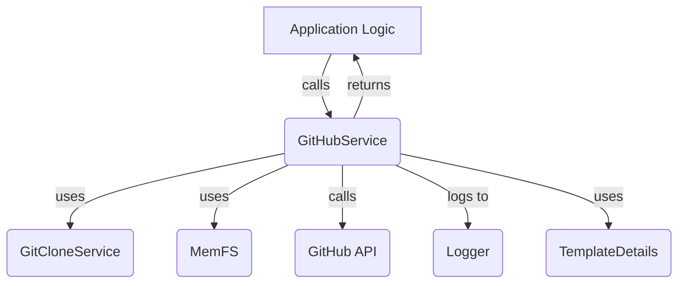
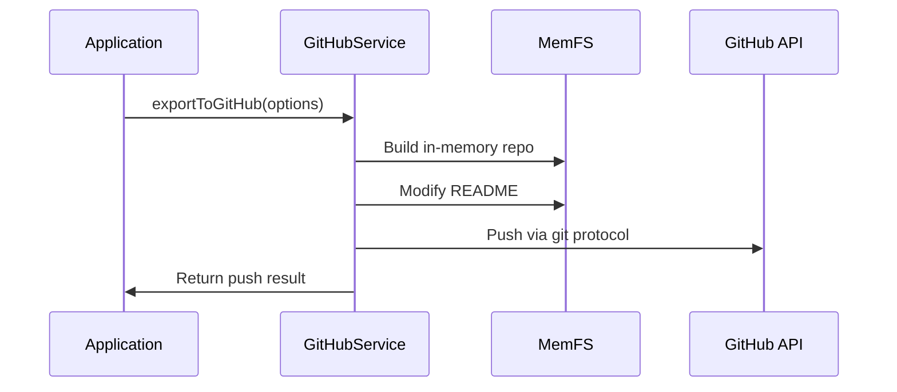

# GitHubService (worker.services.github.GitHubService.GitHubService)

## Overview

The `GitHubService` class is the core service responsible for all interactions with GitHub repositories. It provides high-level methods for repository creation, export, synchronization, and status checking, abstracting both REST API and native git protocol operations. This service is designed to be used by higher-level application logic to manage code export and repository lifecycle in a seamless and robust manner.

## Core Responsibilities
- **Repository Creation**: Create new repositories for authenticated users, handling permission and existence errors.
- **Repository Information**: Fetch repository metadata and check for repository existence.
- **Export to GitHub**: Export code to GitHub using either the native git push protocol or the REST API, including in-memory repository construction and README modification.
- **Remote Status Checking**: Compare local and remote commit histories to determine divergence and compatibility.
- **Logging**: All operations and errors are logged using the system logger.

## Key Methods

### `createUserRepository(options: CreateRepositoryOptions): Promise<CreateRepositoryResult>`
Creates a new GitHub repository for the authenticated user, handling permission and existence errors.

### `getRepository(options: { owner: string; repo: string; token: string }): Promise<{ success: boolean; repository?: GitHubRepository; error?: string }>`
Fetches metadata for a given repository.

### `repositoryExists(options: { repositoryUrl: string; token: string }): Promise<boolean>`
Checks if a repository exists at the given URL.

### `exportToGitHub(options: { ... }): Promise<GitHubPushResponse>`
Exports a set of git objects to GitHub, using either the native git push protocol or REST API as a fallback. Handles in-memory repository construction, README modification, and commit management.

### `checkRemoteStatus(options: { ... }): Promise<{ compatible: boolean; behindBy: number; aheadBy: number; divergedCommits: Array<...> }>`
Compares local and remote commit histories to determine if the local repository is compatible with the remote, and reports on divergence.

## Internal Utilities
- **extractRepoInfo**: Parses owner and repo name from a GitHub URL.
- **modifyReadmeForGitHub**: Replaces placeholders in README with deploy buttons and commits the change.
- **pushViaGitProtocol**: Handles native git push with authentication and progress reporting.
- **findLastCommonCommit**: Finds the last common commit between local and remote histories.

## Dependencies
- **Types**: Uses type definitions from [worker.services.github.types.md](worker.services.github.types.md)
- **Agent Core**: Relies on [Agent Core](Agent Core.md) for repository building and in-memory file system (MemFS).
- **Logger**: Uses [Logger](Logger.md) for all logging operations.
- **Sandbox**: Interacts with [Sandbox and Execution Environment](Sandbox and Execution Environment.md) for template and git object management.

## Data Flow Diagram

## Process Flow: Exporting to GitHub

## Related Types
See [worker.services.github.types.md](worker.services.github.types.md) for all type definitions used by this service.
